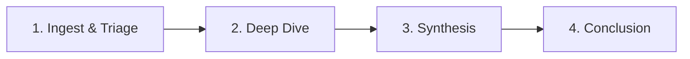
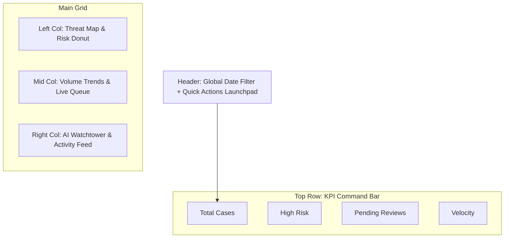
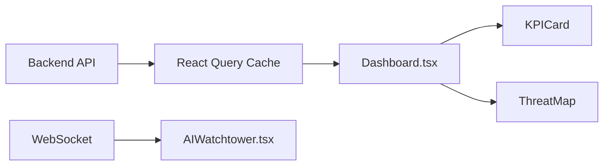
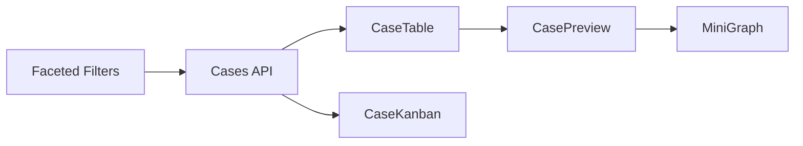
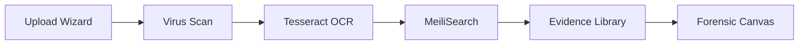
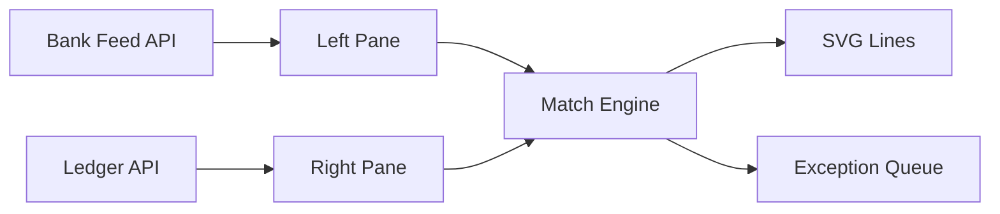
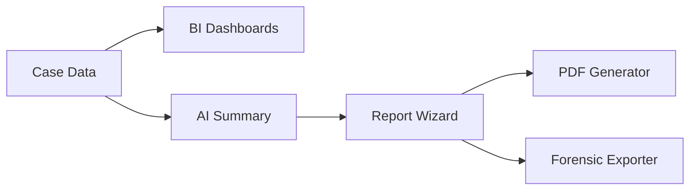
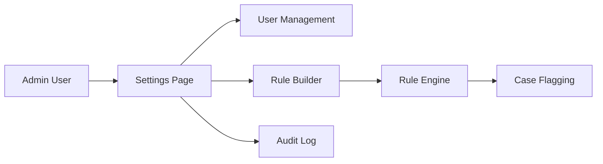

# Antigravity Fraud Detection System: Master Design Specification

> **Version:** 5.0 (Consolidated)
> **Date:** 2025-12-09

## Comprehensive Design Documentation
This document consolidates all strategy and page specifications into a single reference.

---

# 🩺 Application Diagnostics & Gap Analysis

> **Date:** 2025-12-09
> **Scope:** Frontend Application (React/Electron)
> **Goal:** Align with "Phase 4: Advanced Intelligence" and "Premium/Military-Grade" standards.

## Index of Design Documents
### Strategy & Context
*   [00_STRATEGY_DIAGNOSIS.md](00_STRATEGY_DIAGNOSIS.md) (You are here)
*   [00_STRATEGY_USER_JOURNEY.md](00_STRATEGY_USER_JOURNEY.md) (The Golden Path)
*   [00_STRATEGY_FRAUD_MECHANICS.md](00_STRATEGY_FRAUD_MECHANICS.md) (Legal Strategy)
*   [00_STRATEGY_INTERACTIVITY.md](00_STRATEGY_INTERACTIVITY.md) (Sync Architecture)
*   [00_STRATEGY_FRENLY_AI.md](00_STRATEGY_FRENLY_AI.md) (AI Integration)
*   [00_STRATEGY_FRENLY_AI_FUTURE.md](00_STRATEGY_FRENLY_AI_FUTURE.md) (Future Roadmap)
*   [00_STRATEGY_ONBOARDING.md](00_STRATEGY_ONBOARDING.md) (User Guidance)

### Planning Documents (New)
*   [FRAUD_ORCHESTRATION.md](docs/planning/FRAUD_ORCHESTRATION.md) (Plain-Language Framework)
*   [FEATURE_ORGANIZATION.md](docs/planning/FEATURE_ORGANIZATION.md) (Page Structure & User Journey)
*   [CROSS_PAGE_INTEGRATION.md](docs/planning/CROSS_PAGE_INTEGRATION.md) (Data Flow & Integration)

### Functional Pages (The Workflow)
1.  [01_DASHBOARD.md](01_DASHBOARD.md) (Command Center)
2.  [02_CASES.md](02_CASES.md) (Triage & Management)
3.  [03_INVESTIGATION.md](03_INVESTIGATION.md) (Deep Graph Analysis)
4.  [04_EVIDENCE.md](04_EVIDENCE.md) (Forensics Lab)
5.  [05_REPORTING.md](05_REPORTING.md) (Conclusion Wizard)
6.  [06_SETTINGS.md](06_SETTINGS.md) (Mission Control)

## 1. Executive Summary

The current application is a functional **CRUD Prototype**. It successfully handles the basics of Case Management (List/Detail) and File Uploads, but it lacks the "Intelligence" and "Investigation" workflows promised in the Master Plan. The UI is utilitarian ( MVP level) rather than "Premium" or "Data-Dense".

### Strategic Context: Why Change?
*   **Why:** The current "Admin Dashboard" paradigm is reactive. Operators only see what they look for. A "Military-Grade" system must be proactive, alerting operators to threats they haven't noticed.
*   **What:** Shift from "Data Entry" to "Data Investigation". Every page must offer insights, not just tables.
*   **How:** By implementing a "Thick Client" architecture (Electron) that leverages local hardware for heavy visualization (WebGL) and immediate interactions, bypassing web latency.

---

## 2. Page-by-Page Diagnosis (Why, What, How)

### 2.1 Dashboard (`Dashboard.tsx`)
*   **Why (The Gap):** Currently serves static data. Fails to answer "What is happening *right now*?".
*   **What (The Fix):** Transform into a "Command Center" with live feeds and geospatial context.
*   **How (The Tech):** Replace `useEffect` polling with WebSockets. Use `react-map-gl` for the threat map.

### 2.2 Case Management (`Cases.tsx`)
*   **Why (The Gap):** List view hides urgency. Only shows "Open/Closed", not "Structuring" or "Legal Review".
*   **What (The Fix):** Implement a Kanban workflow board and faceted search.
*   **How (The Tech):** Use `dnd-kit` for drag-and-drop columns. Implement a client-side search engine (e.g., `flexsearch`) for instant filtering of thousands of cases.

### 2.3 Forensics & Evidence (`Forensics.tsx`)
*   **Why (The Gap):** Blind file management. Users must download files to see them.
*   **What (The Fix):** Integrated "Forensic Lab" with in-app PDF/Image analysis.
*   **How (The Tech):** Embed `react-pdf` for rendering. Use `tesseract.js` (or backend OCR) to overlay text layers on canvas.

### 2.4 Investigation / Network Analysis
*   **Why (The Gap):** **Critical Feature Missing.** No way to see relationships (e.g., A pays B, B pays C).
*   **What (The Fix):** A "Canvas" view for visual link analysis.
*   **How (The Tech):** `react-force-graph` for the visualization engine. `zustand` for managing complex graph state (nodes/edges).

---

### 2.5 Global UI Elements (New)
*   **Notification Center (Task 4.7):** A "Bell" icon in the header expanding to a message tray for Alerts and System Updates.
*   **Collaboration Bar (Task 4.6):** "Facepile" of active users on the current page with cursor presence.

---

## 3. Technical & Architectural Improvement Plan

### 3.1 State Management
*   **Why:** Complex investigations require persistent state (e.g., "Draft Graph"). Local state is lost on navigation.
*   **What:** Global, persistent client-state.
*   **How:** `Zustand` for UI state (sidebar toggles), `TanStack Query` for server state (caching), and `IndexedDB` for offline persistence.

### 3.2 Visualization Engine
*   **Why:** DOM nodes are too slow for thousands of data points.
*   **What:** GPU-accelerated rendering.
*   **How:** `Canvas` or `WebGL` based libraries (`Recharts`, `react-force-graph`) to maintain 60FPS.

### 3.3 AI Integration Pattern
*   **Why:** AI should not be a "popup"; it should be a "copilot".
*   **What:** Context-aware sidebar.
*   **How:** A persistent `Drawer` component that listens to the active page/selection context and queries the local LLM/Rule Engine for relevant suggestions.

---

## Documentation Synchronization & Knowledge Consolidation

During the recent documentation consolidation effort we executed a non-destructive migration plan to reduce duplication and create canonical references. This section summarizes the migration policy, the artifacts created, and next steps engineers and writers should follow.

Artifacts created (non-destructive):

- `docs/DOCS_SYNC_INDEX.md` — index mapping current files to canonical targets and describing merge rules.
- `docs/DOCS_MIGRATION_GUIDE.md` — step-by-step migration instructions, link-rewrite commands, and verification steps.
- Canonical summaries (temporary):
    - `docs/api/README_MERGED.md`
    - `docs/architecture/CORE_ARCHITECTURE_FULL.md`
    - `docs/architecture/ELECTRON_ARCHITECTURE_FULL.md`
    - `docs/guides/GETTING_STARTED_MERGED.md`
    - `docs/security/SECURITY_FULL.md`
- `docs/archives/` contains verbatim copies of originals for auditability and rollback.

Policy & next steps:

1. Validate the merged summaries with subject owners (API, Architecture, Security, Product).  
2. Rename `_MERGED` / `_FULL` files to canonical names after sign-off (e.g., `docs/api/README.md`, `docs/architecture/CORE_ARCHITECTURE.md`).  
3. Run link-rewrite dry-run, apply replacements, and run link-checker (`docs/check_links.py`) in CI.  
4. Keep originals in `docs/archives/` for 90 days before optional archival deletion.  

Design impacts:

- Update any in-repo references or internal tools that point to legacy doc paths.  
- Add documentation checks to CI to prevent future drift (broken link detection + simple linting).  

Reference: See `docs/DOCS_MIGRATION_GUIDE.md` for the exact commands and verification steps.

# 06. Strategy: How We Prove Fraud & Embezzlement

> **Objective:** Translate "UI Features" into "Court-Admissible Proof".
> **Audience:** Forensic Accountants, Legal Teams, Investigators.

This document analyzes how the specific features in the proposed Phase 4 designs allow an investigator to mechanically prove specific types of financial crimes.

## 1. Proving Embezzlement (Theft by Insider)

Embezzlement usually involves an insider creating false expenses or vendors to siphon money.

### The Feature: Entity Graph (`03_INVESTIGATION.md`)
*   **The Scenario:** An employee approves payments to a "Vendor" that they secretly own.
*   **The Proof Mechanism:**
    *   **Node Analysis:** The Graph renders the **Employee** node and the **Vendor** node.
    *   **Link Detection:** The system automatically draws an edge if they share metadata (e.g., same Phone Number, same physical Address, or shared IP address for login).
    *   **Visual Proof:** A triangle graph (Company -> Vendor -> Employee's Private Bank) visually demonstrates the *Round Trip* of funds.
*   **Court Value:** "Your Honor, this chart shows the 'Vendor' shares a home address with the Defendant."

### The Feature: OCR & Semantic Search (`04_EVIDENCE.md`)
*   **The Scenario:** "Ghost Employees" or Fake Invoices.
*   **The Proof Mechanism:**
    *   **Anomaly detection:** OCR extracts 500 invoice templates. The AI detects that 50 of them (from "Vendor X") use a slightly different font or pixel alignment than the standard template, or have valid math but invalid tax IDs.
    *   **Metadata Analysis:** The file metadata shows "Created by Adobe Photoshop" instead of "Generated by QuickBooks".
*   **Court Value:** Demonstrates **Intent to Deceive** (Forgery).

---

## 2. Proving Structuring (Smurfing)

Structuring is the act of breaking large transactions into smaller ones to avoid regulatory reporting (e.g., <$10k).

### The Feature: Temporal Playback Slider (`03_INVESTIGATION.md`)
*   **The Scenario:** A launderer moves $50,000 via fifty $990 transfers over 3 days.
*   **The Proof Mechanism:**
    *   **Static View specific failure:** A standard list view just shows 50 small, legal transactions.
    *   **Dynamic View success:** As the investigator drags the **Time Slider**, they see a distinct "Pulse" or "Burst" of edges forming rapidly between two nodes.
    *   **Velocity Metrics:** The Dashboard (`01_DASHBOARD.md`) highlights "High Frequency / Low Value" patterns.
*   **Court Value:** Proves **Pattern & Practice**. "This wasn't 50 isolated payments; it was one coordinated event."

---

## 3. Proving Shell Company Networks

### The Feature: Community Detection (`03_INVESTIGATION.md`)
*   **The Scenario:** A fraudster sets up 10 shell companies to obscure the final destination of funds.
*   **The Proof Mechanism:**
    *   **Force-Directed Layout:** The graph algorithm naturally clusters nodes that transact frequently *with each other* but rarely with the outside world.
    *   **Visual Isolation:** The "Shell Network" floats as a detached island or a tightly wound "hairball" on the Canvas, separate from legitimate business operations.
*   **Court Value:** Visualizes the **Conspiracy**. shows the scope of the network.

---

## 4. Ensuring Admissibility (Chain of Custody)

### The Feature: Immutable Audit Logs (`05_SETTINGS.md`)
*   **The Problem:** Defense attorneys will argue, "The investigator altered the data to frame my client."
*   **The Solution:**
    *   **Hash Integration:** Every audit log entry (`User X viewed Case Y`) is cryptographically hashed.
    *   **Read-Only Forensics:** The "Evidence Lab" (`04_EVIDENCE.md`) calculates SHA-256 hashes of original files upon ingestion. If the file is modified (redacted), a *new* version is created; the original is never overwritten.
*   **Court Value:** **Authentication of Evidence**. "We can prove this file has not been altered since upload on Dec 9th."

---

## 5. Summary Matrix

| Crime Type | Key Application Feature | The "Smoking Gun" |
| :--- | :--- | :--- |
| **Kickbacks** | Graph (Link Analysis) | Correlated timestamp: Money leaves Company -> Employee receives "Gift" 2 days later. |
| **Payroll Fraud** | Dashboard (Geo-Map) | "Employee" logging in from Nigeria when they live in Ohio. |
| **Expense Fraud** | Evidence (OCR) | Duplicate receipt numbers submitted by different employees. |
| **Vendor Fraud** | Cases (Faceted Search) | "Vendor" created in the system *after* the invoice date. |
# 08. Strategy: User Journey & The "Golden Path" to Summary

> **Goal:** Guide the user from "Chaos" (Thousands of raw files) to "Clarity" (A court-ready report).
> **Problem:** Current designs show *tools* (`Graph`, `Evidence`) but not the *process*. Users need a map.

## 1. The "Golden Path" Workflow

We define a rigid 4-Step Standard Operating Procedure (SOP) that guides every investigation.



### Step 1: Ingest & Triage (The Filter)
*   **Action:** User uploads Raw Zip. AI Auto-tags "High Risk".
*   **Page:** `01_DASHBOARD` (Alerts) -> `02_CASES` (Kanban: "Incoming").
*   **Goal:** Decide: "Is this worth my time?" (Archive vs. Investigate).

### Step 2: Deep Dive (The Analysis)
*   **Action:** Connecting the dots. Tracing funds.
*   **Page:** `03_INVESTIGATION` (Graph) + `04_EVIDENCE` (Lab).
*   **Goal:** Find the "Smoking Gun".

### Step 3: Synthesis (The Narrative)
*   **Action:** Pinning evidence to the timeline. Annotating nodes.
*   **Page:** **NEW: `Investigation Notebook`** (Persistent scratchpad).
*   **Goal:** Build the story.

### Step 4: Conclusion (The Output)
*   **Action:** Final recommendation and Report Generation.
*   **Page:** **NEW: `Case Conclusion Wizard`**.
*   **Goal:** Generate the "Interactive Dossier".

---

## 2. New Page: The "Case Conclusion Wizard"

**Why:** Investigators often struggle to write the final S.A.R. (Suspicious Activity Report). They have the data but no structure.
**What:** A step-by-step wizard that *forces* a complete summary.

### Comparison: Old vs. New
| Feature | Old (No Page) | New (Wizard) |
| :--- | :--- | :--- |
| **Structure** | Blank Word Doc | Structured Steps (Subject, Method, Evidence, Conclusion) |
| **Data** | Copy-Paste screenshots | Auto-imported "Pinned" Graphs and Docs |
| **Validation** | None | "Missing Key Evidence" warning |

### Wizard Steps:
1.  **Confirm Subjects:** List of all flagged Nodes. "Are these the bad guys?"
2.  **Select Key Evidence:** Checklist of all "Pinned" documents. "Include these in export?"
3.  **Draft Narrative:** Text area with AI auto-complete based on the Evidence.
4.  **Recommendation:** Radio button: "File SAR", "Close - False Positive", "Refer to Legal".

---

## 3. New Page: The "Interactive Digital Dossier" (The Summary)

**Why:** A PDF is dead. A "Premium" app should deliver a dynamic HTML bundle that can be handed to a prosecutor/manager.
**What:** A read-only, self-contained interactive report.

### Visual Layout
*   **Header:** "Case #1234: Operation Red - CONFIDENTIAL".
*   **Executive Summary:** 1-paragraph AI-generated summary.
*   **Key Entities Card:** Photos/Logos of the main suspects.
*   **The Interactive Timeline:** A scrollable history of the *crime* (not the investigation).
*   **Evidence Vault:** Clickable thumbnails of the "Smoking Gun" documents (redacted automatically).

**Magic Feature:** The **"Provenance Link"**. Clicking a sentence in the Summary ("Subject A transferred $50k...") opens the specific Bank Statement PDF page that proves it.

---

## 4. Visualizing the Journey (UI Elements)

### 4.1 The "Case Progress Bar"
A persistent breadcrumb at the top of the interface:
`[ 1. Triage ] > [ 2. Investigation ] > [ 3. Drafting ] > [ 4. Closed ]`
*   **Function:** Clicking "Drafting" takes you to the Conclusion Wizard.

### 4.2 The "Notebook" Sidebar
A retractable right-hand sidebar available on *every* page.
*   **Interaction:** User sees something interesting on the Graph? Drag it to the Notebook.
*   **Function:** This collects the "Ingredients" for the Final Report automatically.

---

## 5. Summary of New Interactions

| User Want | New Interaction | Value |
| :--- | :--- | :--- |
| "Help me not get lost" | **Case Progress Bar** | Always shows where you are in the lifecycle. |
| "Help me write the report"| **Notebook Sidebar** | Collects evidence *as you go*, so you don't hunt for it later. |
| "Show me the summary" | **Interactive Dossier** | A "Wow" factor deliverable that proves the app's value. |
# 00. Strategy: User Onboarding & Guidance

> **Goal:** Accelerate "Time to Value". Turn a novice into a "Level 1 Investigator" in < 5 minutes.
> **Problem:** The app is complex ("Military-Grade"). A blank screen is intimidating.

## 1. The "First Run" Experience (The Setup)
Before the user sees the Dashboard, we present a high-fidelity **"Role Selection" Wizard**.

### Step 1: "Who are you?"
*   **Investigator:** Optimizes UI for Graph & Maps.
*   **Legal:** Optimizes UI for Reports & Logs.
*   **Admin:** Optimizes UI for System Health.
*   **Result:** The layout presets (Sidebar, Widget placement) are auto-configured.

### Step 2: "Connect Data" (Optional)
*   "Drag your first `case_files.zip` here to start analysis."
*   **Value:** Avoids the "Empty Dashboard" problem by seeding the system immediately.

---

## 2. Interactive Guidance (The Tour)
We avoid generic "Next, Next, Next" carousels. Instead, we use **Task-Based Onboarding**.

### The "Rookie Checklist" (Gamification)
A persistent widget in the bottom-left (initially open).
1.  [ ] **Open a Case** (Link to Cases)
2.  [ ] **Find a Connection** (Link to Graph)
3.  [ ] **Flag Evidence** (Link to Lab)
4.  [ ] **Generate Report** (Link to Conclusion)

*   **Reward:** "Certified Level 1" Badge.

### "Just-in-Time" Tooltips
*   **Trigger:** First time user opens the **Investigation Graph**.
*   **Action:** Dim the screen, spotlight the "Force Layout" button.
*   **Content:** "Click here to auto-organize the shell companies." (Keep it actionable).

---

## 3. Frenly AI as the "Guide"
Frenly isn't just a chatbot; it's the "Senior Partner" showing you the ropes.

*   **Welcome Message:**
    > "Welcome, Agent. I see you've uploaded the 'Enron' dataset. I've already flagged 3 anomalies. Want me to show you?"
    > [Show Me] [I'll Explore Myself]

*   **The "Show Me" Action:**
    *   Frenly takes control (programmatic navigation).
    *   Navigates to **Dashboard**.
    *   Highlights the "Risk Gauge".
    *   Navigates to **Graph**.
    *   Selects the "Central Node".

---

## 4. Educational "Empty States"
Never show a blank page with "No Data".

| Page | Bad Empty State | Educational Empty State |
| :--- | :--- | :--- |
| **Cases** | "No Cases Found" | "No Cases yet. **Import from CSV** or **Connect to Database** to see the magic." |
| **Graph** | Blank Canvas | "Drag entities here to start mapping. Try adding 'John Doe'." |
| **Evidence** | Empty Table | "The Lab is quiet. Upload PDFs to activate OCR and Forgery Detection." |

## 5. Technical Implementation
*   **Library:** `driver.js` or `react-joyride` for the spotlight tours.
*   **State:** `user.onboardingStatus` (Persisted in DB).
*   **AI:** `Frenly.suggestTutorial()` triggers based on idle time.
# 07. Strategy: Interactivity, Integration & Real-Time Sync

> **Goal:** Transform the application from a "collection of pages" into a **"Unified Nervous System"**.
> **Context:** In high-stakes investigations, "Page Loads" and "Lost Context" break the analyst's flow.

## 1. Deep Diagnosis: Current "Friction Points"

Even with the new designs (`01`-`05`), the application risks behaving like a standard website.

| Friction Point | The Symptom | The "Deep" Problem |
| :--- | :--- | :--- |
| **Navigation Amnesia** | User filters Cases by "Risk > 90", goes to Dashboard, comes back -> Filters are gone. | **Page-Scoped State:** State dies when the component unmounts. |
| **Context Silos** | User selects "Suspect A" in the Graph. Needs to manually search for "Suspect A" again in Evidence. | **Lack of Global Selection:** No shared "Cursor" concept across domains. |
| **Disconnected Data** | User flags a transaction in the *Evidence* tab. The *Graph* node color doesn't change until refresh. | **Fractured Stores:** Components fetch their own data; they don't share a "Single Source of Truth". |
| **Screen Real Estate** | Analyst wants Graph on Monitor 1 and Evidence on Monitor 2. Cannot do this in a single browser tap. | **Single-Window Constraint:** Treating Electron like a Chrome tab inside a wrapper. |

---

## 2. Proposed "Nervous System" Architecture

We will implement three core patterns to solve this: **The Global Context**, **Data Brushing**, and **Multi-Window Sync**.

### 2.1 The "Active Investigation Context" (Global State)
Instead of state living in pages, state lives in a **Global "Session" Store** (Zustand + IndexedDB persistence).

*   **How it works:**
    *   When a user opens a Case, the **entire app** enters "Case Mode".
    *   **The Sidebar:** Changes from generic navigation to "Case-Specific" tools (Graph, Evidence, Notes).
    *   **The Header:** Displays "Active Case: #1234 - Operation Red" persistently.
    *   **Persistence:** If the user quits and reopens, they land *exactly* where they left off, down to the scroll position.

### 2.2 Data Brushing (Cross-View Interactivity)
"Brushing" is a visualization technique where interaction in one view highlights related data in *all* other views.

*   **Scenario:**
    1.  User acts on **Investigation Canvas (`03`)**: Hovers over a "Company Node".
    2.  **Dashboard (`01`) Reaction:** The "Trend Chart" instantly dims unrelated lines and highlights the specific trend line for that Company.
    3.  **Evidence (`04`) Reaction:** The File List auto-scrolls to documents related to that Company.
*   **Implementation:**
    *   **Event Bus:** `const { hoveredEntityId } = useInvestigationStore();`
    *   **Reactive UI:** All sensitive components subscribe to `hoveredEntityId`.

### 2.3 Detachable Windows (Electron Functionality)
Power users (Forensic Accountants) use 2-3 monitors. We must support this.

*   **The Feature:** "Pop Out" button on the **Investigation Graph** and **Evidence Lab**.
*   **The Tech:**
    *   `ipcRenderer.send('open-window', { route: '/graph/123' })`.
    *   **State Sync:** This is the hard part. We use a **SharedWorker** or **IPC Relay** so that if the user clicks a node in Window A (Graph), the PDF opens in Window B (Main App).
    *   **Result:** A true multi-monitor workspace.

### 2.4 "Command Palette" (Integration Hub)
Accessing features shouldn't require clicking menus.

*   **The feature:** `Cmd+K` (macOS) / `Ctrl+K` (Windows).
*   **Capabilities:**
    *   "Nav to Settings"
    *   "Create New Case"
    *   "Search for entity 'John Doe'" (Global Search)
    *   "Set Risk Score to 90" (Action Execution)
*   **Integration:** This unifies the navigation and action layers into a single keyboard-driven interface.

---

## 3. Synchronization Strategy (Real-Time)

To prove fraud, the team must see the same truth.

### 3.1 Optimistic UI Updates
*   **Problem:** Waiting 200ms for the server to confirm a "Flag" feels sluggish.
*   **Solution:**
    1.  User clicks "Flag".
    2.  **UI Updates Instantly:** Button turns red, Graph node turns red.
    3.  **Background:** API call is sent.
    4.  **Rollback:** If API fails, UI reverts and shows a "Retry" toast.

### 3.2 WebSocket "Pulse"
*   **Scope:** Not just "Chat", but **Data**.
*   **Mechanism:**
    *   Server pushes `ENTITY_UPDATED` event `{ id: 123, risk: 90 }`.
    *   React Query Client (`queryClient.setQueryData`) intercepts this and updates the local cache.
    *   **Result:** All connected clients (and all open windows) update simultaneously without a reload.

---

## 4. User Journey: The "Integrated" Experience

1.  **Analyst** hits `Cmd+K`, types "Case 404", hits Enter.
2.  App transitions context. Sidebar shifts.
3.  Analyst pops the **Graph** to Monitor 2.
4.  On Monitor 2, Analyst clicks a **Suspicious Node**.
5.  On Monitor 1, the **Evidence List** instantly filters to show only PDFs linked to that node.
6.  Analyst flags a PDF on Monitor 1.
7.  On Monitor 2, the Node turns **Red** instantly.

This is "Deep Integration".
# 00. Strategy: Frenly AI Integration

> **Goal:** Integrate the "Frenly AI Assistant" (4-Persona System) into the new page designs.
> **Philosophy:** AI should be *omnipresent but unobtrusive*. It acts as a "Copilot", not a popup.

## 1. Architectural Strategy (Global vs. Local)

We will use a **Hybrid Layout Pattern** to integrate Frenly into the application.

| Scope | UI Component | Pattern | Value |
| :--- | :--- | :--- | :--- |
| **Global** | `<AIAssistant />` | **Floating Widget** (Bottom Right) | Always available for Q&A ("How do I export?"). |
| **Local** | `<AIInsightPanel />` | **Contextual Drawer** (Right Sidebar) | Auto-analyzes the *current* page data (e.g., Graph Risks). |

---

## 2. Technical Implementation (React/TypeScript)

We will leverage the existing `AIContext` to provide "Awareness" to the assistant.

### 2.1 The Global Provider (`App.tsx`)
Wrap the entire application to ensure state persistence across pages.

```tsx
// src/App.tsx
import { AIProvider } from './context/AIContext';
import { AIAssistant } from './components/ai/AIAssistant';

export function App() {
  return (
    <AIProvider>
       <Router>
          {/* ... Routes ... */}
       </Router>
       <AIAssistant /> {/* The Floating Chat Widget */}
    </AIProvider>
  );
}
```

### 2.2 Context awareness (`useContextAwareAI`)
We create a custom hook that auto-updates the AI's "Context" when the user navigates.

```tsx
// src/hooks/useContextAwareAI.ts
import { useEffect } from 'react';
import { useAIContext } from '../context/AIContext';

export function useContextAwareAI(page: string, data: any) {
  const { setContext } = useAIContext();

  useEffect(() => {
    setContext({
      currentPage: page,
      activeData: data, // e.g., the selected Case ID or Graph Node
      timestamp: Date.now()
    });
  }, [page, data]);
}
```

---

## 3. Page-Specific Integration Points

### 3.1 Dashboard (`01_DASHBOARD.md`)
*   **Role:** Watchtower.
*   **Integration:** The AI analyzes live WebSocket feeds for anomalies.
*   **Code:**
    ```tsx
    // pages/Dashboard.tsx
    export const Dashboard = () => {
      const { recentAlerts } = useAlertsSocket();
      useContextAwareAI('dashboard', recentAlerts); // AI now "sees" the alerts

      return (
        <div className="dashboard-grid">
           {/* If High Risk, show AI Insight Panel automatically */}
           {recentAlerts.some(a => a.risk > 90) && (
              <AIInsightPanel 
                 type="alert_analysis" 
                 data={recentAlerts.filter(a => a.risk > 90)} 
              />
           )}
           {/* ... */}
        </div>
      )
    }
    ```

### 3.2 Investigation Graph (`03_INVESTIGATION.md`)
*   **Role:** The Detective.
*   **Integration:** Suggested next steps based on graph topology.
*   **Code:**
    ```tsx
    // pages/Investigation.tsx
    import { AIInsightPanel } from '../components/visualization/AIInsightPanel';

    export const Investigation = () => {
       const selectedNode = useStore(state => state.selectedNode);
       
       return (
          <div className="layout-split">
             <ForceGraph />
             
             {/* Dynamic Sidebar */}
             <div className="sidebar-right">
                {selectedNode ? (
                   <AIInsightPanel 
                      chartType="graph" 
                      data={selectedNode}
                      persona="investigator" // Use the "Detective" persona
                   />
                ) : (
                   <div className="placeholder">Select a node for AI Analysis</div>
                )}
             </div>
          </div>
       )
    }
    ```

### 3.3 Evidence Lab (`04_EVIDENCE.md`)
*   **Role:** The Forensic Accountant.
*   **Integration:** OCR verification and forgery detection.
*   **Code:**
    ```tsx
    // pages/Evidence.tsx
    <FileViewer 
       file={pdfUrl} 
       onLoad={(meta) => {
          // Trigger proactive AI analysis
          aiService.analyzeDocument(meta).then(report => {
             if (report.forgeryLikelihood > 0.8) {
                toast.error("AI Alert: Potential Forgery Detected");
             }
          });
       }}
    />
    ```

---

## 4. The "Persona" Selector UI
Since we completed the **4-Persona System**, the UI must expose this control.

*   **Location:** Inside `<AIAssistant />` header.
*   **Component:** `PersonaToggle`.

```tsx
// components/ai/PersonaToggle.tsx
export const PersonaToggle = () => {
  const { activePersona, setPersona } = useAIContext();
  
  const personas = [
    { id: 'frenly', icon: '🤖', label: 'General' },
    { id: 'investigator', icon: '🕵️‍♀️', label: 'Detective' },
    { id: 'legal', icon: '⚖️', label: 'Legal' },
    { id: 'forensic', icon: '📊', label: 'Accountant' }
  ];

  return (
    <div className="flex gap-2 p-2 bg-slate-800 rounded-lg">
       {personas.map(p => (
          <button 
             key={p.id}
             onClick={() => setPersona(p.id)}
             className={activePersona === p.id ? 'bg-blue-600' : 'opacity-50'}
          >
             {p.icon} {p.label}
          </button>
       ))}
    </div>
  );
}
```
# 00. Strategy: Frenly AI - Future Roadmap (Phase 5+)

> **Goal:** Move beyond "Assistant" to "Active Investigator".
> **Context:** Current status is "Reactive" (User asks, AI answers). The future is "Proactive" & "Multimodal".

## 1. Local RAG (The "Elephant" Memory)
*   **Concept:** Currently, Frenly only knows what is on the screen. **Local RAG (Retrieval Augmented Generation)** allows Frenly to "remember" every case file ever closed on this machine.
*   **User Query:** "Has this phone number appeared in any investigations from 2023?"
*   **Tech:** `ChromaDB` (Local Vector Store) running inside Electron. Indexing occurs in a background Web Worker.
*   **Value:** Connects the dots across years of disconnected data.

## 2. Visual Reasoning (Multimodal Analysis)
*   **Concept:** Drag-and-drop a scanned check or contract into the chat.
*   **Capabilities:**
    *   **Signature Matching:** "This signature matches 'John Doe' from Case #99 with 85% confidence."
    *   **Forgery Layout:** "The pixels around the 'Amount' field suggest digital alteration."
*   **Tech:** Integration with clear-bit/local Vision Transformers (e.g., `Moondream` quantized for local execution).

## 3. "The Devil's Advocate" (Red Teaming)
*   **Concept:** A dedicated Persona specifically designed to *disprove* the user's theory.
*   **Workflow:**
    1.  User: "I think Subject A is guilty of embezzlement."
    2.  Frenly (Red Team): "Here are 3 pieces of evidence that contradict that theory. Have you considered they might be a victim of identity theft?"
*   **Value:** Prevents "Confirmation Bias" – a critical failure in investigations.

## 4. Voice Command Center ("Jarvis" Mode)
*   **Concept:** Hands-free control for high-speed analysis.
*   **Commands:**
    *   "Frenly, highlight all transactions over $10k."
    *   "Map the relationship between Node A and Node B."
*   **Tech:** WebSpeech API (Native) bridged to the `useContextAwareAI` hook.

## 5. Auto-Drafting (Legal Engineering)
*   **Concept:** Generative output for legal documents.
*   **Capabilities:**
    *   **Subpoenas:** "Write a subpoena for Bank of America requesting all records for Account X."
    *   **Affidavits:** "Draft an affidavit summarizing the 'Shell Company' pattern."
*   **Safety:** Templates are "Fill in the blank" to ensure legal compliance, with AI only suggesting the narrative content.

---

## 6. Comparison: Today vs. Future

| Feature | Today (Phase 4) | Future (Phase 5+) |
| :--- | :--- | :--- |
| **Scope** | Current Page Context | Entire Case History (RAG) |
| **Input** | Text Chat | Text, Voice, Images |
| **Role** | Helper | Partner / Red Teamer |
| **Memory** | Session Only | Permanent Vector Store |
# Strategy: Accessibility (A11y)

> **Goal:** Ensure the application is usable by people with disabilities and complies with WCAG 2.1 AA standards.

## 1. Core Principles

- **Perceivable:** All information and UI components must be presentable in ways users can perceive.
- **Operable:** All UI components and navigation must be operable via keyboard alone.
- **Understandable:** Information and operation of UI must be understandable.
- **Robust:** Content must be robust enough to be interpreted by assistive technologies.

---

## 2. Implementation Checklist

### 2.1 Keyboard Navigation

- All interactive elements reachable via `Tab` key.
- Logical focus order (top-to-bottom, left-to-right).
- Visible focus indicators (`:focus-visible` ring).
- Skip links for main content (`Skip to Main Content`).
- Modal traps (focus stays inside dialogs until closed).

### 2.2 Screen Reader Support

- Semantic HTML (`<main>`, `<nav>`, `<aside>`, `<section>`).
- ARIA labels for icons-only buttons: `aria-label="Close"`.
- ARIA live regions for dynamic content (toasts, loading states).
- Proper `role` attributes for custom components.

### 2.3 Color & Contrast

- Text contrast ratio ≥ 4.5:1 (normal text) and ≥ 3:1 (large text).
- Never use color alone to convey information (add icons/text).
- Dark mode support with equivalent contrast.

### 2.4 Forms & Inputs

- All inputs have associated `<label>` elements.
- Error messages linked via `aria-describedby`.
- Required fields marked with `aria-required="true"`.

---

## 3. Testing Strategy

| Tool | Purpose |
| :--- | :--- |
| **axe DevTools** | Automated WCAG violation detection |
| **NVDA / VoiceOver** | Manual screen reader testing |
| **Keyboard-only** | Tab through entire app without mouse |
| **Lighthouse** | Accessibility score tracking |

---

## 4. Component Library Standards

All Radix UI primitives are used as they are built with accessibility in mind. Custom components must:

1. Inherit focus management from Radix.
2. Use `@radix-ui/react-visually-hidden` for off-screen labels.
3. Implement `aria-expanded`, `aria-controls` for disclosures.
# Strategy: Performance & Scale

> **Goal:** Ensure the application remains responsive with 1M+ records, 10k+ node graphs, and concurrent users.

## 1. Core Principles

- **Lazy by Default:** Never load data until it's needed.
- **Virtualize Everything:** DOM nodes are expensive; only render what's visible.
- **Paginate Aggressively:** No unbounded queries.
- **Cache Smart:** Use React Query's stale-while-revalidate pattern.

---

## 2. Frontend Performance

### 2.1 List Virtualization

| Use Case | Library | Notes |
| :--- | :--- | :--- |
| Tables (1000+ rows) | `@tanstack/react-virtual` | Windowed rendering |
| Infinite scroll | `react-window` | Audit Log, Activity Feed |
| Kanban boards | Virtual columns | Only render visible lanes |

### 2.2 Graph Rendering

- **Library:** `react-force-graph` (WebGL / Three.js).
- **Technique:** Level-of-Detail (LOD). At zoom < 50%, switch to clusters.
- **Worker Offload:** Force simulation runs in Web Worker to prevent UI freeze.

### 2.3 Bundle Size

- Code splitting per route via `React.lazy()`.
- Tree-shaking heavy libraries (e.g., `lodash-es` not `lodash`).
- Target: Initial bundle < 250KB gzipped.

---

## 3. Backend Performance

### 3.1 Database Optimization

- **Indexes:** Composite indexes on `(tenant_id, created_at)`.
- **Pagination:** Cursor-based (keyset) pagination, not OFFSET.
- **Connection Pooling:** SQLAlchemy pool size = 10.

### 3.2 Query Patterns

```sql
-- Good: Cursor-based pagination
SELECT * FROM cases 
WHERE tenant_id = ? AND created_at < ?
ORDER BY created_at DESC
LIMIT 50;

-- Bad: Offset pagination (slow on large tables)
SELECT * FROM cases OFFSET 10000 LIMIT 50;
```

### 3.3 Caching

| Layer | Tool | TTL |
| :--- | :--- | :--- |
| API Response | React Query | 30s (stale), 5min (cache) |
| Search Index | MeiliSearch | Real-time sync |
| Static Assets | CDN / Electron | Immutable |

---

## 4. Monitoring & Profiling

| Metric | Target | Tool |
| :--- | :--- | :--- |
| LCP (Largest Contentful Paint) | < 2.5s | Lighthouse |
| FID (First Input Delay) | < 100ms | Web Vitals |
| API P95 Latency | < 500ms | Prometheus |
| Memory Usage | < 500MB | Electron DevTools |

---

## 5. Load Testing

- **Tool:** k6 or Locust.
- **Scenarios:**
  1. 100 concurrent users querying Cases page.
  2. 10 users uploading 100MB evidence files simultaneously.
  3. 1 user rendering a 50k-node graph.
# 01. Dashboard Design: "The Command Center"

> **Goal:** Consolidate tactical metrics (KPIs) with strategic intelligence (Threat Map) into a unified "Glass Cockpit" for fraud operations.
> **Philosophy:** "Situational Awareness at a Glance."


---

## 🎯 Fraud Detection Value

| Fraud Type | How Dashboard Helps |
| :--- | :--- |
| **Embezzlement** | "High Risk Subjects" counter surfaces employees with anomalous behavior patterns. |
| **Money Laundering** | Threat Map visualizes geographic clusters of suspicious transactions (e.g., multiple wire transfers to high-risk jurisdictions). |
| **Vendor Fraud** | AI Watchtower flags vendor invoices that deviate from historical patterns. |
| **Structuring** | Volume Trend chart reveals "just under threshold" transaction patterns. |

---

## 1. Consolidated Feature Set

| Feature Category | Features | Source |
| :--- | :--- | :--- |
| **KPI Ticker** | Total Cases, High Risk Subjects, Pending Reviews, Reviewed Today | Merged |
| **Geospatial** | Threat Map (WebGL) showing transaction origins | Proposed |
| **Analytics** | Volume Trend (Area Chart) + Risk Distribution (Donut) | Merged |
| **Operations** | Live Activity Feed + Quick Actions Launchpad | Merged |
| **Intelligence** | AI Watchtower (Predictive Alerts) | Proposed |

---

## 2. Layout Structure (Grid System)

A dense, data-rich 3-column layout optimized for "Information Density".



---

## 3. Implementation Strategy

### 3.1 KPI Command Bar

- **Why:** Executives need instant health check.
- **What:** 4 metric cards with sparkline trends.
- **How:** `useDashboardMetrics` hook + `recharts` sparklines.

### 3.2 Threat Operations Map

- **Why:** Fraud has geographic patterns (shell companies cluster in specific jurisdictions).
- **What:** Interactive WebGL globe with transaction clusters.
- **How:** `react-map-gl` + floating Risk Donut overlay.

### 3.3 AI Watchtower

- **Why:** Raw logs are noise; interpreted insights are signal.
- **What:** AI-powered alert feed with actionable recommendations.
- **How:** WebSocket subscription to `threat_detected` channel.

---

## 4. Code Relationships

### Components

| Component | Path | Dependencies |
| :--- | :--- | :--- |
| `Dashboard.tsx` | `src/pages/Dashboard.tsx` | KPICard, ThreatMap, ActivityFeed |
| `KPICard.tsx` | `src/components/dashboard/KPICard.tsx` | recharts, lucide-react |
| `ThreatMap.tsx` | `src/components/dashboard/ThreatMap.tsx` | react-map-gl, mapbox-gl |
| `AIWatchtower.tsx` | `src/components/dashboard/AIWatchtower.tsx` | frenly-ai-sdk |

### API Endpoints

| Endpoint | Method | Purpose |
| :--- | :--- | :--- |
| `/api/v1/dashboard/metrics` | GET | KPI summary data |
| `/api/v1/dashboard/threats` | GET | Geospatial threat data |
| `/api/v1/dashboard/activity` | WS | Real-time activity stream |

### Data Flow



---

## 5. Proposed Enhancements

| Enhancement | Priority | Description |
| :--- | :--- | :--- |
| **Predictive Scoring** | High | AI predicts which cases will escalate in next 24h. |
| **Drill-Down Filters** | Medium | Click KPI card → filter entire dashboard to that segment. |
| **Custom Widgets** | Low | User-configurable dashboard layout. |
| **Mobile Companion** | Low | Push notifications for critical alerts. |

---

## 6. User Scenarios

1. **Morning Triage:** User logs in. Sees "Pending Reviews" is high. Clicks card → jumps to Cases Page filtered by `status=pending`.
2. **Hunter Mode:** User sees red pulse on Threat Map. Clicks cluster. AI Watchtower shows "IP range blocked in 3 previous cases."
3. **Executive Briefing:** CFO opens dashboard. Screenshots KPI bar for board meeting.
# 02. Case Management Design: "The War Room"

> **Goal:** Accelerate fraud analyst triage by transforming passive case lists into an active tactical board.
> **Philosophy:** "Active Triage" — Every case must move toward resolution.


---

## 🎯 Fraud Detection Value

| Fraud Type | How Cases Page Helps |
| :--- | :--- |
| **Embezzlement** | Kanban board exposes cases stuck in "Pending" — potential cover-ups by internal actors. |
| **Invoice Fraud** | Adjudication Queue enables rapid approval/rejection of flagged vendor invoices. |
| **Shell Companies** | Investigation Canvas (Mode D) visualizes entity networks, revealing hidden ownership. |
| **Collusion Rings** | Graph analysis clusters related cases, surfacing coordinated fraud schemes. |

---

## 1. Consolidated Feature Set

| Feature Category | Features | Source |
| :--- | :--- | :--- |
| **Views** | Data Table, Kanban Board, Adjudication Queue, Investigation Canvas | Merged |
| **Search** | MeiliSearch (typo-tolerant) + Faceted Filtering | Merged |
| **Actions** | Bulk Actions, Quick Preview, Rapid Decisions (A/R/E) | Merged |
| **Creation** | "New Investigation" Wizard | Proposed |
| **Preview** | Drawer with Tabs: Overview, Graph, Timeline, Financials | Merged |

---

## 2. Layout Structure: "The Cockpit"

### 2.1 Mode A: Triage Table (High Volume)

- **Columns:** Checkbox, ID, Subject (+ Risk Badge), Status, Value, Analyst, Actions.
- **Bulk Actions:** Assign, Export CSV, Archive.

### 2.2 Mode B: Strategy Board (Kanban)

- **Columns:** Incoming → Triage → Analysis → Legal Review → Closed.
- **Card Content:** Sparkline, Days Open, Analyst Avatar.

### 2.3 Mode C: Adjudication Queue (Split-View)

- **Layout:** Master-Detail (Left List / Right Details).
- **Hotkeys:** `A` Approve, `R` Reject, `E` Escalate.
- **Optimistic UI:** Next item loads instantly.

### 2.4 Mode D: Investigation Canvas (Deep Dive)

- **Layout:** Infinite WebGL Canvas (Force Directed Graph).
- **Tools:** Shortest Path, Time Slider, Community Detection.
- **Tech:** `react-force-graph` for 10,000+ nodes.

---

## 3. Implementation Strategy

### 3.1 Quick Preview Drawer

- **Why:** Eliminates "pogo-sticking" between list and detail views.
- **What:** Side sheet with case summary, mini-graph, and timeline.
- **How:** `Radix UI Sheet` + React Query lazy fetch.

### 3.2 Faceted Search

- **Why:** Text search alone is insufficient for fraud investigation.
- **What:** Sidebar filters for Status, Risk Level, Date Range, Analyst.
- **How:** MeiliSearch for text, SQL for range filters.

### 3.3 Rapid Adjudication

- **Why:** False positives must be cleared in seconds, not minutes.
- **What:** Streamlined decision engine with AI reasoning display.
- **How:** Keyboard-driven workflow with optimistic updates.

---

## 4. Code Relationships

### Components

| Component | Path | Dependencies |
| :--- | :--- | :--- |
| `CaseList.tsx` | `src/pages/CaseList.tsx` | CaseTable, CaseKanban, CaseFilters |
| `CaseTable.tsx` | `src/components/cases/CaseTable.tsx` | @tanstack/react-table, react-virtual |
| `CaseKanban.tsx` | `src/components/cases/CaseKanban.tsx` | @dnd-kit/core |
| `CasePreview.tsx` | `src/components/cases/CasePreview.tsx` | Radix Sheet, MiniGraph |
| `InvestigationCanvas.tsx` | `src/components/cases/InvestigationCanvas.tsx` | react-force-graph |

### API Endpoints

| Endpoint | Method | Purpose |
| :--- | :--- | :--- |
| `/api/v1/cases` | GET | List cases with filters |
| `/api/v1/cases/:id` | GET | Case detail |
| `/api/v1/cases/:id/graph` | GET | Entity relationship graph |
| `/api/v1/cases/:id/adjudicate` | POST | Submit decision |

### Data Flow



---

## 5. Proposed Enhancements

| Enhancement | Priority | Description |
| :--- | :--- | :--- |
| **AI Case Routing** | High | Auto-assign cases based on analyst expertise and workload. |
| **Related Cases** | High | "Similar Cases" panel shows historically related investigations. |
| **SLA Timers** | Medium | Visual countdown for regulatory deadlines (SAR filing). |
| **Voice Notes** | Low | Analyst records audio notes attached to case. |

---

## 6. User Scenarios

1. **Morning Triage:** Analyst opens Table View. Sorts by Risk Score (Desc). Bulk-assigns top 5 Critical cases.
2. **Workflow Check:** Supervisor opens Kanban. Notices 10 cases stuck in Legal Review. Drags 3 back to Analysis.
3. **Deep Dive:** Analyst opens Case #1234. Switches to Investigation Canvas. Uses Shortest Path to trace money flow from Subject A to Shell Company Z.
# 04. Evidence & Forensics Design: "The Lab"

> **Goal:** A unified pipeline for Data Ingestion, Organization, and Deep Forensic Analysis.
> **Philosophy:** "From Raw Data to Admissible Evidence."


---

## 🎯 Fraud Detection Value

| Fraud Type | How Evidence Page Helps |
| :--- | :--- |
| **Document Forgery** | ELA Heatmap reveals Photoshop tampering on invoices and receipts. |
| **Ghost Vendors** | OCR extracts vendor names from scanned documents → cross-reference with vendor registry. |
| **Timestomping** | Metadata timeline exposes documents with suspicious creation/modification dates. |
| **Redaction Fraud** | Gap Analysis reconstructs hidden transactions from partial bank statements. |

---

## 1. Consolidated Feature Set

| Feature Category | Features | Source |
| :--- | :--- | :--- |
| **Ingestion** | 5-Step Wizard (Upload → Scan → Map → Preview → Confirm) | Merged |
| **Automation** | AI Auto-Mapping & Gap Analysis | Merged |
| **Library** | Case Binders (Folder Tree) + Multi-Modal Viewer | Merged |
| **Forensics** | PDF/Image Tools (OCR, Annotate, Redact) | Merged |
| **Analysis** | Tamper Detection (ELA, Metadata Timeline) | Merged |
| **Video/Audio** | Transcription + Frame Extraction | Proposed |

---

## 2. Layout Structure: "The Laboratory"

### 2.1 Mode A: Airlock (Ingestion)

- **UI:** Stepper Wizard centered on screen.
- **Steps:** Source → Sanitize → Map → Confirm.

### 2.2 Mode B: Vault (Library)

- **UI:** Split pane. Left = Folder Tree. Right = Smart Cards.
- **Smart Cards:** Show extracted metadata, not just filenames.

### 2.3 Mode C: Workbench (Forensics)

- **UI:** Dark mode, high-contrast split screen.
- **Left:** Document Canvas (Zoomable, Layered).
- **Right:** Analysis Panel (OCR Text, Metadata, Tamper Flags).

---

## 3. Implementation Strategy

### 3.1 Ingestion Wizard

- **Why:** "Garbage in, garbage out" — strict validation before data enters.
- **What:** 5-step interactive importer with AI-powered column mapping.
- **How:** Heuristic engine scans top 50 rows for pattern recognition.

### 3.2 Forensic Canvas

- **Why:** Downloading malware-laden PDFs to local disk is dangerous.
- **What:** Sandboxed, web-based rendering engine.
- **How:** `react-pdf` + HTML5 Canvas overlay for annotations.

### 3.3 Video & Audio Pipeline

- **Why:** Fraud cases often include call recordings, CCTV, WhatsApp voice notes.
- **What:** Transcription + Frame Extraction.
- **How:** Whisper AI for audio, key frame extraction for video OCR.

---

## 4. Code Relationships

### Components

| Component | Path | Dependencies |
| :--- | :--- | :--- |
| `EvidenceLibrary.tsx` | `src/pages/EvidenceLibrary.tsx` | FolderTree, SmartCard, UploadWizard |
| `UploadWizard.tsx` | `src/components/evidence/UploadWizard.tsx` | react-dropzone, stepper |
| `ForensicCanvas.tsx` | `src/components/evidence/ForensicCanvas.tsx` | react-pdf, fabric.js |
| `TamperDetector.tsx` | `src/components/evidence/TamperDetector.tsx` | ELA library, exiftool |

### API Endpoints

| Endpoint | Method | Purpose |
| :--- | :--- | :--- |
| `/api/v1/evidence/upload` | POST | Upload files |
| `/api/v1/evidence/:id/ocr` | GET | Extract text |
| `/api/v1/evidence/:id/metadata` | GET | EXIF data |
| `/api/v1/evidence/:id/ela` | GET | Error Level Analysis |

### Data Flow



---

## 5. Proposed Enhancements

| Enhancement | Priority | Description |
| :--- | :--- | :--- |
| **Signature Matching** | High | Clip a signature → find all documents with matching signatures. |
| **Handwriting Analysis** | Medium | AI compares handwriting samples across documents. |
| **Blockchain Notarization** | Medium | Hash evidence to blockchain for legal admissibility. |
| **AR Document Overlay** | Low | iPad camera overlays annotations on physical documents. |

---

## 6. User Scenarios

1. **Import:** Analyst drops Zip of 50 PDFs. Wizard detects "Chase Bank Statements". Auto-applies template.
2. **Verify:** System flags "Statement_Mar.pdf" as **Tampered**. Analyst opens in Workbench.
3. **Analyze:** Analyst toggles ELA Heatmap. Sees inconsistent noise around "Total Amount". Confirms forgery.
4. **Extract:** Analyst clips forged amount, adds note, saves as "Key Evidence".
# 05. Reconciliation Design: "The Clearing House"

> **Goal:** The single source of financial truth. Detecting discrepancies between Bank Feeds (External) and Ledgers (Internal).
> **Philosophy:** "Zero Tolerance" — Every cent must be accounted for.


---

## 🎯 Fraud Detection Value

| Fraud Type | How Reconciliation Page Helps |
| :--- | :--- |
| **Skimming** | Unmatched bank deposits reveal cash that never hit the books. |
| **Ghost Employees** | Payroll transactions with no matching employee record. |
| **Check Fraud** | Duplicate check numbers or altered amounts surface as mismatches. |
| **Kickbacks** | Vendor payments without corresponding purchase orders. |

---

## 1. Design Philosophy: "The Connection Canvas"

Unlike a standard table, Reconciliation is about **relationships**. The UI visualizes connections between two datasets.

- **Visual Metaphor:** Connector Cables — drag a plug from Bank (Left) to Ledger (Right).

---

## 2. Layout: The Matchmaker Split

| Left Pane (Bank Feed) | Center (Match Engine) | Right Pane (Internal Ledger) |
| :--- | :--- | :--- |
| Verified external truth | AI logic, confidence scores | Internal records |
| Unmatched transactions | Action buttons | Open bills/invoices |

### 2.1 Smart Cable Interaction

- **Auto-Match:** Green lines for high-confidence matches. Click "Confirm All".
- **Suggester:** Dotted yellow lines for potential matches.
- **Manual:** Drag card from Left to Right to snap together.

---

## 3. Core Features & Logic

### 3.1 Advanced Matching Logic

| Scenario | Description | Solver Logic |
| :--- | :--- | :--- |
| **Many-to-One** | One deposit covers 5 invoices | Subset Sum algorithm |
| **One-to-Many** | One invoice paid in 3 installments | Bucket Fill algorithm |
| **FX Variance** | USD invoice paid in EUR | Forex Lookback (±1.5% tolerance) |
| **Ghost Match** | No common ID | Behavioral ML pattern matching |

### 3.2 Exception Queue

- **UI:** Comparison Diff (Red/Green text).
- **Actions:** Update System, Force Match, Send to Adjudication.
- **Escalation:** Fraud suspicion → push to Cases Page (Mode C).

---

## 4. Code Relationships

### Components

| Component | Path | Dependencies |
| :--- | :--- | :--- |
| `Reconciliation.tsx` | `src/pages/Reconciliation.tsx` | MatchCanvas, ExceptionQueue |
| `MatchCanvas.tsx` | `src/components/recon/MatchCanvas.tsx` | react-xarrows, @dnd-kit |
| `TransactionCard.tsx` | `src/components/recon/TransactionCard.tsx` | Badge, Tooltip |
| `ExceptionQueue.tsx` | `src/components/recon/ExceptionQueue.tsx` | DiffViewer |

### API Endpoints

| Endpoint | Method | Purpose |
| :--- | :--- | :--- |
| `/api/v1/recon/bank-feed` | GET | External bank transactions |
| `/api/v1/recon/ledger` | GET | Internal ledger entries |
| `/api/v1/recon/match` | POST | Confirm match |
| `/api/v1/recon/exceptions` | GET | Unresolved conflicts |

### Data Flow



---

## 5. Proposed Enhancements

| Enhancement | Priority | Description |
| :--- | :--- | :--- |
| **Predictive Matching** | High | AI pre-matches based on historical patterns. |
| **Bank API Integration** | High | Direct feeds from Plaid/Yodlee for real-time sync. |
| **Tolerance Rules** | Medium | Configurable variance thresholds per currency/vendor. |
| **Audit Trail** | Medium | Every match/rejection logged with user and timestamp. |

---

## 6. User Scenarios

1. **Morning Coffee:** Controller logs in. Sees "Match Rate: 92%".
2. **The Sweep:** Clicks "Mock-Match" to preview AI suggestions. Commits. 920 items reconciled in 1 second.
3. **The Mystery:** One transaction remains: "$5,000 to Unknown".
4. **The Hunt:** User filters Right Pane for "$5,000". No match.
5. **The Fix:** User drags $5k item to "Create New Expense" dropzone.
6. **The Anomaly:** Duplicate Check # detected. User right-clicks → "Report Fraud". Item moves to Cases.
# 06. Reporting & Intelligence Design: "The Insight Deck"

> **Goal:** Synthesize operational data into strategic business intelligence and court-admissible reports.
> **Philosophy:** "Intelligence, not just Data." Interactive dashboards that become static evidence when needed.


---

## 🎯 Fraud Detection Value

| Fraud Type | How Reporting Page Helps |
| :--- | :--- |
| **Embezzlement** | Burn Rate Simulator reveals unexplained fund depletion patterns. |
| **Construction Fraud** | Milestone Tracker exposes phases marked "complete" without matching expenditure. |
| **Regulatory Evasion** | Compliance templates ensure SAR/STR filings meet jurisdictional requirements. |
| **Evidence Tampering** | Forensic ZIP package includes SHA-256 hashes for chain of custody. |

---

## 1. Consolidated Feature Set

| Feature Category | Features | Source |
| :--- | :--- | :--- |
| **BI Dashboards** | Cashflow Waterfall, Burn Rate Simulator, Peer Benchmarks | `08_VIS` |
| **Milestone Tracking** | Phase Stepper, Fund Utilization | `08_VIS` |
| **Summary Preview** | Success Banner, Executive Cards, Key Findings | `09_SUMMARY` |
| **Report Builder** | Conclusion Wizard (4 Steps), Template Selection | `05_REPORTING` |
| **Export Options** | PDF (4 templates), Forensic ZIP Package | `09_SUMMARY` |
| **Advanced** | Interactive Story Mode (Scrollytelling) | `09_SUMMARY` |

---

## 2. Layout: "The Boardroom"

### Tab Structure

| Tab | Name | Purpose |
| :--- | :--- | :--- |
| **A** | Financial Health | Cashflow Waterfall, Burn Rate Simulator |
| **B** | Project Tracker | Milestone Stepper, Peer Benchmarks |
| **C** | Summary Preview | Success Banner + Key Findings (AI) |
| **D** | Report Builder | Conclusion Wizard (Verify → Select → Draft → Sign) |

---

## 3. Implementation Strategy

### 3.1 Cashflow Balance & Waterfall

- **Why:** Investigators need to isolate "Project Cost" from noise (personal expenses, mirror transactions).
- **What:** Split-view with Waterfall Chart showing subtraction layers.
- **How:** `recharts` WaterfallChart + category toggles.

### 3.2 Conclusion Wizard

- **Why:** Court-admissible reports require structured methodology.
- **What:** 4-step flow: Verify Subjects → Select Evidence → Draft Narrative → Sign.
- **How:** Multi-step form with AI-assisted narrative generation.

### 3.3 Forensic Export

- **Why:** Legal proceedings require chain of custody documentation.
- **What:** ZIP package with hashes, custody log, self-contained HTML viewer.
- **How:** JSZip + SHA-256 hash generation.

---

## 4. Code Relationships

### Components

| Component | Path | Dependencies |
| :--- | :--- | :--- |
| `Reporting.tsx` | `src/pages/Reporting.tsx` | Tabs, CashflowChart, ReportWizard |
| `CashflowWaterfall.tsx` | `src/components/reporting/CashflowWaterfall.tsx` | recharts |
| `MilestoneTracker.tsx` | `src/components/reporting/MilestoneTracker.tsx` | Stepper, ProgressBar |
| `ReportWizard.tsx` | `src/components/reporting/ReportWizard.tsx` | react-hook-form, AI |
| `ForensicExporter.tsx` | `src/components/reporting/ForensicExporter.tsx` | JSZip, crypto-js |

### API Endpoints

| Endpoint | Method | Purpose |
| :--- | :--- | :--- |
| `/api/v1/reporting/cashflow/:caseId` | GET | Cashflow breakdown |
| `/api/v1/reporting/milestones/:caseId` | GET | Project phases |
| `/api/v1/reporting/summary/:caseId` | GET | AI-generated summary |
| `/api/v1/reporting/export/:caseId` | POST | Generate PDF/ZIP |

### Data Flow



---

## 5. Proposed Enhancements

| Enhancement | Priority | Description |
| :--- | :--- | :--- |
| **Interactive Story Mode** | High | Scrollytelling presentation synced to charts. |
| **Multi-Language Export** | Medium | PDFs in English, Arabic, Indonesian. |
| **Scheduled Reports** | Medium | Auto-generate weekly summary emails. |
| **Blockchain Notarization** | Low | Timestamp reports on public blockchain. |

---

## 6. User Scenarios

1. **CFO Review:** Opens Tab A. Sees "Burn Rate" in red. Adjusts simulation sliders.
2. **Phase Approval:** PM opens Tab B. Marks "Foundation" complete. Releases Phase 2 funds.
3. **Legal Filing:** Investigator opens Tab D. Runs Wizard. Signs report. Downloads Forensic ZIP.
# 07. Settings & Admin Design: "Mission Control"

> **Goal:** Centralize security policy, user roles, detection rules, and system health monitoring.
> **Philosophy:** "The investigator is also a target." Every action must be logged and auditable.


---

## 🎯 Fraud Detection Value

| Fraud Type | How Settings Page Helps |
| :--- | :--- |
| **Insider Threat** | Audit Log surfaces suspicious analyst behavior (bulk approvals, after-hours access). |
| **Rule Evasion** | Detection Rule Builder allows real-time threshold adjustments without code deploy. |
| **Collusion** | Permission Matrix reveals toxic role combinations (e.g., Approver + Requester). |
| **Evidence Tampering** | Immutable audit trail prevents log deletion. |

---

## 1. Page Structure (Vertical Navigation)

| Tab | Purpose |
| :--- | :--- |
| **Team & Access** | User management, roles, permissions |
| **Security Audit** | Immutable action log, session history |
| **Detection Logic** | No-code rule builder for fraud thresholds |
| **System Health** | CPU/Memory gauges, API latency |
| **Integrations** | ETL connectors (Plaid, Stripe) |

---

## 2. Implementation Strategy

### 2.1 Audit Log ("Black Box")

- **Why:** Internal fraud requires tamper-proof evidence of analyst actions.
- **What:** Append-only log with hash chain (blockchain-inspired).
- **How:** Database triggers write to `audit_logs` table. Frontend uses `react-virtualized` for 100k+ row scanning.

### 2.2 Detection Rule Builder

- **Why:** Analysts need to adjust thresholds without engineering involvement.
- **What:** No-code predicate builder (drag-and-drop conditions).
- **How:** `react-query-builder` → JSON Logic output → backend evaluation.

### 2.3 System Health Gauges

- **Why:** Admins need to detect performance degradation before users complain.
- **What:** Real-time CPU, Memory, Queue Depth gauges.
- **How:** `react-gauge-chart` + `/health/metrics` endpoint.

---

## 3. Code Relationships

### Components

| Component | Path | Dependencies |
| :--- | :--- | :--- |
| `Settings.tsx` | `src/pages/Settings.tsx` | Tabs, UserTable, RuleBuilder |
| `AuditLog.tsx` | `src/components/settings/AuditLog.tsx` | react-virtualized |
| `RuleBuilder.tsx` | `src/components/settings/RuleBuilder.tsx` | react-query-builder |
| `HealthGauges.tsx` | `src/components/settings/HealthGauges.tsx` | react-gauge-chart |
| `PermissionMatrix.tsx` | `src/components/settings/PermissionMatrix.tsx` | DataTable |

### API Endpoints

| Endpoint | Method | Purpose |
| :--- | :--- | :--- |
| `/api/v1/settings/users` | GET/POST | User CRUD |
| `/api/v1/settings/audit-log` | GET | Action history |
| `/api/v1/settings/rules` | GET/POST | Detection rules |
| `/api/v1/health/metrics` | GET | System health |

### Data Flow



---

## 4. Proposed Enhancements

| Enhancement | Priority | Description |
| :--- | :--- | :--- |
| **Role Templates** | High | Pre-built permission sets (Analyst, Manager, Auditor). |
| **IP Allowlisting** | Medium | Restrict access by IP range. |
| **2FA Enforcement** | Medium | Require TOTP for all users. |
| **Auto-Update Manager** | Low | Electron app update controls with release notes. |

---

## 5. User Scenarios

1. **Onboarding:** Admin creates new Analyst user. Assigns "Analyst" role template.
2. **Threshold Tuning:** Compliance Officer opens Rule Builder. Changes "Large Transaction" threshold from $10k to $8k.
3. **Incident Response:** Security team opens Audit Log. Filters by User X. Sees 50 bulk approvals at 2 AM.
4. **Health Check:** Admin sees API Latency gauge in yellow. Allocates more backend resources.
