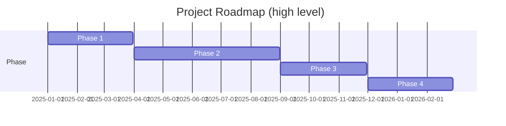

# 01 — Project & Roadmap

## Overview
High-level project charter, master plan, roadmaps and phase summaries. This index links to per-phase details and implementation records.

## Strategic Roadmap Summary
The Simple378 Fraud Detection platform is a sophisticated, production-ready application with advanced AI capabilities. The focus now shifts from basic implementation to **finesse optimization**, **user experience excellence**, and **ecosystem expansion**.

### Current State Assessment
- ✅ **Production Ready**: All Phases 1-5 complete with military-grade security
- ✅ **Advanced Features**: AI fraud detection, semantic search, relationship graphs implemented
- ✅ **Enterprise Infrastructure**: Monitoring, backup, audit trails, compliance logging
- ✅ **Desktop First**: Electron app with SQLCipher, secure IPC, multi-platform support

### Phase 6 Vision: Finesse & Excellence
Transform from an **excellent technical implementation** to a **world-class user experience** through sophisticated finesse enhancements across user experience, performance, intelligence, collaboration, and security.

**Key Gaps Identified:**
- Status documentation needs updating
- AI training pipeline requires automation
- Evidence services need integration
- UX polish for intelligent interactions
- Advanced search capabilities
- AI explainability improvements

For detailed strategic roadmap: [01_Project/strategic-roadmap.md](01_Project/strategic-roadmap.md)

## Fraud and Security Strategy
Focus on fraud detection mechanisms, typologies, and security planning for proactive investigation.

### Core Capabilities
- Fraud orchestration and pattern detection
- Typology analysis for various fraud schemes
- Security strategy implementation
- API security enhancements

### Key Components
- Multi-modal fraud detection
- Behavioral anomaly analysis
- Privacy-preserving computation
- Advanced threat modeling

For detailed fraud and security strategy: [01_Project/fraud-security-strategy.md](01_Project/fraud-security-strategy.md)

## Feature Management and Compliance
Comprehensive approach to feature flags, organization, and compliance frameworks.

### Feature Management
- Feature flag system implementation
- Feature organization and prioritization
- Compliance review frameworks
- Regulatory requirement alignment

### Compliance Frameworks
- Standards-based compliance
- Audit trail management
- Regulatory reporting
- Risk assessment procedures

For detailed feature management: [01_Project/feature-compliance.md](01_Project/feature-compliance.md)

## User Experience and UI Development
UI/UX design, loading states, and user journey guidelines for optimal user experience.

### UI/UX Enhancements
- Loading state implementations
- User journey mapping
- Interface optimization
- Accessibility improvements

### Development Focus
- Frontend loading states
- UI diagnostics and improvements
- User-centric design principles
- Performance optimization

For detailed UX/UI development: [01_Project/ux-ui-development.md](01_Project/ux-ui-development.md)

## Implementation Diagnostics and Onboarding
Current status assessment, readiness evaluation, and onboarding processes.

### Diagnostics Framework
- System health assessment
- Implementation gap analysis
- Readiness evaluation
- Diagnostic methodologies

### Onboarding Processes
- Legacy system diagnosis
- Onboarding workflows
- Implementation tracking
- Status monitoring

For detailed implementation diagnostics: [01_Project/implementation-diagnostics.md](01_Project/implementation-diagnostics.md)

## Next Phase Proposal
Production deployment track focusing on monitoring, automation, and resilience.

### Immediate Priorities
1. **Health & Monitoring Infrastructure**: Health check endpoints, APM setup, request ID middleware
2. **Environment & Configuration**: Environment variables, configuration validation
3. **Basic CI/CD**: GitHub Actions workflows, deployment automation

### Week 1 Implementation Plan
- Core infrastructure setup (health checks, monitoring)
- Configuration and testing environment
- Basic CI/CD pipeline establishment

### Success Metrics
- Uptime: 99.9%
- P95 Response Time: <200ms
- Error Rate: <0.1%
- Test Coverage: >80%
- Deployment Time: <10 minutes
- MTTR: <1 hour

For detailed next phase proposal: [01_Project/next-phase-proposal.md](01_Project/next-phase-proposal.md)

## AI Roadmap Strategy
Moving beyond reactive assistance to proactive investigation capabilities.

### Future AI Capabilities
- **Local RAG**: Retrieval-augmented generation for case history memory
- **Visual Reasoning**: Multimodal analysis of documents and images
- **Red Teaming**: Devil's advocate persona to challenge theories
- **Voice Commands**: Hands-free investigation control
- **Auto-Drafting**: Legal document generation with templates

### AI Evolution
| Feature | Current (Phase 4) | Future (Phase 5+) |
|---------|-------------------|-------------------|
| Scope | Current Page Context | Entire Case History |
| Input | Text Chat | Text, Voice, Images |
| Role | Helper | Partner / Red Teamer |
| Memory | Session Only | Permanent Vector Store |

For detailed AI roadmap: [01_Project/ai-roadmap-strategy.md](01_Project/ai-roadmap-strategy.md)

## TOC
- Master Plan & Strategy — [docs/project/master_plan.md](project/master_plan.md)
- Master TODO (summary) — [docs/project/master_todo.md](project/master_todo.md)
- Product Roadmap & Vision — [docs/project/roadmap.md](project/roadmap.md)
- Perfection Roadmap (full) — [docs/project/PERFECTION_ROADMAP.md](project/PERFECTION_ROADMAP.md)
- Implementation Record — [docs/project/IMPLEMENTATION_RECORD.md](project/IMPLEMENTATION_RECORD.md)
- Phases index — [docs/project/phases/](project/phases/)
- System Orchestration Framework — [docs/SYSTEM_ORCHESTRATION_FRAMEWORK.md](SYSTEM_ORCHESTRATION_FRAMEWORK.md)

## Visualization — Roadmap (simplified)

## How to Use
- Use the strategic roadmap for high-level direction and AI capabilities overview
- Review fraud and security strategy for investigation methodologies
- Refer to feature management for compliance and organizational guidance
- Check UX/UI development for user experience improvements
- Use implementation diagnostics for current status and onboarding
- Follow next phase proposal for deployment planning
- Explore AI roadmap for future capabilities

For detailed phase reports, follow links under `docs/project/phases/` or the archive.
