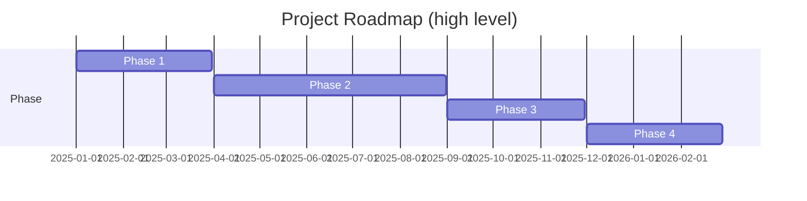

# 01 — Project & Roadmap

Overview
--------
High-level project charter, master plan, roadmaps and phase summaries. This index links to per-phase details and implementation records.

TOC
----
- Master Plan & Strategy — [docs/project/master_plan.md](project/master_plan.md)
- Master TODO (summary) — [docs/project/master_todo.md](project/master_todo.md)
- Product Roadmap & Vision — [docs/project/roadmap.md](project/roadmap.md)
- Perfection Roadmap (full) — [docs/project/PERFECTION_ROADMAP.md](project/PERFECTION_ROADMAP.md)
- Implementation Record — [docs/project/IMPLEMENTATION_RECORD.md](project/IMPLEMENTATION_RECORD.md)
- Phases index — [docs/project/phases/](project/phases/)
- System Orchestration Framework — [docs/SYSTEM_ORCHESTRATION_FRAMEWORK.md](SYSTEM_ORCHESTRATION_FRAMEWORK.md)

Visualization — Roadmap (simplified)
-----------------------------------

How to use
----------
- Use the master plan for strategic context and the Implementation Record for operational history.
- For detailed phase reports, follow links under `docs/project/phases/` or the archive.
