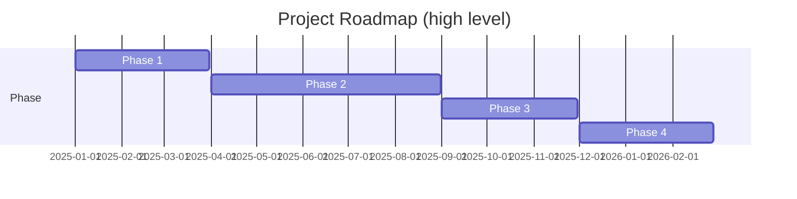

# 01 — Project & Roadmap

Overview
--------
High-level project charter, master plan, roadmaps and phase summaries. This index links to per-phase details and implementation records.

TOC
----
- Strategic Roadmap — [01_Project/02_Strategic_Roadmap.md](01_Project/02_Strategic_Roadmap.md)
- Project Overview — [01_Project/01_Project_Overview.md](01_Project/01_Project_Overview.md)
- Architecture Overview — [05_Architecture_and_Design/01_Architecture_Overview.md](../05_Architecture_and_Design/01_Architecture_Overview.md)
- Security Implementation — [03_Standards_and_Policies/01_Security_Policies.md](../03_Standards_and_Policies/01_Security_Policies.md)
- Performance Architecture — [05_Architecture_and_Design/02_Performance_Architecture.md](../05_Architecture_and_Design/02_Performance_Architecture.md)

Visualization — Roadmap (simplified)
-----------------------------------

How to use
----------
- Use the master plan for strategic context and the Implementation Record for operational history.
- For detailed phase reports, follow links under `docs/project/phases/` or the archive.
