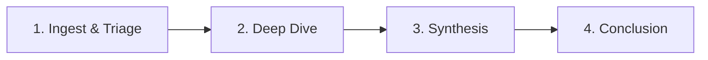

# User Experience and UI Development

## Smart Loading States Spike

**Feature ID:** `FE.UI.STATE-001`  
**Feature Name:** Smart Loading States & Skeleton Screens  
**Category:** User Experience Finesse  
**Priority:** 🔴 Critical (Q1 Quick Win #1)  
**Quarter:** Q1 2026  
**Estimated Effort:** 2-3 days

### Implementation Status (Updated 2025-12-10)
**Current Status:** 🟡 40% COMPLETE (In Progress)  
**Diagnostic Report:** Available in reports section

#### Completed Components
- Base `Skeleton` component with variants (text/rectangular/circular) ✅
- Generic `LoadingState` wrapper (spinner/skeleton/dots modes) ✅
- `InvestigationSkeleton` component (full implementation) ✅
- Partial Dashboard integration ✅

#### Remaining Work (60%)
- `SkeletonCard`, `SkeletonTable`, `SkeletonList`, `SkeletonAvatar` components
- `useLoadingState` hook with timeout/retry logic
- Page integrations: Cases, Evidence, Forensics, Reporting, Settings
- Comprehensive test suite (unit, integration, E2E)
- Accessibility audit with screen reader testing
- Storybook stories and documentation

## Loading States Diagnosis Summary & Update Instructions

**Date:** December 10, 2025  
**Status:** 🟡 40% IMPLEMENTED | Diagnosis & Update Instructions Complete  
**Owner:** Frontend Engineering Team

### Executive Summary
The `FE_UI_LOADING_STATES` spike has been comprehensively diagnosed. The good news: 40% of the work is already done with solid, production-ready components. The work ahead is straightforward component creation and integration with no technical blockers.

**Key Numbers:**
- ✅ 40% Complete (133 LOC implemented)
- ❌ 60% Remaining (220 LOC needed)
- ⏱️ 3-4 days to finish (from 2025-12-11)
- 🎯 Target Completion: Friday 2025-12-13 EOD

### Documentation Created
1. **Comprehensive Diagnosis Report** - Detailed analysis of each component, page-by-page integration status, implementation completion matrix, critical gaps identified
2. **Updated Spike Document** - Current status, remaining work, implementation instructions
3. **Implementation Instructions** - Step-by-step guide for completing the remaining 60%

## Implementation Status & Instructions

**Document Date:** December 10, 2025  
**Status:** Diagnosis Complete | Implementation 40% Done  
**Owner:** Frontend Engineering Team

### Quick Status Summary
| Aspect | Status | Details |
|--------|--------|---------|
| Overall Completion | 🟡 40% | 133 LOC done, 220 LOC remaining |
| Diagnostic Report | ✅ Complete | Comprehensive analysis available |
| Spike Status | 🔄 Updated | Current implementation status |
| Implementation Risk | 🟢 Low | No technical blockers; straightforward build-out |
| Time to Complete | ⏳ 3-4 days | From 2025-12-11 start date |

### What's Already Done (40%)
1. **`frontend/src/components/ui/Skeleton.tsx`** (38 LOC) ✅ - Base skeleton component with three variants, Tailwind styling, dark mode support, WCAG-compliant
2. **`frontend/src/components/LoadingState.tsx`** (45 LOC) ✅ - Generic loading state wrapper with spinner/skeleton/dots modes
3. **`InvestigationSkeleton`** component (full implementation) ✅
4. **Partial Dashboard integration** ✅

### What's Remaining (60%)
- Additional skeleton components (Card, Table, List, Avatar)
- `useLoadingState` hook with timeout/retry logic
- Page integrations across all major pages
- Comprehensive test suite
- Accessibility audit
- Storybook stories and documentation

## UX Metrics Baseline & Measurement Framework

**Purpose:** Establish current-state baselines for Phase 6 finesse enhancements  
**Goal:** Enable data-driven measurement of 50% improvement targets  
**Status:** Ready for implementation  
**Timeline:** 1 week data collection

### Overview

#### Why Baseline Metrics?
Before implementing Phase 6 finesse enhancements, we need to:
1. **Measure current state** — Understand where we are today
2. **Set improvement targets** — Define what "success" looks like
3. **Track progress** — Monitor improvements over time
4. **Validate ROI** — Prove that finesse enhancements deliver value

#### Success Criteria
Phase 6 aims for:
- **50% reduction** in time-to-insight for investigations
- **+0.3 points** (6% improvement) in user satisfaction (4.2 → 4.5 / 5.0)
- **<100ms** UI response time for all interactions
- **90%+** user adoption of advanced features

### Metrics Categories

#### 1. Performance Metrics
- **Page Load Time:** Time to interactive (TTI) for each page
- **UI Response Time:** Time for user interactions (button clicks, form submissions)
- **Bundle Size:** JavaScript/CSS bundle sizes and loading performance
- **Memory Usage:** Browser memory consumption during typical workflows

#### 2. User Experience Metrics
- **Task Completion Time:** Time to complete common investigation workflows
- **Error Rate:** Frequency of user errors and frustration points
- **Feature Adoption:** Percentage of users using advanced features
- **User Satisfaction:** NPS or satisfaction survey scores

#### 3. System Health Metrics
- **Error Rates:** JavaScript errors, API failures, network issues
- **Uptime:** System availability and reliability
- **Performance Degradation:** How system performs under load

## User Journey & The "Golden Path" to Summary

**Goal:** Guide the user from "Chaos" (Thousands of raw files) to "Clarity" (A court-ready report).  
**Problem:** Current designs show tools but not the process. Users need a map.

### The "Golden Path" Workflow
We define a rigid 4-Step Standard Operating Procedure (SOP) that guides every investigation.

#### Step 1: Ingest & Triage (The Filter)
**Action:** User uploads Raw Zip. AI Auto-tags "High Risk".  
**Page:** Dashboard (Alerts) -> Cases (Kanban: "Incoming").  
**Goal:** Decide: "Is this worth my time?" (Archive vs. Investigate).

#### Step 2: Deep Dive (The Analysis)
**Action:** Connecting the dots. Tracing funds.  
**Page:** Investigation (Graph) + Evidence (Lab).  
**Goal:** Find the "Smoking Gun".

#### Step 3: Synthesis (The Narrative)
**Action:** Pinning evidence to the timeline. Annotating nodes.  
**Page:** NEW: Investigation Notebook (Persistent scratchpad).  
**Goal:** Build the story.

#### Step 4: Conclusion (The Report)
**Action:** Export court-ready dossier.  
**Page:** Reporting (Wizard).  
**Goal:** Deliver actionable intelligence.

This comprehensive UX/UI development framework combines smart loading states, diagnostics, implementation guidance, metrics baseline, and user journey mapping to create exceptional user experiences.