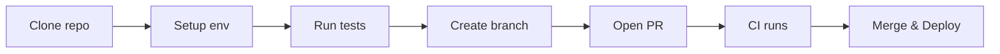

# 02 — Developer Guide

Overview
--------
Developer onboarding, coding standards, API pointers, testing and CI guidance. Use this page for quick developer tasks and links to detailed runbooks.

TOC
----
- Developer Quickstart & Setup — [02_Developer_Guide/general-guide.md](02_Developer_Guide/general-guide.md)
- API Reference — [02_Developer_Guide/api-versioning.md](02_Developer_Guide/api-versioning.md)
- Contributing & Coding Standards — [02_Developer_Guide/general-guide.md](02_Developer_Guide/general-guide.md)
- Testing & CI — [02_Developer_Guide/testing.md](02_Developer_Guide/testing.md)
- Frontend Standards & UI components — [02_Developer_Guide/general-guide.md](02_Developer_Guide/general-guide.md)

Visualization — Developer flow
------------------------------

How to use
----------
- Start with the quickstart, then follow the API and testing links for task-specific guidance.
