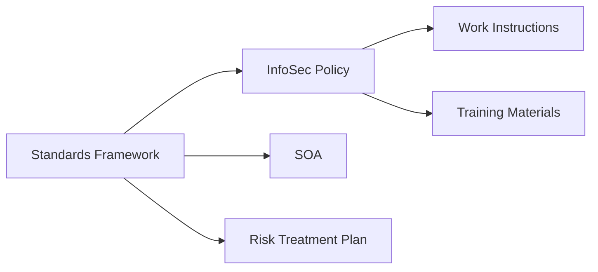

# 03 — Standards & Policies

Overview
--------
Canonical policies, SOA, risk treatment, incident response and training materials. Policy and audit texts are preserved verbatim under `docs/standards/`.

TOC
----
- Security Overview and Audits — [03_Standards_and_Policies/overview-audits.md](03_Standards_and_Policies/overview-audits.md)
- Authentication and API Security — [03_Standards_and_Policies/auth-api.md](03_Standards_and_Policies/auth-api.md)
- Incident Response and Production — [03_Standards_and_Policies/incident-production.md](03_Standards_and_Policies/incident-production.md)
- Project Completion and Testing — [03_Standards_and_Policies/completion-testing.md](03_Standards_and_Policies/completion-testing.md)
- Executive Summaries and Checklists — [03_Standards_and_Policies/summaries-checklists.md](03_Standards_and_Policies/summaries-checklists.md)

Visualization — Policy relationships
----------------------------------

Special note
------------
Policy and audit documents must be moved verbatim; do not summarise legal clauses.
