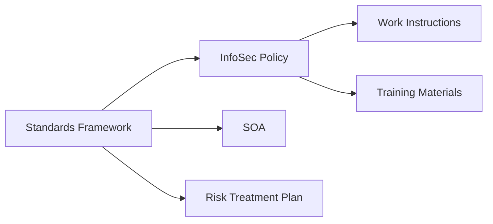

# 03 — Standards & Policies

Overview
--------
Canonical policies, SOA, risk treatment, incident response and training materials. Policy and audit texts are preserved verbatim under `docs/standards/`.

TOC
----
- Comprehensive Standards Framework — [docs/standards/comprehensive_standards_framework.md](standards/comprehensive_standards_framework.md)
- Information Security Policy — [docs/standards/policy/information_security_policy.md](standards/policy/information_security_policy.md)
- Statement of Applicability — [docs/standards/policy/statement_of_applicability.md](standards/policy/statement_of_applicability.md)
- Risk Treatment Plan — [docs/standards/policy/risk_treatment_plan.md](standards/policy/risk_treatment_plan.md)
- Incident Response Procedures — [docs/standards/procedures/security_incident_response.md](standards/procedures/security_incident_response.md)
- Work instructions & training — [docs/standards/work_instructions/](standards/work_instructions/) and [docs/standards/training/compliance_training_materials.md](standards/training/compliance_training_materials.md)

Visualization — Policy relationships
----------------------------------

Special note
------------
Policy and audit documents must be moved verbatim; do not summarise legal clauses.
