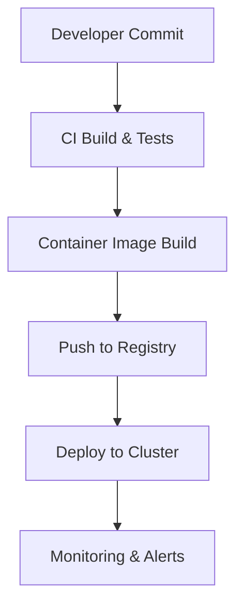

# 04 — Operations & Deployment

Overview
--------
Deployment checklists, CI/CD, containerization, orchestration and production readiness. Use this index before any rollout.

TOC
----
- Operations Overview — [04_Operations_and_Deployment/overview.md](04_Operations_and_Deployment/overview.md)
- Monitoring Operations — [04_Operations_and_Deployment/monitoring.md](04_Operations_and_Deployment/monitoring.md)
- Deployment Operations — [04_Operations_and_Deployment/deployment.md](04_Operations_and_Deployment/deployment.md)
- Maintenance Operations — [04_Operations_and_Deployment/maintenance.md](04_Operations_and_Deployment/maintenance.md)
- Troubleshooting Operations — [04_Operations_and_Deployment/troubleshooting.md](04_Operations_and_Deployment/troubleshooting.md)

Visualization — Deployment pipeline
-------------------------------

How to use
----------
- Follow the deployment checklist and CI docs; use the Kubernetes doc for production manifests.
