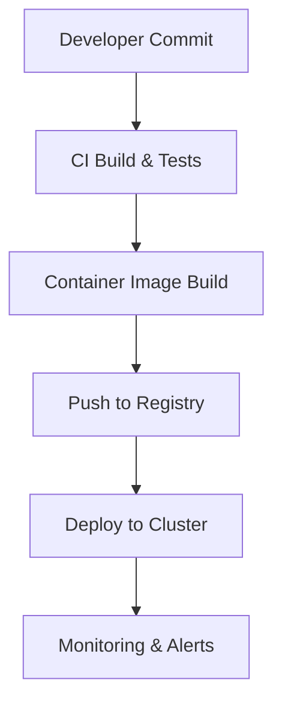

# 04 — Operations & Deployment

Overview
--------
Deployment checklists, CI/CD, containerization, orchestration and production readiness. Use this index before any rollout.

TOC
----
- Production deployment checklist — [docs/deployment/DEPLOYMENT_CHECKLIST.md](deployment/DEPLOYMENT_CHECKLIST.md)
- CI/CD pipelines — [docs/deployment/ci-cd.md](deployment/ci-cd.md)
- Docker & Compose — [docs/deployment/docker.md](deployment/docker.md)
- Kubernetes configuration — [docs/KUBERNETES_DEPLOYMENT.md](KUBERNETES_DEPLOYMENT.md)
- Scaling & performance — [docs/deployment/scaling.md](deployment/scaling.md)
- Desktop packaging & signing — [docs/deployment/desktop.md](deployment/desktop.md)
- GitHub secrets & CI configuration — [docs/GITHUB_SECRETS_SETUP.md](GITHUB_SECRETS_SETUP.md)

Visualization — Deployment pipeline
-------------------------------

How to use
----------
- Follow the deployment checklist and CI docs; use the Kubernetes doc for production manifests.
