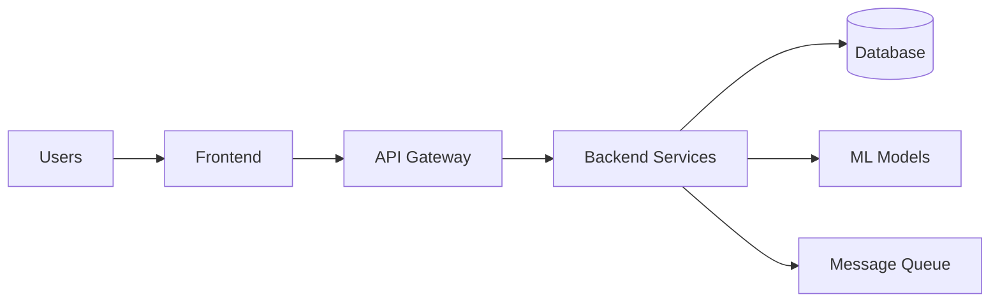

# 05 — Architecture & Design

Overview
--------
System-level architecture, C4 diagrams and full design specification. Use this index to locate diagrams and detailed design rationale.

TOC
----
- Deployment Planning — [05_Architecture_and_Design/planning.md](05_Architecture_and_Design/planning.md)
- Orchestration Setup — [05_Architecture_and_Design/orchestration.md](05_Architecture_and_Design/orchestration.md)
- Execution Steps — [05_Architecture_and_Design/execution.md](05_Architecture_and_Design/execution.md)
- Deployment Monitoring — [05_Architecture_and_Design/monitoring.md](05_Architecture_and_Design/monitoring.md)
- Post-Deployment Procedures — [05_Architecture_and_Design/post-deployment.md](05_Architecture_and_Design/post-deployment.md)

Visualization — High-level component map
--------------------------------------

How to use
----------
- Open the C4 diagrams first for a visual overview, then read the design spec for rationales and trade-offs.
