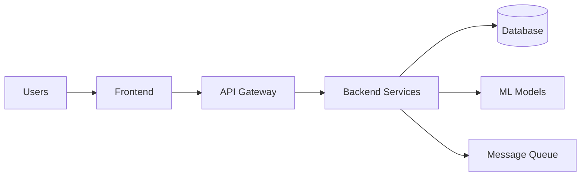

# 05 — Architecture & Design

Overview
--------
System-level architecture, C4 diagrams and full design specification. Use this index to locate diagrams and detailed design rationale.

TOC
----
- C4 diagrams — [docs/architecture/C4_DIAGRAMS.md](architecture/C4_DIAGRAMS.md)
- Full design specification — [docs/architecture/FULL_DESIGN_SPEC.md](architecture/FULL_DESIGN_SPEC.md)
- Plugin architecture migration plan — [docs/PLUGIN_ARCHITECTURE_MIGRATION_PLAN.md](PLUGIN_ARCHITECTURE_MIGRATION_PLAN.md)
- 10/10 Vision Architecture — [docs/architecture/VISION_10_10.md](architecture/VISION_10_10.md)
- Zenith Horizon (2027+) — [docs/architecture/ZENITH_VISION.md](architecture/ZENITH_VISION.md)
- System orchestration framework — [docs/SYSTEM_ORCHESTRATION_FRAMEWORK.md](SYSTEM_ORCHESTRATION_FRAMEWORK.md)

Visualization — High-level component map
--------------------------------------

How to use
----------
- Open the C4 diagrams first for a visual overview, then read the design spec for rationales and trade-offs.
