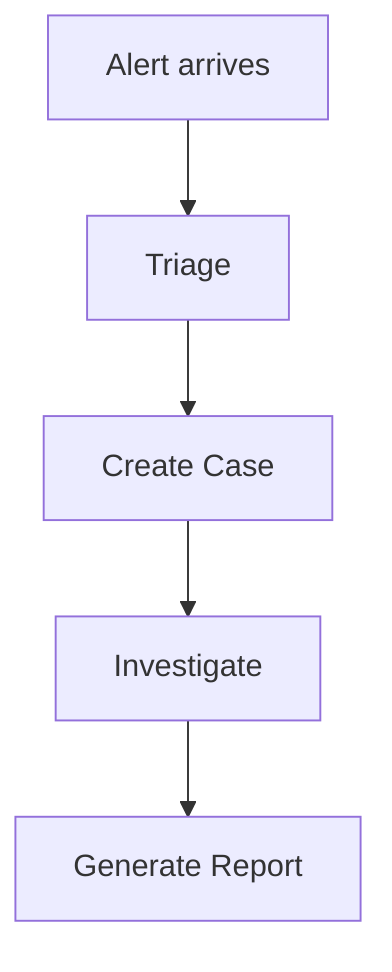

# 06 — User Guides

Overview
--------
User-facing manuals: getting started, workflows, tutorials, troubleshooting, and FAQ. Use this index to navigate end-user documentation and tutorials.

TOC
----
- Admin and Users Router — [06_User_Guides/admin-users.md](06_User_Guides/admin-users.md)
- AI and Services Router — [06_User_Guides/ai-services.md](06_User_Guides/ai-services.md)
- Cases and Evidence Router — [06_User_Guides/cases-evidence.md](06_User_Guides/cases-evidence.md)
- Reporting and Stats Router — [06_User_Guides/reporting-stats.md](06_User_Guides/reporting-stats.md)
- Reconciliation and Additional Services — [06_User_Guides/reconciliation-services.md](06_User_Guides/reconciliation-services.md)

Visualization — Typical user workflow
-----------------------------------

How to use
----------
- Follow the getting-started guide for first-time access; use tutorials for guided hands-on practice.
