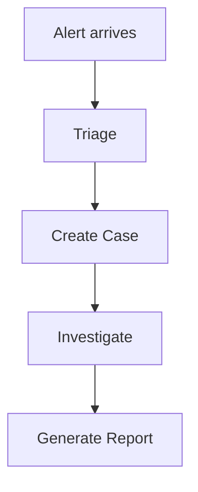

# 06 — User Guides

Overview
--------
User-facing manuals: getting started, workflows, tutorials, troubleshooting, and FAQ. Use this index to navigate end-user documentation and tutorials.

TOC
----
- Getting started — [docs/users/getting-started.md](users/getting-started.md)
- Tutorials — [docs/users/tutorials/first-case.md](users/tutorials/first-case.md), [docs/users/tutorials/fraud-analysis.md](users/tutorials/fraud-analysis.md)
- Investigation & case workflows — [docs/users/cases.md](users/cases.md)
- Troubleshooting & FAQ — [docs/users/troubleshooting.md](users/troubleshooting.md)

Visualization — Typical user workflow
-----------------------------------

How to use
----------
- Follow the getting-started guide for first-time access; use tutorials for guided hands-on practice.
