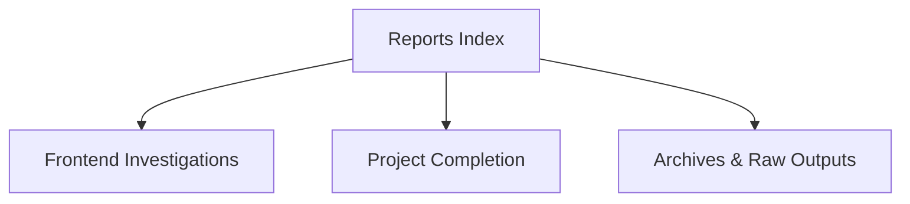

# 07 — Reports & Audits

Overview
--------
Consolidated diagnostics, investigation reports, completion summaries and audit outputs. Use this index for executive summaries and links to raw outputs in archives.

TOC
----
- Project Overview and Completion — [07_Reports/project-overview.md](07_Reports/project-overview.md)
- Comprehensive Diagnostics — [07_Reports/comprehensive-diagnostics.md](07_Reports/comprehensive-diagnostics.md)
- SSOT and Data Integrity — [07_Reports/ssot-integrity.md](07_Reports/ssot-integrity.md)
- Testing and Implementation Records — [07_Reports/testing-records.md](07_Reports/testing-records.md)
- Priority Assessments — [07_Reports/priority-assessments.md](07_Reports/priority-assessments.md)

Visualization — Reports hierarchy
-------------------------------

How to use
----------
- Use this index to find investigation narratives and link to raw diagnostic JSONs in archives for reproducibility.
