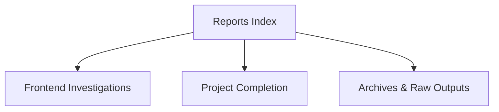

# 07 — Reports & Audits

Overview
--------
Consolidated diagnostics, investigation reports, completion summaries and audit outputs. Use this index for executive summaries and links to raw outputs in archives.

TOC
----
- Frontend investigations — [docs/FRONTEND_INVESTIGATION_REPORT.md](FRONTEND_INVESTIGATION_REPORT.md), [docs/FRONTEND_INVESTIGATION_REPORT_UPDATED.md](FRONTEND_INVESTIGATION_REPORT_UPDATED.md)
- Frontend progress & completion — [docs/FRONTEND_IMPROVEMENTS_PROGRESS.md](FRONTEND_IMPROVEMENTS_PROGRESS.md), [docs/FRONTEND_COMPLETION_SUMMARY.md](FRONTEND_COMPLETION_SUMMARY.md)
- Project completion — [docs/project/PROJECT_COMPLETION_FINAL.md](project/PROJECT_COMPLETION_FINAL.md)
- Consolidated archives — [docs/internal/archives/reports/consolidated_reports.md](internal/archives/reports/consolidated_reports.md)

Visualization — Reports hierarchy
-------------------------------

How to use
----------
- Use this index to find investigation narratives and link to raw diagnostic JSONs in archives for reproducibility.
