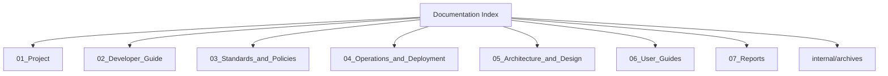

# Documentation Index

Overview
--------
This is the single entry point for project documentation. Each link below goes to a concise topical index that summarizes detailed files and links to full documents stored one layer down.

TOC
----
- Project & Roadmap — [docs/01_Project.md](01_Project.md)
- Developer Guide — [docs/02_Developer_Guide.md](02_Developer_Guide.md)
- Standards & Policies — [docs/03_Standards_and_Policies.md](03_Standards_and_Policies.md)
- Operations & Deployment — [docs/04_Operations_and_Deployment.md](04_Operations_and_Deployment.md)
- Architecture & Design — [docs/05_Architecture_and_Design.md](05_Architecture_and_Design.md)
- User Guides — [docs/06_User_Guides.md](06_User_Guides.md)
- Reports & Audits — [docs/07_Reports.md](07_Reports.md)
- Internal archives — [docs/internal/archives/README.md](internal/archives/README.md)

Quick navigation
----------------
Use the topical index pages for summaries and direct links to full documents. Archived snapshots and raw outputs live under `docs/internal/archives/`.

Visualization
-------------

How to use
----------
- Click a topical index, read the short overview, then follow links to the detailed file you need.
- For legal, compliance, or audit text, consult files under `docs/standards/` (preserved verbatim).

Maintainers: update this file when index files change.
# Documentation Index

> **Last Updated:** 2025-12-16
> **🎯 NEW:** Documentation consolidated and optimized! Diamond Standard Framework added.

## Overview

This index provides a comprehensive guide to all documentation for the 378x492 Fraud Detection platform. Documentation is now organized by **audience** for easier navigation and better user experience.

---

## 🎯 **New Audience-Centric Organization**

**Documentation reorganized for optimal user experience!**

### **What's New:**
- 👥 **[Users](users/)** - End-user guides and tutorials
- 🛠️ **[Developers](developers/)** - Technical implementation docs
  - **Note:** The `backend/app/routers/onboarding.py` module has been deprecated. Onboarding functionality has been consolidated into `backend/app/routers/identity.py`.
- ⚙️ **[Administrators](administrators/)** - System administration guides
- 📊 **[API](api/)** - Complete API documentation
- 🚀 **[Deployment](deployment/)** - DevOps and operations
- 📋 **[Project](project/)** - Project management and planning
- 🔧 **[Internal](internal/)** - Archives and internal tools

### **Migration Status:**
- ✅ **Structure Created:** New audience-centric directories established
- ✅ **Content Preserved:** All existing documentation accessible via symlinks
- ✅ **Navigation Updated:** Main index reflects new organization
- 🔄 **Content Enhancement:** User-friendly overviews being added

**[📖 View Reorganization Details](internal/tools/DOCUMENTATION_SYSTEM_REDESIGN_PROPOSAL.md)**

---

## 👥 **Users** - End-User Documentation

**For fraud investigators, analysts, and platform users**

| Section | Description | Key Documents |
|---------|-------------|---------------|
| **Getting Started** | Platform introduction and basic usage | [Quick Start](users/getting-started.md), [FAQ](users/faq.md) |
| **Core Workflows** | Main user workflows and processes | [Project Selection](users/project_selection.md), [Dashboard](users/dashboard.md), [Cases](users/cases.md), [Investigation](users/investigation.md) |
| **Specialized Tasks** | Evidence handling, reporting, settings | [Ingestion](users/ingestion.md), [Network Analysis](users/network-analysis.md), [Settings](users/settings.md) |
| **Interactive Tutorials** | Step-by-step walkthroughs | [First Case](users/tutorials/first-case.md), [Fraud Analysis](users/tutorials/fraud-analysis.md) |

## 🛠️ **Developers** - Technical Documentation

**For developers and technical contributors**

| Section | Description | Key Documents |
|---------|-------------|---------------|
| **Setup & Architecture** | Development environment and system design | [Setup](developers/setup.md), [Architecture](developers/architecture.md) |
| **Frontend Development** | UI components and page implementations | [UI Components](developers/ui-components.md) |
| **API Integration** | API usage and integration patterns | |
| **Testing & Quality** | Testing strategies and code quality | |

## ⚙️ **Administrators** - System Administration

**For system administrators and operations teams**

| Section | Description | Key Documents |
|---------|-------------|---------------|
| **Installation & Setup** | System deployment and initial configuration | [Installation](administrators/installation.md) |
| **User Management** | User administration and permissions | |
| **Monitoring & Maintenance** | System monitoring and maintenance procedures | |
| **Operations** | Backup, recovery, and incident response | |

## 📊 **API** - Complete API Documentation

**For API integrations and technical integrations**

| Section | Description | Key Documents |
|---------|-------------|---------------|
| **API Overview** | Authentication and general API information | [Documentation](api/README.md) |
| **Endpoints** | Organized by functional area | |
| **SDK & Examples** | SDK libraries and integration examples | |

## 🚀 **Deployment** - DevOps & Operations

**For deployment engineers and DevOps teams**

| Section | Description | Key Documents |
|---------|-------------|---------------|
| **Container Deployment** | Docker and containerization | [Docker](deployment/docker.md) |
| **CI/CD** | Continuous integration and deployment | |
| **Production Operations** | Production monitoring and maintenance | |

## 📋 **Project** - Project Management

**For project managers and stakeholders**

| Section | Description | Key Documents |
|---------|-------------|---------------|
| **Planning & Roadmap** | Project vision and roadmap | [Roadmap](project/roadmap.md) |
| **Implementation Phases** | Development phases and milestones (Inc. new Phase 14) | [Perfection Impl. Log](project/PERFECTION_ROADMAP_IMPLEMENTATION_LOG.md) |
| **Metrics & Success** | Success metrics and KPIs | |

## 🔧 **Internal** - Archives & Tools

**For internal development and archived content**

| Section | Description | Key Documents |
|---------|-------------|---------------|
| **System Status** | Current certified system health & status | [**Diamond Standard Certification**](reports/DIAMOND_STANDARD_CERTIFICATION_FINAL.md), [**System Orchestration Framework**](SYSTEM_ORCHESTRATION_FRAMEWORK.md) |
| **Diagnostics & Analysis** | Unified system analysis and reporting | [Consolidated System Status](reports/CONSOLIDATED_SYSTEM_STATUS_2025_12_16.md), [Diagnostic Reports Archive](reports/archived/) |
| **Research & Archives** | Research, experiments, and archived docs | [Project Completion Archive](internal/archives/PROJECT_COMPLETION_ARCHIVE.md), [System Diagnostics Framework](internal/archives/SYSTEM_DIAGNOSTICS_FRAMEWORK.md), [Strategic Roadmap](internal/archives/STRATEGIC_ROADMAP.md), [API Security Guide](internal/archives/API_SECURITY_GUIDE.md), [Testing Framework](internal/archives/TESTING_FRAMEWORK.md), [Production Operations](internal/archives/PRODUCTION_OPERATIONS.md), [Feature Development Archive](internal/archives/FEATURE_DEVELOPMENT_ARCHIVE.md) |

---

## 🏆 **Diamond Standard Certification** - System Health Overview

**Current Status:** ✅ **Diamond Standard Certified (9.2/10)**  
**Certification Date:** December 16, 2025  
**Next Review:** December 16, 2026  

**Key Metrics:**
- **Architecture Quality:** 9.5/10 ✅
- **Security Implementation:** 9.8/10 ✅  
- **Frontend Excellence:** 9.0/10 ✅
- **Backend Robustness:** 9.2/10 ✅
- **Overall System Score:** 9.2/10 🏆

**📊 [View Full Certification Details](reports/DIAMOND_STANDARD_CERTIFICATION_FINAL.md)**

---

## 🔄 **System Orchestration Framework** - Unified Management

The platform now features a comprehensive orchestration framework that synchronizes all system dimensions with real-time scoring and investigation capabilities.

**Core Features:**
- **8-Dimensional Analysis** with weighted scoring
- **Real-time Synchronization** across components  
- **Automated Investigation** with root cause analysis
- **Implementation Alignment** with quality gates

**🚀 [View Orchestration Framework](SYSTEM_ORCHESTRATION_FRAMEWORK.md)**

---

**📖 For detailed technical documentation, explore each section above. Documentation has been consolidated for optimal clarity and maintainability while preserving all critical information.**

- **Documentation Lead:** docs@team.local
- **Technical Writers:** writers@team.local
- **Repository:** https://github.com/organization/378x492
