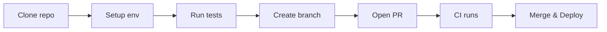

# 02 — Developer Guide

Overview
--------
Developer onboarding, coding standards, API pointers, testing and CI guidance. Use this page for quick developer tasks and links to detailed runbooks.

TOC
----
- Developer Quickstart & Setup — [docs/developers/README.md](developers/README.md)
- API Reference — [docs/api/README.md](api/README.md) and [docs/API_DOCUMENTATION.md](API_DOCUMENTATION.md)
- Contributing & Coding Standards — [docs/developers/contributing.md](archive/versions/2025/q4/development/contributing.md)
- Testing & CI — [docs/developers/TESTING_DOCUMENTATION.md](build/testing/TESTING_DOCUMENTATION.md) and [docs/deployment/ci-cd.md](archive/2025/q4/operations/ci-cd.md)
- Frontend Standards & UI components — [docs/developers/FRONTEND_STANDARDS.md](developers/FRONTEND_STANDARDS.md)

Visualization — Developer flow
------------------------------

How to use
----------
- Start with the quickstart, then follow the API and testing links for task-specific guidance.
