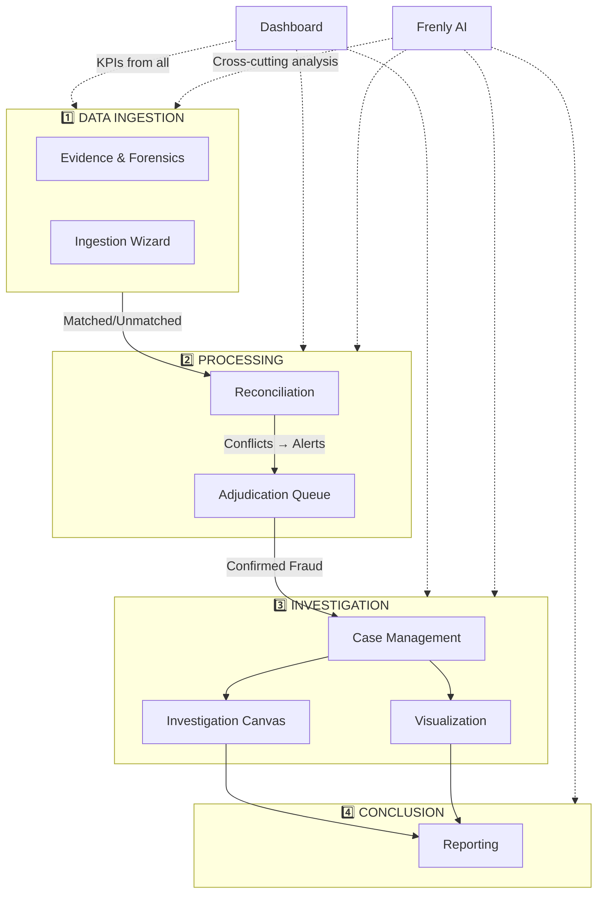
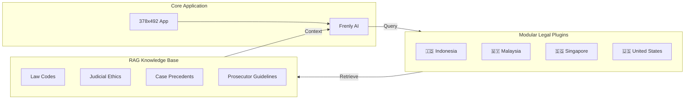

# Cross-Page Integration & Evidentiary Framework

> **Goal:** Document how all feature pages interact to prove fraud, embezzlement, and criminal intent (mens rea).
> **Philosophy:** "From Raw Data to Court-Ready Evidence."

---

## 📊 Fraud Investigation Workflow



### Visual Injection Strategy

Every summary and explanation should include:
- **Inline Charts**: Sparklines in text for trends (e.g., "Transaction volume ↗ 34%")
- **Annotated Screenshots**: Evidence with AI highlights
- **Timeline Strips**: Compact event timelines in cards
- **Risk Heatmaps**: Color-coded severity indicators
- **Entity Mini-Graphs**: Relationship snippets showing key connections

---

## 🔗 Cross-Page Integration Points

| From Page | To Page | Data Flow | Visual Injection |
|-----------|---------|-----------|------------------|
| **Ingestion** → Reconciliation | Parsed transactions | Progress bar, file icons |
| **Reconciliation** → Adjudication | Conflict alerts | Match score badges |
| **Adjudication** → Cases | Confirmed frauds | Risk donut chart |
| **Cases** → Investigation | Case entities | Mini entity graph |
| **Investigation** → Reporting | Evidence + findings | Annotated screenshots |
| **Visualization** → Reporting | Charts + anomalies | Static chart embeds |
| **Evidence** → All Pages | Documents + forensics | Thumbnail previews |
| **AI Assistant** → All Pages | Insights, scores | Confidence badges |

---

## 🕸️ Entity Link Analysis

### Detection Methods

| Pattern | Method | Visual |
|---------|--------|--------|
| **Circular Flow** | Cycle detection in transaction graph | Animated loop highlight |
| **Hub & Spoke** | Degree centrality analysis | Node size scaling |
| **Shell Company** | Sequential invoice detection | Scatter plot |
| **Shared Attributes** | Entity overlap matrix | Venn diagram |
| **Money Layering** | Path length analysis | Sankey diagram |
| **Kickback Loop** | Bi-directional flow detection | Dual-arrow edges |
| **Nominee Structures** | Beneficial owner tracing | Tree expansion |
| **Structuring** | Threshold proximity histogram | Cliff chart |

### Link Analysis Algorithms

```typescript
interface LinkAnalysis {
  shortestPath(from: string, to: string): Path[];
  communityDetection(): Community[];
  pageRank(): Record<string, number>;
  betweennessCentrality(): Record<string, number>;
  stronglyConnectedComponents(): Component[];
}
```

---

## ⚖️ Proving Fraud: Evidentiary Chain

### 1. Actus Reus (The Act)

| Evidence Type | Source Page | Detection Method | Visual |
|---------------|-------------|------------------|--------|
| Transaction records | Ingestion/Reconciliation | OCR + matching | Transaction table |
| Bank statements | Evidence | PDF parsing | Annotated PDF |
| Missing funds | Visualization (Waterfall) | Gap calculation | Waterfall chart |
| Duplicate payments | Reconciliation | Conflict detection | Side-by-side diff |
| Forged documents | Evidence (ELA) | Error level analysis | ELA heatmap |
| Altered signatures | Evidence | Signature matching | Overlay comparison |
| Ghost vendors | Reconciliation | Entity matching | Link graph |
| Inflated invoices | Visualization | Peer benchmark | Scatter plot outliers |
| Asset conversion | Investigation | Entity tracing | Sankey flow |
| Unauthorized withdrawals | Reconciliation | Balance verification | Timeline + gaps |

### 2. Mens Rea (Criminal Intent)

| Pattern | Detection Method | Source Page | Intent Indicator |
|---------|------------------|-------------|------------------|
| Structuring | Amount histogram | Visualization | Deliberate threshold avoidance |
| Off-hours transactions | Temporal heatmap | Visualization | Concealment timing |
| Sequential invoices | Invoice# scatter | Evidence | Shell company exclusivity |
| Cover-up edits | Metadata timeline | Evidence | Post-discovery modification |
| Pattern of concealment | Timeline analysis | Investigation | Systematic hiding |
| Round-number bias | Benford's Law deviation | Ingestion | Fabricated data |
| Backdating | Temporal gap analysis | Reconciliation | False timeline creation |
| False documentation | ELA + OCR mismatch | Evidence | Document fabrication |
| Email trail | Keyword extraction | Evidence | Premeditation language |
| Communication patterns | Network analysis | Investigation | Conspiracy coordination |
| Access pattern anomalies | Audit log | Settings | Unauthorized entry timing |
| System manipulation | Audit log | Settings | Log gap or deletion attempts |

### 3. Chain of Custody

| Requirement | Implementation | Status |
|-------------|----------------|--------|
| Evidence hashing (SHA-256) | Reporting ZIP export | ✅ |
| Audit trail logging | Settings/Audit Log | ✅ |
| Timestamp immutability | DB triggers | ✅ |
| User action attribution | All pages | ✅ |
| Forensic packaging | Self-contained ZIP | ✅ |
| Digital signatures | Report sign-off | 🚧 |

---

## 🤖 4-Persona AI Comments Integration

Each page should include contextual AI insights from all 4 personas:

### Persona Integration Points

| Page | 👮‍♀️ Frenly AI | ⚖️ Legal | 📊 Forensic | 🔍 Investigator |
|------|-------------|----------|-------------|-----------------|
| **Dashboard** | Daily summary | Compliance alerts | Statistical trends | Priority triage |
| **Reconciliation** | Match suggestions | Audit requirements | Variance analysis | Pattern flags |
| **Adjudication** | Decision support | Evidence standards | Probability scores | Similar cases |
| **Investigation** | Path suggestions | Admissibility notes | Link analysis | Interview tips |
| **Reporting** | Narrative draft | Legal formatting | Calculation verify | Finding summary |

### Example Multi-Persona Output

```json
{
  "finding": "Wire transfer to offshore account",
  "personas": {
    "frenly_ai": "This matches 3 previous embezzlement cases.",
    "legal_advisor": "Document beneficial ownership chain for court.",
    "forensic_accountant": "Amount represents 47% of monthly payroll.",
    "investigator": "Check if recipient shares address with employee."
  }
}
```

---

## 🌍 Localization & Legal RAG Framework

### Translation Requirements

| Component | Localization Need |
|-----------|-------------------|
| **UI Labels** | Standard i18n (react-intl) |
| **Legal Terms** | Domain-specific glossary per jurisdiction |
| **Report Templates** | Country-specific formatting |
| **Currency/Dates** | Regional formats |
| **AI Prompts** | Native language processing |

### RAG Legal Plugin Architecture



### Plugin Structure per Jurisdiction

```text
plugins/legal/
├── indonesia/
│   ├── laws/           # KUHP, UU Tipikor, etc.
│   ├── ethics/         # Kode Etik Hakim
│   ├── guidance/       # Jaksa Agung Guidelines
│   └── glossary.json   # Legal term translations
├── malaysia/
│   ├── laws/           # Penal Code, AMLA
│   └── ...
└── shared/
    ├── fatf/           # FATF recommendations
    └── basel/          # Basel III compliance
```

### RAG Integration for AI

```typescript
interface LegalRAGPlugin {
  jurisdiction: string;
  
  // Query relevant laws
  getApplicableLaws(fraudType: string): LawReference[];
  
  // Get sentencing guidelines
  getSentencingGuidelines(offense: string): Guideline[];
  
  // Translate legal terms
  translateTerms(terms: string[], lang: string): Record<string, string>;
  
  // Get court precedents
  getSimilarCases(pattern: string): CasePrecedent[];
}
```

---

## 📋 Plain-Language Reporting

### Readability Requirements

Reports must be understandable by non-experts:

| Audience | Reading Level | Formatting |
|----------|---------------|------------|
| **Executives** | Grade 10 | Executive summary, bullet points |
| **Court/Legal** | Technical + Plain | Dual-column (legal + explanation) |
| **General Public** | Grade 8 | Infographics, analogies |
| **Regulators** | Technical | Structured forms, appendices |

### AI-Assisted Simplification

```typescript
interface ReportSimplification {
  // Convert technical to plain language
  simplify(text: string, targetGrade: number): string;
  
  // Add visual explanations
  addInfographic(finding: Finding): InfographicConfig;
  
  // Generate analogies
  createAnalogy(concept: string): string;
}
```

---

## 📁 Complete Feature Documentation Inventory

### Feature Documents (12 files)

| Document | Size | Status | Missing Sections |
|----------|------|--------|------------------|
| [adjudication.md](./features/adjudication.md) | 12.8 KB | 🔶 Needs Update | Accessibility, Responsive, Performance, Testing |
| [ai-assistant.md](./features/ai-assistant.md) | 60.7 KB | ✅ Complete | — |
| [authentication.md](./features/authentication.md) | 7.9 KB | 🔶 Check | Verify structure |
| [cases.md](./features/cases.md) | 34.2 KB | ✅ Complete | — |
| [dashboard.md](./features/dashboard.md) | 13.6 KB | 🔶 Needs Update | Testing |
| [desktop-experience.md](./features/desktop-experience.md) | 21.2 KB | 🔶 Check | Verify structure |
| [error-handling.md](./features/error-handling.md) | 15.6 KB | 🔶 Check | Verify structure |
| [evidence-and-forensics.md](./features/evidence-and-forensics.md) | 29.1 KB | ✅ Complete | — |
| [reconciliation.md](./features/reconciliation.md) | 36.3 KB | 🔶 Needs Update | Keyboard, Accessibility, Responsive, Performance, Testing |
| [reporting.md](./features/reporting.md) | 39.0 KB | ✅ Complete | — |
| [settings.md](./features/settings.md) | 10.6 KB | 🔶 Needs Update | Performance, Testing |
| [visualization.md](./features/visualization.md) | 53.2 KB | 🔶 Needs Update | Testing |

### Mockup Assets (5 files)

| Asset | Size | Associated Doc |
|-------|------|----------------|
| [cases_mockup.png](./features/../assets/cases_mockup.png) | 629 KB | `cases.md` |
| [dashboard_mockup.png](./features/../assets/dashboard_mockup.png) | 719 KB | `dashboard.md` |
| [evidence_mockup.png](./features/../assets/evidence_mockup.png) | 604 KB | `evidence-and-forensics.md` |
| [investigation_mockup.png](./features/../assets/investigation_mockup.png) | 779 KB | `investigation.md` (missing) |
| [settings_mockup.png](./features/../assets/settings_mockup.png) | 455 KB | `settings.md` |

### Missing Mockups (To Generate)

| Page | Needed Asset |
|------|--------------|
| Adjudication | `adjudication_mockup.png` |
| Reporting | `reporting_mockup.png` |
| Reconciliation | `reconciliation_mockup.png` |
| Visualization | `visualization_mockup.png` |
| AI Assistant | `ai_assistant_mockup.png` |

---

## 🏗️ Canonical Document Structure

All feature docs should follow this structure:

```text
# [Feature Title]: "[Code Name]"
> Goal: ...
> Philosophy: ...


---

## 🎯 Fraud Detection Value (Table)
## 1. Consolidated Feature Set (Table)
## 2. Layout Structure (Diagram)
## 3. Implementation Strategy (Subsections)
## 4. Code Relationships (Components, API, Data Flow)
## 5. Proposed Enhancements (Table)
## 6. User Scenarios (Numbered list)

---

# Technical Specification

**Route:** `/feature`
**Component:** `src/pages/Feature.tsx`
**Status:** ✅ Implemented

## 🏗 Architecture References
## Layout (Wireframe)
## Components (Table)
## Features (Detailed)
## API Endpoints (Table + Code blocks)
## Keyboard Shortcuts (Table)
## Accessibility (Table)
## Responsive Behavior (Table)
## Performance Optimizations (List)
## Testing Strategy (Unit/E2E)
## Related Files (Code tree)
## 🔮 Future Enhancements (Phases)
```

---

## 🔮 Future Enhancements

### Phase 6: Localization
- [ ] Implement i18n framework with react-intl
- [ ] Create jurisdiction-specific legal plugins
- [ ] Develop RAG knowledge base for Indonesian laws
- [ ] Add multi-language AI prompt templates

### Phase 7: Advanced Entity Analysis
- [ ] Implement community detection algorithms
- [ ] Add beneficial ownership tracing
- [ ] Develop nominee structure detection
- [ ] Create cross-border transaction tracking

---

## 📚 Related Planning Docs

| Document | Purpose |
|----------|---------|
| [FEATURE_ORGANIZATION.md](./FEATURE_ORGANIZATION.md) | Feature distribution proposal |
| [MASTER_ROADMAP.md](./MASTER_ROADMAP.md) | Implementation phases |
| [master_plan.md](../../master_plan.md) | Project strategy |
| [master_todo.md](../../master_todo.md) | Task checklist |

