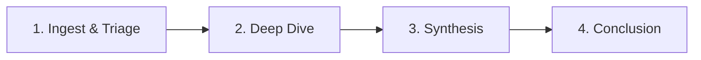

# 08. Strategy: User Journey & The "Golden Path" to Summary

> **Goal:** Guide the user from "Chaos" (Thousands of raw files) to "Clarity" (A court-ready report).
> **Problem:** Current designs show *tools* (`Graph`, `Evidence`) but not the *process*. Users need a map.

## 1. The "Golden Path" Workflow

We define a rigid 4-Step Standard Operating Procedure (SOP) that guides every investigation.

### Step 1: Ingest & Triage (The Filter)
*   **Action:** User uploads Raw Zip. AI Auto-tags "High Risk".
*   **Page:** `01_DASHBOARD` (Alerts) -> `02_CASES` (Kanban: "Incoming").
*   **Goal:** Decide: "Is this worth my time?" (Archive vs. Investigate).

### Step 2: Deep Dive (The Analysis)
*   **Action:** Connecting the dots. Tracing funds.
*   **Page:** `03_INVESTIGATION` (Graph) + `04_EVIDENCE` (Lab).
*   **Goal:** Find the "Smoking Gun".

### Step 3: Synthesis (The Narrative)
*   **Action:** Pinning evidence to the timeline. Annotating nodes.
*   **Page:** **NEW: `Investigation Notebook`** (Persistent scratchpad).
*   **Goal:** Build the story.

### Step 4: Conclusion (The Output)
*   **Action:** Final recommendation and Report Generation.
*   **Page:** **NEW: `Case Conclusion Wizard`**.
*   **Goal:** Generate the "Interactive Dossier".

---

## 2. New Page: The "Case Conclusion Wizard"

**Why:** Investigators often struggle to write the final S.A.R. (Suspicious Activity Report). They have the data but no structure.
**What:** A step-by-step wizard that *forces* a complete summary.

### Comparison: Old vs. New
| Feature | Old (No Page) | New (Wizard) |
| :--- | :--- | :--- |
| **Structure** | Blank Word Doc | Structured Steps (Subject, Method, Evidence, Conclusion) |
| **Data** | Copy-Paste screenshots | Auto-imported "Pinned" Graphs and Docs |
| **Validation** | None | "Missing Key Evidence" warning |

### Wizard Steps:
1.  **Confirm Subjects:** List of all flagged Nodes. "Are these the bad guys?"
2.  **Select Key Evidence:** Checklist of all "Pinned" documents. "Include these in export?"
3.  **Draft Narrative:** Text area with AI auto-complete based on the Evidence.
4.  **Recommendation:** Radio button: "File SAR", "Close - False Positive", "Refer to Legal".

---

## 3. New Page: The "Interactive Digital Dossier" (The Summary)

**Why:** A PDF is dead. A "Premium" app should deliver a dynamic HTML bundle that can be handed to a prosecutor/manager.
**What:** A read-only, self-contained interactive report.

### Visual Layout
*   **Header:** "Case #1234: Operation Red - CONFIDENTIAL".
*   **Executive Summary:** 1-paragraph AI-generated summary.
*   **Key Entities Card:** Photos/Logos of the main suspects.
*   **The Interactive Timeline:** A scrollable history of the *crime* (not the investigation).
*   **Evidence Vault:** Clickable thumbnails of the "Smoking Gun" documents (redacted automatically).

**Magic Feature:** The **"Provenance Link"**. Clicking a sentence in the Summary ("Subject A transferred $50k...") opens the specific Bank Statement PDF page that proves it.

---

## 4. Visualizing the Journey (UI Elements)

### 4.1 The "Case Progress Bar"
A persistent breadcrumb at the top of the interface:
`[ 1. Triage ] > [ 2. Investigation ] > [ 3. Drafting ] > [ 4. Closed ]`
*   **Function:** Clicking "Drafting" takes you to the Conclusion Wizard.

### 4.2 The "Notebook" Sidebar
A retractable right-hand sidebar available on *every* page.
*   **Interaction:** User sees something interesting on the Graph? Drag it to the Notebook.
*   **Function:** This collects the "Ingredients" for the Final Report automatically.

---

## 5. Summary of New Interactions

| User Want | New Interaction | Value |
| :--- | :--- | :--- |
| "Help me not get lost" | **Case Progress Bar** | Always shows where you are in the lifecycle. |
| "Help me write the report"| **Notebook Sidebar** | Collects evidence *as you go*, so you don't hunt for it later. |
| "Show me the summary" | **Interactive Dossier** | A "Wow" factor deliverable that proves the app's value. |
