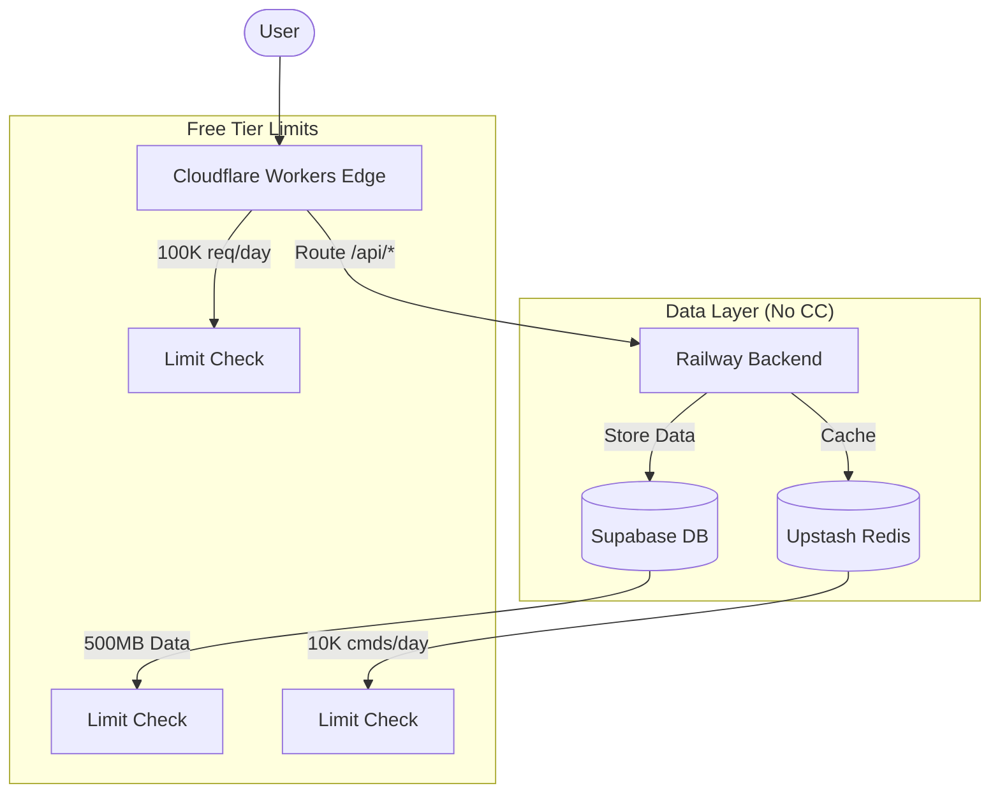

# 🎉 Initial Deployment Complete - Free Tier (No CC)

Your Zenith Platform is now live using a **100% Free, No Credit Card** architecture!

## 🌐 Live Endpoints

| Service | URL | Status |
|---------|-----|--------

- [x] **Frontend:** `https://zenith-frontend-v1.pages.dev` (Cloudflare Pages)
- [x] **Gateway:** `https://zenith-gateway.zenith-platform-v1.workers.dev` (Cloudflare Workers)
- [x] **Backend:** `https://zenith-fraud-detection-backend-production.up.railway.app` (Railway)
- [x] **Workflows:** `zenith-workflows` (Cloudflare Workflows Beta)| 🟢 Live |
| **Database** | Neon DB (`neondb`) | 🟢 Live |
| **Cache** | Upstash (`zenith-cache`) | 🟢 Live |

---

## 🏗️ Architecture



## 💰 Cost Analysis

| Provider | Service | Free Tier Limit | Your Cost |
|----------|---------|-----------------|-----------|
| **Cloudflare** | Edge Gateway | 100,000 req/day | **$0** |
| **Railway** | Backend Compute | $5.00 credit/mo | **$0** (trial) |
| **Supabase** | PostgreSQL | 500MB storage | **$0** |
| **Upstash** | Redis Cache | 10,000 cmd/day | **$0** |
| **TOTAL** | | | **$0.00/mo** |

---

## 🔑 Your Credentials

Stored in `.credentials.env` (local only):

```bash
# Cloudflare Edge
GATEWAY_URL=https://zenith-gateway.zenith-platform-v1.workers.dev

# Database
DATABASE_URL=postgresql://postgres...

# Cache
REDIS_URL=rediss://default...
```

## 🚀 Next Steps

1. **Update Frontend:** Point your frontend `.env` to the new Gateway URL.

   ```bash
   NEXT_PUBLIC_API_URL=https://zenith-gateway.zenith-platform-v1.workers.dev
   ```

2. **Monitor Limits:**
   - Check **Supabase Dashboard** for storage usage.
   - Check **Cloudflare Dashboard** for request counts.
   - Check **Railway Dashboard** for credit usage ($5/mo).

3. **Scale (Optional):**
   - If you need more backend power later, you can add **Render** (free with sleep) or **Koyeb** (free) to split the load.

---

**Deployment Successful!** 🚀
