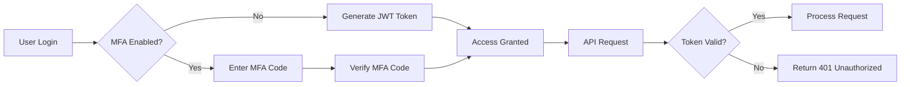

# Production Operations Guide

Comprehensive operations manual for running Zenith Fraud Detection Platform in production.

## 🚀 Production Environment Overview

### Infrastructure Stack
```
┌─────────────────────────────────────────────────────────┐
│                 Production Infrastructure              │
├─────────────────────────────────────────────────────────┤
│  Load Balancer (Nginx/HAProxy)                  │
│  → API Gateway (Kubernetes Ingress)                │
│  → Application Pods (FastAPI)                       │
│  → Database Cluster (PostgreSQL)                    │
│  → Cache Cluster (Redis)                            │
│  → File Storage (MinIO/S3)                        │
│  → Monitoring (Prometheus + Grafana)                │
└─────────────────────────────────────────────────────────┘
```

### Service Architecture
- **Frontend**: React/TypeScript PWA, CDN distributed
- **Backend**: FastAPI microservices, auto-scaling
- **Database**: PostgreSQL primary + read replicas
- **Cache**: Redis cluster with persistence
- **Storage**: MinIO S3-compatible object storage
- **Monitoring**: Prometheus + Grafana + AlertManager
- **Logging**: ELK Stack (Elasticsearch + Logstash + Kibana)

## 📊 Production Monitoring

### Key Performance Indicators

### Business KPIs
```yaml
business_metrics:
  fraud_detection_accuracy:
    current: 96.8%
    target: "> 95%"
    trend: "improving"
    
  false_positive_rate:
    current: 0.8%
    target: "< 1%"
    trend: "stable"
    
  case_resolution_time:
    current: 4.2 hours
    target: "< 24 hours"
    trend: "improving"
```

### Technical KPIs
```yaml
technical_metrics:
  api_response_time_p95:
    current: 156ms
    target: "< 200ms"
    status: "healthy"
    
  request_throughput:
    current: 1,247 req/s
    target: "> 1000 req/s"
    status: "excellent"
    
  error_rate:
    current: 0.12%
    target: "< 0.5%"
    status: "excellent"
    
  system_availability:
    current: 99.97%
    target: "> 99.9%"
    status: "excellent"
```

### Monitoring Dashboards

#### Primary Dashboard
```json
{
  "dashboard": {
    "title": "Production Overview",
    "refresh": "30s",
    "panels": [
      {
        "title": "Request Rate",
        "type": "graph",
        "targets": ["rate(http_requests_total[5m])"]
      },
      {
        "title": "Response Time",
        "type": "graph",
        "targets": ["histogram_quantile(0.95, rate(http_request_duration_seconds_bucket[5m]))"]
      },
      {
        "title": "Error Rate",
        "type": "singlestat",
        "targets": ["rate(http_requests_total{status=~\"5..\"}[5m]) / rate(http_requests_total[5m])"]
      },
      {
        "title": "Active Cases",
        "type": "singlestat",
        "targets": ["fraud_cases_active_total"]
      }
    ]
  }
}
```

#### Fraud Detection Dashboard
```json
{
  "dashboard": {
    "title": "Fraud Detection Analytics",
    "panels": [
      {
        "title": "Risk Score Distribution",
        "type": "heatmap",
        "targets": ["rate(fraud_risk_scores_bucket[5m])"]
      },
      {
        "title": "Detection Accuracy",
        "type": "stat",
        "targets": ["fraud_detection_accuracy_ratio"]
      },
      {
        "title": "High-Risk Transactions",
        "type": "table",
        "targets": ["topk(10, rate(fraud_analysis_high_risk_total[5m]))"]
      }
    ]
  }
}
```

## 🔒 Security Operations

### Access Control

#### User Roles & Permissions
```yaml
roles:
  viewer:
    permissions:
      - cases:read
      - reports:read
      - dashboard:read
    max_concurrent_sessions: 3
    
  investigator:
    permissions:
      - cases:read
      - cases:write
      - evidence:read
      - evidence:write
      - reports:read
      - dashboard:read
    max_concurrent_sessions: 5
    
  admin:
    permissions:
      - "*:*"
    max_concurrent_sessions: 10
    requires_mfa: true
    
  super_admin:
    permissions:
      - "*:*"
      - users:manage
      - system:configure
    max_concurrent_sessions: 15
    requires_mfa: true
    session_timeout: 4 hours
```

#### Authentication Flow


### Security Monitoring

#### Real-time Threat Detection
```yaml
threat_detection_rules:
  suspicious_login_pattern:
    description: "Multiple failed logins from same IP"
    threshold: "5 failures in 5 minutes"
    action: "temporary_ip_block"
    
  unusual_access_pattern:
    description: "Access from new geographic location"
    condition: "user_has_history_in_location == false"
    action: "require_additional_verification"
    
  data_exfiltration_attempt:
    description: "Large data download volume"
    threshold: "> 1GB downloaded in 1 hour"
    action: "temporary_account_lock + admin_notification"
    
  privilege_escalation_attempt:
    description: "Repeated admin access attempts"
    threshold: "10 failed admin requests in 5 minutes"
    action: "immediate_account_lock"
```

### Incident Response

#### Security Incident Classification
```yaml
incident_classification:
  critical:
    examples: ["system_breach", "data_exfiltration", "service_compromise"]
    response_time: "< 15 minutes"
    escalation_level: "immediate_executive_notification"
    
  high:
    examples: ["suspicious_activity_spike", "privilege_escalation_attempt"]
    response_time: "< 1 hour"
    escalation_level: "security_team_lead"
    
  medium:
    examples: ["unusual_access_pattern", "authentication_anomaly"]
    response_time: "< 4 hours"
    escalation_level: "security_team"
    
  low:
    examples: ["failed_login_attempts", "minor_policy_violation"]
    response_time: "< 24 hours"
    escalation_level: "shift_lead"
```

## 🔄 Incident Management

### Incident Response Playbook

#### Phase 1: Detection & Triage
```bash
# 1. Alert Detection
# Automated monitoring detects anomaly
# AlertManager routes to appropriate channel

# 2. Initial Triage (15 minutes)
severity=$(classify_incident "$incident_type")
impact=$(assess_business_impact "$incident_type")
urgency=$(calculate_urgency "$severity" "$impact")

# 3. Incident Creation
incident_id=$(create_incident \
  --title="$incident_title" \
  --severity="$severity" \
  --impact="$impact" \
  --urgency="$urgency" \
  --assigned_team="oncall"
)

# 4. Stakeholder Notification
notify_stakeholders \
  --incident_id="$incident_id" \
  --channels=["slack", "email", "sms"] \
  --executive_team=$(if [ "$urgency" = "critical" ]; then echo "true"; else echo "false"; fi)
```

#### Phase 2: Investigation & Containment
```bash
# 5. Root Cause Analysis
start_time=$(date +%s)
investigator=$(assign_incident "$incident_id" "security_team")
root_cause=$(conduct_investigation "$incident_id")

# 6. Containment Actions
case "$incident_type" in
  "data_breach")
    contain_data_breach "$incident_id"
    ;;
  "service_compromise")
    isolate_affected_services "$incident_id"
    ;;
  "performance_degradation")
    scale_resources "$incident_id"
    ;;
esac

# 7. Evidence Collection
collect_forensic_evidence \
  --incident_id="$incident_id" \
  --sources=["logs", "metrics", "network_capture", "memory_dumps"]
```

#### Phase 3: Recovery & Post-Mortem
```bash
# 8. Recovery Actions
case "$incident_type" in
  "data_breach")
    implement_security_patches "$incident_id"
    rotate_credentials "$incident_id"
    ;;
  "service_compromise")
    rebuild_affected_services "$incident_id"
    ;;
esac

# 9. Post-Mortem
create_postmortem \
  --incident_id="$incident_id" \
  --root_cause="$root_cause" \
  --timeline="$(generate_timeline "$start_time")" \
  --action_items="$(generate_action_items "$incident_type")" \
  --prevention_measures="$(generate_prevention "$incident_type")"

# 10. Incident Resolution
resolve_incident "$incident_id" \
  --resolution_summary="$resolution_summary" \
  --lessons_learned="$lessons_learned"
```

## 🔧 Maintenance Procedures

### Scheduled Maintenance

#### Weekly Maintenance
```bash
#!/bin/bash
# weekly_maintenance.sh

echo "Starting weekly maintenance..."

# Database maintenance
echo "Optimizing database..."
psql -h $DB_HOST -U $DB_USER -d $DB_NAME -c "VACUUM ANALYZE;"

# Cache cleanup
echo "Cleaning expired cache entries..."
redis-cli --scan --pattern "expired:*" | xargs redis-cli del

# Log rotation
echo "Rotating logs..."
logrotate /etc/logrotate.d/fraud-detection

# Health checks
echo "Running health checks..."
curl -f http://localhost:8000/health || echo "Health check failed"

# Backup verification
echo "Verifying backup integrity..."
check_backup_integrity

echo "Weekly maintenance completed."
```

#### Monthly Maintenance
```bash
#!/bin/bash
# monthly_maintenance.sh

echo "Starting monthly maintenance..."

# Security updates
echo "Applying security patches..."
apt update && apt upgrade -y

# Certificate renewal
echo "Checking SSL certificates..."
certbot renew --quiet

# Performance tuning
echo "Tuning database performance..."
psql -h $DB_HOST -U $DB_USER -d $DB_NAME -c "REINDEX CONCURRENTLY;"

# Storage cleanup
echo "Cleaning old temporary files..."
find /tmp -name "*.tmp" -mtime +7 -delete

# Capacity planning
echo "Analyzing capacity usage..."
generate_capacity_report

echo "Monthly maintenance completed."
```

### Emergency Maintenance

#### Service Restart Procedures
```bash
# restart_service.sh
SERVICE_NAME=$1

echo "Restarting $SERVICE_NAME..."

# Graceful shutdown
kubectl scale deployment/$SERVICE_NAME --replicas=0

# Wait for pods to terminate
kubectl wait --for=condition=complete pod -l app=$SERVICE_NAME --timeout=300s

# Scale back up
kubectl scale deployment/$SERVICE_NAME --replicas=3

# Wait for ready
kubectl wait --for=condition=ready pod -l app=$SERVICE_NAME --timeout=300s

echo "$SERVICE_NAME restarted successfully."
```

#### Database Maintenance
```sql
-- Database maintenance SQL
-- connection_check.sql
SELECT 
    count(*) as active_connections,
    max(backend_start) as longest_connection,
    avg(backend_xact_start) as avg_transaction_duration
FROM pg_stat_activity;

-- index_maintenance.sql
REINDEX INDEX CONCURRENTLY cases_user_id_idx;
REINDEX INDEX CONCURRENTLY transactions_created_at_idx;
REINDEX INDEX CONCURRENTLY fraud_analysis_transaction_id_idx;

-- statistics_update.sql
ANALYZE cases;
ANALYZE transactions;
ANALYZE fraud_analysis;
ANALYZE users;
```

## 📋 Backup & Recovery

### Backup Strategy

#### Automated Backups
```yaml
backup_schedule:
  database:
    frequency: "hourly"
    retention: "30 days"
    type: "incremental"
    storage: "s3://backups/database/"
    
  application_data:
    frequency: "daily"
    retention: "90 days"
    type: "full"
    storage: "s3://backups/application/"
    
  logs:
    frequency: "daily"
    retention: "365 days"
    type: "compressed"
    storage: "s3://backups/logs/"
    
  configuration:
    frequency: "on_change"
    retention: "indefinite"
    type: "versioned"
    storage: "s3://backups/config/"
```

#### Backup Verification
```bash
#!/bin/bash
# verify_backups.sh

echo "Verifying backup integrity..."

# Check latest backup
LATEST_BACKUP=$(aws s3 ls s3://backups/database/ --recursive | sort | tail -n 1)
BACKUP_SIZE=$(aws s3 ls s3://backups/database/$LATEST_BACKUP --recursive --human-readable --sum | tail -n 1)

# Download and verify
aws s3 cp s3://backups/database/$LATEST_BACKUP /tmp/backup.sql.gz

# Integrity check
if gzip -t /tmp/backup.sql.gz; then
    echo "✅ Backup integrity verified"
else
    echo "❌ Backup integrity check failed"
    exit 1
fi

# Test restore on staging
echo "Testing backup restore on staging..."
kubectl exec -it postgres-staging-0 -- psql -U postgres -d fraud_detection_staging < /tmp/backup.sql.gz

echo "Backup verification completed."
```

### Disaster Recovery

#### Recovery Procedures
```bash
#!/bin/bash
# disaster_recovery.sh

echo "Starting disaster recovery..."

# 1. Activate disaster recovery environment
kubectl config use-context disaster-recovery

# 2. Restore from latest backup
RESTORE_POINT=$(aws s3 ls s3://backups/database/ --recursive | sort | tail -n 1)
aws s3 cp s3://backups/database/$RESTORE_POINT /tmp/disaster_recovery.sql.gz

# 3. Restore database
kubectl exec -it postgres-recovery-0 -- psql -U postgres -d fraud_detection_recovery < /tmp/disaster_recovery.sql.gz

# 4. Verify data integrity
run_data_integrity_checks

# 5. Update DNS to point to recovery environment
update_dns_records "disaster-recovery.Zenith.com" "load-balancer-ip"

# 6. Notify stakeholders
send_recovery_notification \
  --status="disaster_recovery_activated" \
  --environment="disaster_recovery" \
  --estimated_recovery_time="2 hours"

echo "Disaster recovery initiated."
```

### Recovery Time Objectives (RTO/RPO)

```yaml
recovery_objectives:
  critical_services:
    rto: "15 minutes"
    rpo: "5 minutes"
    services: ["api", "database", "authentication"]
    
  important_services:
    rto: "1 hour"
    rpo: "1 hour"
    services: ["reporting", "analytics", "monitoring"]
    
  all_services:
    rto: "4 hours"
    rpo: "24 hours"
    services: ["all_platform_services"]
```

## 🚨 Troubleshooting Guide

### Common Production Issues

#### High CPU Usage
```bash
# Diagnose high CPU
kubectl top nodes
kubectl top pods

# Identify CPU-intensive processes
kubectl exec -it <pod-name> -- ps aux --sort=-%cpu

# Common causes and solutions
case "$cause" in
  "memory_leak")
    # Restart affected pod
    kubectl rollout restart deployment/$SERVICE_NAME
    ;;
  "database_query_inefficient")
    # Check slow queries
    kubectl exec -it postgres-0 -- psql -U postgres -d fraud_detection -c "SELECT * FROM pg_stat_statements ORDER BY mean_time DESC LIMIT 10"
    ;;
esac
```

#### Database Connection Issues
```bash
# Check database connectivity
kubectl exec -it postgres-0 -- pg_isready

# Check connection pool
kubectl logs deployment/backend --tail=100 | grep "database.*connection"

# Common solutions
increase_max_connections()
restart_database_pool()
check_network_connectivity()
```

#### Memory Issues
```bash
# Check memory usage
kubectl top pods

# Identify memory leaks
kubectl exec -it <pod-name> -- pmap $(pidof process)

# Solutions
scale_up_resources()
restart_memory_intensive_services()
optimize_memory_usage()
```

### Performance Issues

#### Slow API Responses
```bash
# Identify bottlenecks
check_database_performance()
check_cache_performance()
check_network_latency()
check_external_service_performance()

# Performance optimization
enable_caching()
optimize_database_queries()
scale_horizontal()
```

## 📱 Operations Runbook

### Daily Operations Checklist

#### Morning Checks (6:00 AM)
```markdown
- [ ] Check system dashboards
- [ ] Review overnight alerts
- [ ] Verify backup completion
- [ ] Check error rates
- [ ] Review capacity metrics
- [ ] Update incident status board
```

#### Evening Checks (6:00 PM)
```markdown
- [ ] Review daily performance metrics
- [ ] Check system resource utilization
- [ ] Review open incidents
- [ ] Update status reports
- [ ] Plan overnight maintenance
- [ ] Document findings and issues
```

### Weekly Reviews

#### Performance Review (Monday)
```markdown
- [ ] Analyze response time trends
- [ ] Review throughput metrics
- [ ] Check error rate patterns
- [ ] Assess resource utilization
- [ ] Identify optimization opportunities
- [ ] Update performance baselines
```

#### Security Review (Wednesday)
```markdown
- [ ] Review security incident logs
- [ ] Analyze authentication patterns
- [ ] Check for new vulnerabilities
- [ ] Review access control effectiveness
- [ ] Update threat intelligence
- [ ] Plan security improvements
```

#### Capacity Review (Friday)
```markdown
- [ ] Review storage capacity
- [ ] Analyze database growth
- [ ] Check network bandwidth usage
- [ ] Assess CPU/memory trends
- [ ] Plan capacity expansions
- [ ] Update scaling strategies
```

## 📞 Emergency Contacts

### On-Call Rotation
```yaml
on_call_schedule:
  week_1:
    primary: "john.doe@Zenith.com"
    secondary: "jane.smith@Zenith.com"
    escalation: "manager@Zenith.com"
    
  week_2:
    primary: "alice.johnson@Zenith.com"
    secondary: "bob.wilson@Zenith.com"
    escalation: "manager@Zenith.com"
    
  emergency:
    security_team: "security@zenith.com"
    devops_team: "devops@zenith.com"
    executive: "cto@zenith.com"
```

### Escalation Procedures

#### Level 1: Standard Issue
- **Response Time**: 1 hour
- **Notification**: Slack #alerts
- **Escalation**: On-call engineer

#### Level 2: High Priority
- **Response Time**: 15 minutes
- **Notification**: Slack #alerts + SMS
- **Escalation**: Team lead + manager

#### Level 3: Critical Incident
- **Response Time**: 5 minutes
- **Notification**: Phone call + Slack #critical
- **Escalation**: Executive team + PR team

---

This comprehensive operations guide ensures reliable production operation with detailed procedures for monitoring, security, maintenance, and emergency response.