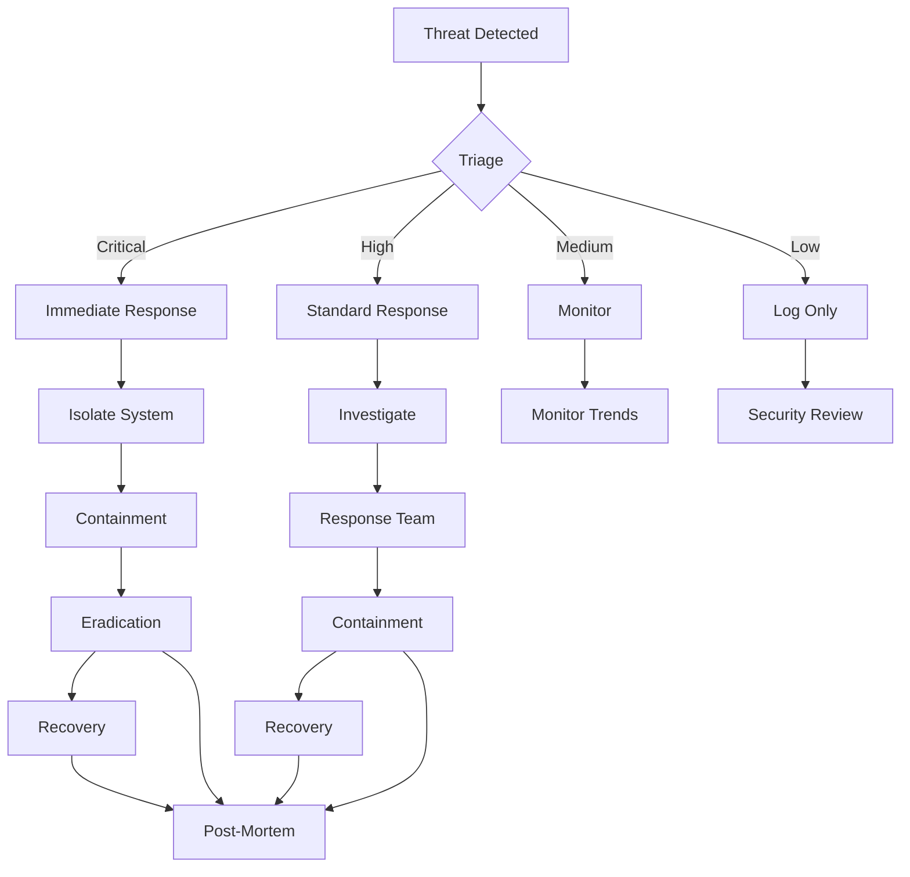

# Security Operations Guide

Comprehensive security operations for Zenith Fraud Detection Platform in production.

## 🔒 Security Architecture Overview

### Defense-in-Depth Strategy
```
┌─────────────────────────────────────────────────┐
│                Security Layers              │
├─────────────────────────────────────────────────┤
│  Network Security (Perimeter)              │
│  → Application Security (Application)       │
│  → Data Security (Core)                   │
│  → Infrastructure Security (Foundation)       │
│  → Monitoring & Response (Operations)        │
└─────────────────────────────────────────────────┘
```

### Security Controls Framework
- **Prevention**: Proactive security measures
- **Detection**: Real-time threat identification
- **Response**: Incident response and recovery
- **Recovery**: Business continuity and restoration

## 🛡️ Network Security

### Perimeter Defense

#### Firewall Configuration
```yaml
# firewall-rules.yml
network_security:
  inbound_rules:
    - port: 443
      protocol: TCP
      source: 0.0.0.0/0
      action: ACCEPT
      description: "HTTPS access"
      
    - port: 80
      protocol: TCP
      source: 0.0.0.0/0
      action: REDIRECT
      target: 443
      description: "HTTP to HTTPS redirect"
      
    - port: 22
      protocol: TCP
      source: 10.0.0.0/8
      action: ACCEPT
      description: "SSH from internal network"
      
    - port: 22
      protocol: TCP
      source: 0.0.0.0/0
      action: DROP
      description: "Block external SSH"
  
  outbound_rules:
    - destination: 0.0.0.0/0
      action: ACCEPT
      description: "Allow outbound traffic"
      
    - destination: known_malicious_ips
      action: DROP
      description: "Block known malicious IPs"
```

#### DDoS Protection
```yaml
# ddos-protection.yml
ddos_mitigation:
  rate_limiting:
    - endpoint: "/api/*"
      requests_per_second: 1000
      burst: 5000
      action: "throttle"
      
    - endpoint: "/auth/login"
      requests_per_second: 10
      burst: 50
      action: "temporary_block"
      
  ip_reputation:
    provider: "crowdsec"
    action: "challenge"
    block_threshold: 50
      
  geographic_blocking:
    blocked_countries: ["CN", "RU", "KP", "IR"]
    exceptions: ["whitelisted_ips"]
```

#### SSL/TLS Configuration
```nginx
# ssl-configuration.conf
server {
    listen 443 ssl http2;
    server_name api.zenith.com;
    
    # Modern SSL configuration
    ssl_certificate /etc/ssl/certs/api.zenith.com.crt;
    ssl_certificate_key /etc/ssl/private/api.zenith.com.key;
    ssl_protocols TLSv1.2 TLSv1.3;
    ssl_ciphers ECDHE-ECDSA-AES256-GCM-SHA384:ECDHE-RSA-AES256-GCM-SHA384;
    ssl_prefer_server_ciphers off;
    
    # Security headers
    add_header Strict-Transport-Security "max-age=31536000; includeSubDomains; preload";
    add_header X-Frame-Options DENY;
    add_header X-Content-Type-Options nosniff;
    add_header X-XSS-Protection "1; mode=block";
    add_header Referrer-Policy "strict-origin-when-cross-origin";
    add_header Content-Security-Policy "default-src 'self'; script-src 'self' 'unsafe-inline'; style-src 'self' 'unsafe-inline'";
    
    # SSL session cache
    ssl_session_cache shared:SSL:10m;
    ssl_session_timeout 10m;
}
```

## 🔐 Application Security

### Authentication & Authorization

#### JWT Implementation
```python
# jwt_security.py
import jwt
import time
from datetime import datetime, timedelta
from typing import Dict, Optional, Any

class JWTSecurityManager:
    def __init__(self, secret_key: str, algorithm: str = "HS256"):
        self.secret_key = secret_key
        self.algorithm = algorithm
        
        # Token configuration
        self.access_token_expire = timedelta(hours=1)
        self.refresh_token_expire = timedelta(days=30)
        
    def generate_tokens(self, user_data: Dict[str, Any]) -> Dict[str, str]:
        """Generate access and refresh tokens"""
        now = datetime.utcnow()
        
        access_token = jwt.encode({
            'sub': user_data['user_id'],
            'email': user_data['email'],
            'roles': user_data['roles'],
            'iat': now,
            'exp': now + self.access_token_expire,
            'type': 'access'
        }, self.secret_key, algorithm=self.algorithm)
        
        refresh_token = jwt.encode({
            'sub': user_data['user_id'],
            'iat': now,
            'exp': now + self.refresh_token_expire,
            'type': 'refresh'
        }, self.secret_key, algorithm=self.algorithm)
        
        return {
            'access_token': access_token,
            'refresh_token': refresh_token,
            'token_type': 'Bearer',
            'expires_in': int(self.access_token_expire.total_seconds())
        }
    
    def verify_token(self, token: str) -> Optional[Dict[str, Any]]:
        """Verify and decode JWT token"""
        try:
            payload = jwt.decode(token, self.secret_key, algorithms=[self.algorithm])
            return payload
        except jwt.ExpiredSignatureError:
            return None
        except jwt.InvalidTokenError:
            return None
```

#### Multi-Factor Authentication (MFA)
```python
# mfa_service.py
import pyotp
import qrcode
from typing import Dict, Any

class MFAService:
    def __init__(self):
        self.totp_cache = {}
        
    def generate_mfa_secret(self, user_id: str) -> str:
        """Generate TOTP secret for user"""
        secret = pyotp.random_base32()
        self.totp_cache[user_id] = secret
        return secret
    
    def generate_qr_code(self, secret: str) -> bytes:
        """Generate QR code for MFA setup"""
        totp_uri = pyotp.totp.TOTP(secret).provisioning_uri(
            name="Zenith Fraud Detection",
            issuer_name="Zenith"
        )
        return qrcode.make(totp_uri)
    
    def verify_mfa_token(self, user_id: str, token: str) -> bool:
        """Verify MFA token"""
        if user_id not in self.totp_cache:
            return False
            
        totp = pyotp.TOTP(self.totp_cache[user_id])
        return totp.verify(token, valid_window=1)
    
    def generate_backup_codes(self, user_id: str) -> list[str]:
        """Generate backup codes for MFA recovery"""
        codes = [str(random.randint(100000, 999999)) for _ in range(8)]
        self.backup_codes_cache[user_id] = codes
        return codes
```

#### Role-Based Access Control (RBAC)
```python
# rbac_service.py
from enum import Enum
from typing import List, Dict, Set

class UserRole(Enum):
    VIEWER = "viewer"
    INVESTIGATOR = "investigator"
    ADMIN = "admin"
    SUPER_ADMIN = "super_admin"

class Permission(Enum):
    READ_CASES = "cases:read"
    WRITE_CASES = "cases:write"
    DELETE_CASES = "cases:delete"
    READ_USERS = "users:read"
    MANAGE_USERS = "users:manage"
    SYSTEM_CONFIG = "system:config"
    AUDIT_LOGS = "audit:read"

ROLE_PERMISSIONS = {
    UserRole.VIEWER: {
        Permission.READ_CASES,
        Permission.AUDIT_LOGS
    },
    UserRole.INVESTIGATOR: {
        Permission.READ_CASES,
        Permission.WRITE_CASES,
        Permission.AUDIT_LOGS
    },
    UserRole.ADMIN: {
        Permission.READ_CASES,
        Permission.WRITE_CASES,
        Permission.DELETE_CASES,
        Permission.READ_USERS,
        Permission.SYSTEM_CONFIG,
        Permission.AUDIT_LOGS
    },
    UserRole.SUPER_ADMIN: {
        # All permissions
    }
}

class RBACService:
    def __init__(self):
        self.user_roles = {}
        
    def assign_role(self, user_id: str, role: UserRole):
        """Assign role to user"""
        self.user_roles[user_id] = role
        
    def has_permission(self, user_id: str, permission: Permission) -> bool:
        """Check if user has specific permission"""
        user_role = self.user_roles.get(user_id, UserRole.VIEWER)
        return permission in ROLE_PERMISSIONS.get(user_role, set())
        
    def check_access(self, user_id: str, resource: str, action: str) -> bool:
        """Check access to specific resource and action"""
        permission_map = {
            ("case", "read"): Permission.READ_CASES,
            ("case", "write"): Permission.WRITE_CASES,
            ("case", "delete"): Permission.DELETE_CASES,
            ("user", "read"): Permission.READ_USERS,
            ("user", "manage"): Permission.MANAGE_USERS,
        }
        
        required_permission = permission_map.get((resource, action))
        return self.has_permission(user_id, required_permission)
```

## 🗄️ Data Security

### Encryption at Rest
```python
# encryption_service.py
from cryptography.fernet import Fernet
from cryptography.hazmat.primitives import hashes
from cryptography.hazmat.primitives.kdf.pbkdf2 import PBKDF2HMAC
import base64
import os

class DataEncryptionService:
    def __init__(self):
        self.key_derivation_salt = os.environ.get('ENCRYPTION_SALT', 'default_salt')
        
    def derive_key(self, password: str, salt: bytes) -> bytes:
        """Derive encryption key from password"""
        kdf = PBKDF2HMAC(
            algorithm=hashes.SHA256(),
            length=32,
            salt=salt,
            iterations=100000,
        )
        return kdf.derive(password.encode())
    
    def encrypt_sensitive_data(self, data: str, encryption_key: bytes) -> Dict[str, Any]:
        """Encrypt sensitive data"""
        f = Fernet(encryption_key)
        encrypted_data = f.encrypt(data.encode())
        
        return {
            'encrypted_data': base64.b64encode(encrypted_data).decode(),
            'encryption_method': 'AES-256-CBC',
            'key_id': 'current_key_version'
        }
    
    def decrypt_sensitive_data(self, encrypted_data: str, encryption_key: bytes) -> str:
        """Decrypt sensitive data"""
        f = Fernet(encryption_key)
        decoded_data = base64.b64decode(encrypted_data.encode())
        decrypted_data = f.decrypt(decoded_data)
        return decrypted_data.decode()
```

### Database Security
```sql
-- database_security.sql
-- Row Level Security
CREATE POLICY fraud_case_policy ON fraud_cases AS
FOR SELECT
USING (user_id = current_user_id())
WITH CHECK (true);

ALTER TABLE fraud_cases ENABLE ROW LEVEL SECURITY;

-- Column Level Encryption
CREATE EXTENSION IF NOT EXISTS pgcrypto;

-- Encrypt sensitive columns
ALTER TABLE fraud_cases 
ADD COLUMN ssn_encrypted bytea;

UPDATE fraud_cases 
SET ssn_encrypted = pgp_sym_encrypt(ssn, current_setting('encryption_key'));

-- Audit trigger
CREATE OR REPLACE FUNCTION audit_fraud_case_modification()
RETURNS TRIGGER AS $$
BEGIN
    IF TG_OP != 'SELECT' THEN
        INSERT INTO audit_log (
            table_name,
            operation,
            user_id,
            old_values,
            new_values,
            timestamp
        ) VALUES (
            TG_TABLE_NAME,
            TG_OP,
            current_user_id(),
            OLD,
            NEW,
            NOW()
        );
    END IF;
    RETURN NEW;
END;
$$ LANGUAGE plpgsql;

CREATE TRIGGER fraud_case_audit
AFTER INSERT OR UPDATE OR DELETE ON fraud_cases
FOR EACH ROW EXECUTE FUNCTION audit_fraud_case_modification();
```

## 🔍 Threat Detection

### Real-time Monitoring
```python
# threat_detection.py
from datetime import datetime, timedelta
from typing import Dict, List, Any
import asyncio

class ThreatDetectionService:
    def __init__(self):
        self.threat_rules = self.load_threat_rules()
        self.alert_thresholds = self.load_thresholds()
        
    async def monitor_user_activity(self, user_id: str, activity: Dict[str, Any]):
        """Monitor user activity for suspicious patterns"""
        threats = []
        
        # Check for unusual login patterns
        if await self.detect_suspicious_login(user_id, activity):
            threats.append({
                'type': 'suspicious_login_pattern',
                'severity': 'high',
                'description': f'Unusual login pattern detected for user {user_id}',
                'timestamp': datetime.utcnow(),
                'user_id': user_id
            })
        
        # Check for privilege escalation attempts
        if await self.detect_privilege_escalation(user_id, activity):
            threats.append({
                'type': 'privilege_escalation_attempt',
                'severity': 'critical',
                'description': f'Privilege escalation attempt detected for user {user_id}',
                'timestamp': datetime.utcnow(),
                'user_id': user_id
            })
        
        # Check for data exfiltration patterns
        if await self.detect_data_exfiltration(user_id, activity):
            threats.append({
                'type': 'data_exfiltration_attempt',
                'severity': 'critical',
                'description': f'Data exfiltration attempt detected for user {user_id}',
                'timestamp': datetime.utcnow(),
                'user_id': user_id
            })
        
        # Process detected threats
        for threat in threats:
            await self.process_threat(threat)
    
    async def detect_suspicious_login(self, user_id: str, activity: Dict[str, Any]) -> bool:
        """Detect suspicious login patterns"""
        recent_logins = await self.get_recent_logins(user_id, hours=24)
        
        # Multiple locations in short time
        if len(set(login['ip_address'] for login in recent_logins)) > 3:
            return True
        
        # Rapid successive logins
        if len(recent_logins) > 10:
            return True
        
        return False
    
    async def detect_privilege_escalation(self, user_id: str, activity: Dict[str, Any]) -> bool:
        """Detect privilege escalation attempts"""
        user_permissions = await self.get_user_permissions(user_id)
        
        # Attempting to access admin functions without proper role
        if activity.get('endpoint', '').startswith('/admin') and 'admin' not in user_permissions:
            return True
        
        # Multiple permission denied errors
        recent_denials = await self.get_recent_permission_denials(user_id, hours=1)
        if len(recent_denials) > 5:
            return True
        
        return False
    
    async def detect_data_exfiltration(self, user_id: str, activity: Dict[str, Any]) -> bool:
        """Detect data exfiltration patterns"""
        recent_data_access = await self.get_recent_data_access(user_id, hours=1)
        
        # Unusually large data downloads
        total_downloaded = sum(access.get('size_bytes', 0) for access in recent_data_access)
        if total_downloaded > 1024 * 1024 * 100:  # 100MB in 1 hour
            return True
        
        # Access to unusual data types
        if activity.get('data_type') not in await self.get_normal_access_patterns(user_id):
            return True
        
        return False
    
    async def process_threat(self, threat: Dict[str, Any]):
        """Process detected threat"""
        # Log threat
        await self.log_security_event(threat)
        
        # Block user if critical threat
        if threat['severity'] == 'critical':
            await self.block_user_account(threat['user_id'])
        
        # Send alert
        await self.send_security_alert(threat)
        
        # Create security incident
        await self.create_security_incident(threat)
```

### Security Analytics Dashboard
```json
{
  "dashboard": {
    "title": "Security Operations Center",
    "panels": [
      {
        "title": "Threat Overview",
        "type": "stat",
        "targets": [
          "critical_threats_total",
          "high_threats_total",
          "medium_threats_total",
          "threats_trend"
        ]
      },
      {
        "title": "Security Events",
        "type": "table",
        "targets": ["security_events_last_hour"],
        "options": {
          "showPagination": true,
          "pageSize": 20
        }
      },
      {
        "title": "User Risk Scores",
        "type": "heatmap",
        "targets": ["user_risk_scores"],
        "options": {
          "colorScale": "interpolateRdYlGn"
        }
      },
      {
        "title": "Failed Authentication Attempts",
        "type": "graph",
        "targets": ["failed_auth_attempts"],
        "options": {
          "alertThreshold": 50
        }
      }
    ]
  }
}
```

## 🚨 Incident Response

### Incident Management Workflow


### Incident Response Playbook
```yaml
# incident_response.yml
incident_response:
  phases:
    preparation:
      contacts:
        security_team: security@zenith.com
        management: management@zenith.com
        legal: legal@zenith.com
        pr: pr@zenith.com
        
      tools:
        slack_workspace: security-Zenith
        incident_platform: https://incidents.Zenith.com
        documentation: https://docs.zenith.com/security
        
    detection_analysis:
      immediate_actions:
        - verify_threat_authenticity
        - assess_business_impact
        - initiate_communications
        - activate_response_team
        
      data_collection:
        - preserve_forensic_evidence
        - collect_system_logs
        - document_timeline
        - identify_affected_systems
        
    containment_erradication:
      strategies:
        - isolate_affected_systems
        - block_malicious_ips
        - disable_compromised_accounts
        - patch_vulnerabilities
        
      validation:
        - verify_threat_elimination
        - scan_for_persistence
        - validate_system_integrity
        
    recovery:
      procedures:
        - restore_from_backups
        - rebuild_compromised_systems
        - reset_credentials
        - implement_additional_controls
        
      lessons_learned:
        - conduct_post_mortem
        - update_security_policies
        - improve_detection_rules
        - update_incident_procedures
```

### Security Alert Configuration
```yaml
# security_alerts.yml
alert_rules:
  critical:
    - name: "System Compromise"
      condition: "compromise_indicators_total > 0"
      severity: "critical"
      notification_channels: ["slack_critical", "sms", "phone", "email"]
      escalation: "immediate"
      
    - name: "Data Breach"
      condition: "data_exfiltration_detected > 0"
      severity: "critical"
      notification_channels: ["slack_critical", "sms", "phone", "email"]
      escalation: "immediate"
      
  high:
    - name: "Privilege Escalation"
      condition: "privilege_escalation_attempts > 5"
      severity: "high"
      notification_channels: ["slack_security", "email"]
      escalation: "15_minutes"
      
    - name: "Brute Force Attack"
      condition: "failed_login_attempts_per_minute > 10"
      severity: "high"
      notification_channels: ["slack_security", "email"]
      escalation: "5_minutes"
      
  medium:
    - name: "Suspicious Activity"
      condition: "anomalous_user_behavior_score > 0.7"
      severity: "medium"
      notification_channels: ["slack_security", "email"]
      escalation: "1_hour"
      
    - name: "Failed Authentication"
      condition: "authentication_failure_rate > 0.05"
      severity: "medium"
      notification_channels: ["slack_security"]
      escalation: "30_minutes"
```

## 🔐 Security Monitoring Tools

### Real-time Monitoring
```python
# security_monitor.py
import asyncio
import logging
from typing import Dict, Any

class SecurityMonitoringService:
    def __init__(self):
        self.logger = logging.getLogger('security_monitoring')
        self.active_alerts = {}
        
    async def start_monitoring(self):
        """Start security monitoring services"""
        tasks = [
            self.monitor_authentication_failures(),
            self.monitor_privileged_operations(),
            self.monitor_data_access_patterns(),
            self.monitor_network_traffic(),
            self.monitor_system_integrity()
        ]
        
        await asyncio.gather(*tasks)
    
    async def monitor_authentication_failures(self):
        """Monitor for authentication failure patterns"""
        while True:
            # Check for brute force attacks
            failed_attempts = await self.get_recent_failed_auths(minutes=5)
            if len(failed_attempts) > 20:
                await self.trigger_security_alert(
                    alert_type="brute_force_attack",
                    severity="high",
                    details={
                        "failed_attempts": len(failed_attempts),
                        "time_window": "5 minutes",
                        "source_ips": list(set(attempt['ip'] for attempt in failed_attempts))
                    }
                )
            
            await asyncio.sleep(60)  # Check every minute
    
    async def monitor_privileged_operations(self):
        """Monitor privileged operations for anomalies"""
        privileged_operations = await self.get_privileged_operations(minutes=1)
        
        for operation in privileged_operations:
            if not await self.verify_operation_authorization(operation):
                await self.trigger_security_alert(
                    alert_type="unauthorized_privileged_access",
                    severity="critical",
                    details={
                        "operation": operation['action'],
                        "user_id": operation['user_id'],
                        "resource": operation['resource'],
                        "ip_address": operation['ip_address']
                    }
                )
    
    async def trigger_security_alert(self, alert_type: str, severity: str, details: Dict[str, Any]):
        """Trigger security alert"""
        alert = {
            "alert_id": f"alert_{int(time.time())}",
            "timestamp": datetime.utcnow().isoformat(),
            "alert_type": alert_type,
            "severity": severity,
            "details": details
        }
        
        # Log alert
        self.logger.critical(f"SECURITY ALERT: {alert}")
        
        # Send notifications
        await self.send_security_notification(alert)
        
        # Store alert for correlation
        self.active_alerts[alert["alert_id"]] = alert

    async def send_security_notification(self, alert: Dict[str, Any]):
        """Send security notification to multiple channels"""
        notification_message = f"""
🚨 SECURITY ALERT - {alert['severity'].upper()}

Type: {alert['alert_type']}
Time: {alert['timestamp']}
Details: {alert['details']}

Immediate action required!
        """
        
        # Slack notification
        await self.send_slack_notification(notification_message, alert['severity'])
        
        # Email notification for high severity
        if alert['severity'] in ['critical', 'high']:
            await self.send_email_notification(notification_message)
        
        # SMS notification for critical severity
        if alert['severity'] == 'critical':
            await self.send_sms_notification(notification_message)
```

## 📊 Security Metrics & Reporting

### Security KPIs
```yaml
security_kpis:
  threat_detection:
    mean_time_to_detect: "Time from threat start to detection"
    detection_coverage: "Percentage of threats detected vs. actual"
    false_positive_rate: "Rate of false security alerts"
    
  incident_response:
    mean_time_to_respond: "Time from alert to initial response"
    mean_time_to_contain: "Time from detection to containment"
    mean_time_to_recover: "Time from containment to full recovery"
    
  compliance:
    audit_trail_completeness: "Percentage of actions with complete audit trails"
    security_policy_compliance: "Compliance with security policies"
    vulnerability_remiation_time: "Time to patch critical vulnerabilities"
```

### Security Dashboard
```json
{
  "dashboard": {
    "title": "Security Operations Dashboard",
    "panels": [
      {
        "title": "Threat Detection Metrics",
        "type": "row",
        "panels": [
          {
            "title": "Active Threats",
            "type": "stat",
            "targets": ["active_threats_count"]
          },
          {
            "title": "Detection Rate",
            "type": "stat",
            "targets": ["threat_detection_rate"]
          },
          {
            "title": "False Positive Rate",
            "type": "stat",
            "targets": ["security_false_positive_rate"]
          }
        ]
      },
      {
        "title": "Incident Response Metrics",
        "type": "row",
        "panels": [
          {
            "title": "Mean Response Time",
            "type": "stat",
            "targets": ["incident_mean_response_time_minutes"]
          },
          {
            "title": "Active Incidents",
            "type": "stat",
            "targets": ["active_incidents_count"]
          }
        ]
      },
      {
        "title": "Security Events Timeline",
        "type": "graph",
        "targets": ["security_events_total"],
        "options": {
          "alertThreshold": 10
        }
      }
    ]
  }
}
```

## 🔧 Security Automation

### Automated Response
```python
# security_automation.py
import asyncio
from typing import Dict, Any

class SecurityAutomationService:
    def __init__(self):
        self.automation_rules = self.load_automation_rules()
        
    async def execute_automated_response(self, alert: Dict[str, Any]):
        """Execute automated security response based on alert type"""
        alert_type = alert['alert_type']
        severity = alert['severity']
        
        if alert_type == 'brute_force_attack' and severity in ['high', 'critical']:
            await self.automate_ip_blocking(alert)
        elif alert_type == 'system_compromise':
            await self.automate_system_isolation(alert)
        elif alert_type == 'data_exfiltration_attempt':
            await self.automate_user_lockout(alert)
        elif alert_type == 'vulnerability_exploit':
            await self.automate_patch_deployment(alert)
    
    async def automate_ip_blocking(self, alert: Dict[str, Any]):
        """Automatically block malicious IPs"""
        malicious_ips = alert['details']['source_ips']
        
        for ip in malicious_ips:
            # Add to firewall blacklist
            await self.add_firewall_rule(
                action='block',
                source_ip=ip,
                rule_name=f"auto_block_{ip.replace('.', '_')}"
            )
            
            # Add to security group
            await self.add_to_security_group(
                group_name='auto_blocked_ips',
                ip_address=ip,
                reason='Brute force attack detected'
            )
    
    async def automate_system_isolation(self, alert: Dict[str, Any]):
        """Automatically isolate compromised systems"""
        affected_systems = alert['details'].get('affected_systems', [])
        
        for system in affected_systems:
            # Isolate from network
            await self.isolate_system_from_network(system)
            
            # Stop non-essential services
            await self.stop_non_essential_services(system)
            
            # Enable enhanced monitoring
            await self.enable_enhanced_monitoring(system)
    
    async def automate_user_lockout(self, alert: Dict[str, Any]):
        """Automatically lock out user accounts"""
        user_id = alert['details']['user_id']
        
        # Lock user account
        await self.lock_user_account(user_id)
        
        # Invalidate all sessions
        await self.invalidate_user_sessions(user_id)
        
        # Notify user
        await self.send_user_lockout_notification(user_id)
```

### Security Testing
```bash
#!/bin/bash
# security_testing.sh

# Penetration Testing Framework
echo "Starting security testing framework..."

# Network Scanning
nmap -sS -sV -o scan_results.txt api.zenith.com

# Web Application Testing
sqlmap -u "https://api.zenith.com" --batch --level=3

# Authentication Testing
hydra -l admin.txt -p passwords.txt https://api.zenith.com/auth/login

# SSL/TLS Testing
sslscan api.zenith.com:443

# Vulnerability Scanning
nessus -sV api.zenith.com -p 80,443

echo "Security testing completed. Results saved to:"
echo "  - scan_results.txt"
echo "  - sqlmap_results.txt"
echo "  - hydra_results.txt"
echo "  - sslscan_results.txt"
echo "  - nessus_results.xml"
```

---

This comprehensive security operations guide provides enterprise-grade security controls, monitoring, and incident response capabilities for the Zenith Fraud Detection Platform.