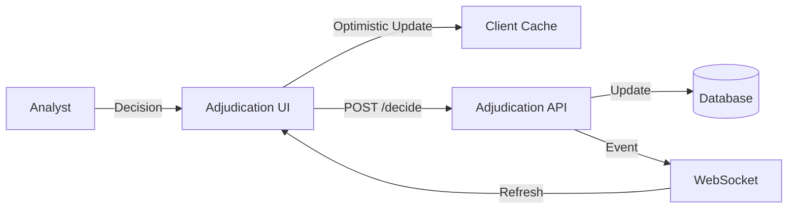

# 07. Adjudication & Decisioning: "The Gavel"

> **Goal:** Provide a high-velocity, keyboard-centric interface for fraud analysts to adjudicate alerts.
> **Philosophy:** "Flow State Decisioning." Minimized friction, instant context, and optimistic UI for speed.


---

## Overview

The **Adjudication Queue** provides a specialized workflow for fraud analysts to review, approve, reject, or escalate flagged alerts. Unlike standard data grids, this "Inbox Zero" style interface is optimized for rapid decision-making with full keyboard navigation support and split-view context.

---

## Technical Metadata

**Route:** `/adjudication`
**Component:** `src/pages/AdjudicationQueue.tsx`
**Status:** ⚠️ Planned (Implementation Pending)
**Backend Router:** `backend/api/adjudication.py` (To be created)

---

## Layout

```
┌─────────────────────────────────────────────────────────────────────────┐
│ Header: "Adjudication Queue"              📊 Stats: 34 Pending | 12 Today│
├────────────────┬────────────────────────────────────────────────────────┤
│                │                                                        │
│  Alert Queue   │              Selected Alert Details                    │
│  ────────────  │              ────────────────────────                  │
│                │                                                        │
│  🔴 #5678     │  Alert #5678: Wire Transfer Anomaly                    │
│  Wire Xfer    │  ──────────────────────────────────────────────────── │
│  $125,000     │                                                        │
│  High Risk    │  Subject: Acme Corp                                    │
│  ────────────  │  Amount: $125,000                                      │
│  🟠 #5677     │  Type: International Wire                              │
│  Check Fraud  │  Flagged: Dec 6, 2025 09:15 AM                         │
│  $45,000      │                                                        │
│  Medium Risk  │  ┌──────────────────────────────────────────────────┐ │
│  ────────────  │  │ [Context] [AI Reasoning] [History] [Graph]      │ │
│  🟡 #5676     │  └──────────────────────────────────────────────────┘ │
│  Duplicate    │                                                        │
│  $12,500      │  AI Reasoning:                                         │
│  Low Risk     │  "This transaction deviates from typical patterns     │
│  ────────────  │   for this entity. Historical transfers average       │
│               │   $15,000. This represents an 8x increase..."         │
│               │                                                        │
│               │  ┌──────────────────────────────────────────────────┐ │
│               │  │ [✅ Approve] [❌ Reject] [⚠️ Escalate]           │ │
│               │  │                                                   │ │
│               │  │ Comment: [Optional note...                      ]│ │
│               │  └──────────────────────────────────────────────────┘ │
│               │                                                        │
└────────────────┴────────────────────────────────────────────────────────┘
```

---

## Components

### AlertList (`components/adjudication/AlertList.tsx`)
Scrollable list of pending alerts with sorting and filtering.

**Props:**
```typescript
interface AlertListProps {
  alerts: Alert[];
  selectedId?: string;
  onSelect: (alertId: string) => void;
  sortBy: 'priority' | 'date' | 'amount';
  sortOrder: 'asc' | 'desc';
  onSortChange: (sort: SortConfig) => void;
}
```

**Features:**
- Glassmorphism styling for visual appeal
- Risk-level color coding
- Keyboard navigation (↑/↓ arrows)
- Virtual scrolling for performance

### AlertCard (`components/adjudication/AlertCard.tsx`)
Detailed view of selected alert.

**Props:**
```typescript
interface AlertCardProps {
  alert: Alert;
  onDecision: (decision: Decision) => void;
}
```

### AlertHeader (`components/adjudication/AlertHeader.tsx`)
Header section with alert summary and status.

### ContextTabs (`components/adjudication/ContextTabs.tsx`)
Tabbed interface for alert context information.

**Tabs:**
- **Context:** Transaction details and entity information
- **AI Reasoning:** AI model explanation for flagging
- **History:** Previous alerts for same entity
- **Graph:** Related entity relationships

### DecisionPanel (`components/adjudication/DecisionPanel.tsx`)
Action buttons and comment input for decisions.

**Props:**
```typescript
interface DecisionPanelProps {
  alertId: string;
  onDecision: (decision: 'approve' | 'reject' | 'escalate', comment?: string) => void;
  loading?: boolean;
}
```

### AIReasoningTab (`components/adjudication/AIReasoningTab.tsx`)
Display of AI model reasoning and confidence scores.

### HistoryTab (`components/adjudication/HistoryTab.tsx`)
Historical alerts for the same entity.

### GraphTab (`components/adjudication/GraphTab.tsx`)
Mini entity relationship graph.

### EvidenceTab (`components/adjudication/EvidenceTab.tsx`)
Supporting documents for the alert.

### AdjudicationQueueSkeleton (`components/adjudication/AdjudicationQueueSkeleton.tsx`)
Loading state placeholder.

---

## Features

### Queue Management
- **Pagination:** Navigate through large queues
- **Sorting:** By priority, date, amount, risk score
- **Filtering:** By status, risk level, alert type
- **Real-time Updates:** New alerts appear automatically

### Decision Workflow

| Decision | Effect | Required |
|----------|--------|----------|
| Approve | Clear alert, mark as reviewed | Optional comment |
| Reject | Flag as false positive | Comment required |
| Escalate | Send to supervisor | Comment required |

### Optimistic UI
- Decisions apply immediately in UI
- **Undo:** 5-second window to revert decision
- Background sync with server
- Rollback on error with notification

### Keyboard Shortcuts
| Key | Action |
|-----|--------|
| `↑` / `↓` | Navigate alerts |
| `Enter` | Select alert |
| `a` | Approve selected |
| `r` | Reject selected |
| `e` | Escalate selected |
| `c` | Focus comment field |
| `1-4` | Switch context tabs |
| `Esc` | Deselect / Clear |

### Collaboration Features
- Real-time status updates
- Alert lock when another analyst is reviewing
- Notification when alert resolved by another user

---

## Data Flow

## Data Flow



---

## API Integration

### Get Alert Queue
```typescript
GET /api/v1/adjudication?page=1&status=pending&sort_by=priority

Response (200):
{
  "items": [
    {
      "id": "alert_5678",
      "type": "wire_transfer_anomaly",
      "subject": {
        "id": "subj_123",
        "name": "Acme Corp"
      },
      "amount": 125000,
      "currency": "USD",
      "risk_score": 87,
      "risk_level": "high",
      "flagged_at": "2025-12-06T09:15:00Z",
      "status": "pending"
    }
  ],
  "total": 34,
  "page": 1,
  "per_page": 20
}
```

### Get Alert Detail
```typescript
GET /api/v1/adjudication/:id

Response (200):
{
  "id": "alert_5678",
  "type": "wire_transfer_anomaly",
  "subject": {
    "id": "subj_123",
    "name": "Acme Corp",
    "type": "company"
  },
  "transaction": {
    "id": "txn_789",
    "type": "wire_transfer",
    "amount": 125000,
    "currency": "USD",
    "destination": "Offshore Bank Ltd",
    "date": "2025-12-05T14:30:00Z"
  },
  "ai_reasoning": {
    "summary": "Transaction deviates from typical patterns...",
    "confidence": 0.87,
    "indicators": [
      { "type": "amount_anomaly", "score": 0.92 },
      { "type": "destination_risk", "score": 0.78 }
    ]
  },
  "history": [
    {
      "alert_id": "alert_5123",
      "type": "velocity_anomaly",
      "resolved_at": "2025-11-15T10:00:00Z",
      "decision": "approved"
    }
  ]
}
```

### Submit Decision
```typescript
POST /api/v1/adjudication/:id/decide
Content-Type: application/json

Request:
{
  "decision": "approve",
  "comment": "Verified with account holder. Legitimate business transaction."
}

Response (200):
{
  "id": "alert_5678",
  "status": "approved",
  "resolved_at": "2025-12-06T10:30:00Z",
  "resolved_by": "user_789"
}
```

---

## Accessibility

| Feature | Implementation |
|---------|----------------|
| List Navigation | `role="listbox"` with `aria-activedescendant` |
| Tab Panel | ARIA tabs pattern |
| Decision Buttons | Clear `aria-label`, disabled state announcements |
| Focus Management | Focus restored after decision |
| Live Regions | `aria-live="polite"` for queue updates |
| Screen Reader | Alert details announced on selection |

---

## Responsive Behavior

| Breakpoint | Layout Change |
|------------|---------------|
| ≥1280px | Side-by-side split view (30% / 70%) |
| ≥1024px | Side-by-side split view (40% / 60%) |
| ≥768px | Stacked: list above, detail below |
| <768px | Full-screen list → tap to see detail |

---

## 🏗 Architecture References

*   **Technology Stack:** See [00_TECH_STACK.md](../../architecture/SYSTEM_ARCHITECTURE.md)
*   **Data Models:** See [00_DATA_MODELS.md](../../architecture/SYSTEM_ARCHITECTURE.md)
*   **Scoring Logic:** See [00_FRAUD_LOGIC.md](../../architecture/SYSTEM_ARCHITECTURE.md)

---

## Performance Optimizations

- **Virtual Scrolling:** Alert list uses windowing for large queues
- **Optimistic Updates:** Immediate UI feedback before server confirmation
- **Memoization:** AlertCard and tabs memoized
- **Lazy Loading:** AI Reasoning and Graph tabs load on demand
- **WebSocket Batching:** Updates debounced for performance

---

## Testing

### Unit Tests
- Alert selection and navigation
- Decision submission logic
- Undo functionality
- Tab switching

### E2E Tests
- Full adjudication workflow
- Keyboard navigation
- Real-time update handling
- Error recovery (network failure)

---

## Related Files

```
frontend/src/
├── pages/AdjudicationQueue.tsx
├── components/adjudication/
│   ├── AlertList.tsx
│   ├── AlertCard.tsx
│   ├── AlertHeader.tsx
│   ├── ContextTabs.tsx
│   ├── DecisionPanel.tsx
│   ├── AIReasoningTab.tsx
│   ├── HistoryTab.tsx
│   ├── GraphTab.tsx
│   ├── EvidenceTab.tsx
│   └── AdjudicationQueueSkeleton.tsx
└── lib/
    ├── api.ts
    └── websocket.ts
```

---


## 🔌 Implementation Links

### Frontend Components
- [`AdjudicationQueue.tsx`](../../../frontend/src/pages/AdjudicationQueue.tsx)

### Backend Services
- [`cases.py`](../../../backend/app/routers/cases.py)

### Key API Endpoints
- `GET /cases?status=adjudication`
- `POST /cases/{id}/adjudicate`

---

## Future Enhancements

- [ ] Implement split-view interface (alert list + detail panel)
- [ ] Add keyboard navigation and alert selection handling
- [ ] Build context tabs (Context, AI Reasoning, History, Graph)
- [ ] Create decision panel with Approve/Reject/Escalate buttons
- [ ] Integrate real API endpoints for queue and decisions
- [ ] Add WebSocket real-time updates and collaboration
- [ ] Implement sorting/filtering by priority, date, amount, status
- [ ] Add optimistic UI updates with undo functionality
- [ ] Implement full keyboard shortcuts (a/r/e decisions, 1-4 tabs)
- [ ] Bulk decision mode (multi-select)
- [ ] Decision templates / quick responses
- [ ] Analyst performance metrics
- [ ] Alert priority auto-sorting by AI
- [ ] Voice notes for comments
- [ ] Comparison view for similar alerts
- [ ] Customizable decision reasons dropdown
- [ ] AI reasoning display with confidence scores
- [ ] History and graph tabs implementation
- [ ] Real-time collaboration features (alert locking)
