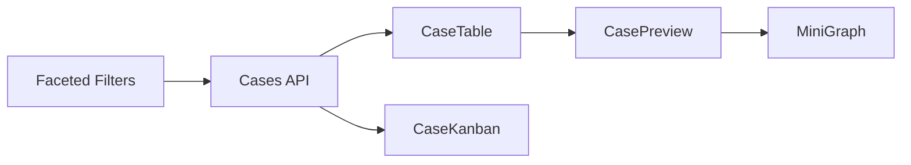

# 02. Case Management Design: "The War Room"

> **Goal:** Accelerate fraud analyst triage by transforming passive case lists into an active tactical board.
> **Philosophy:** "Active Triage" — Every case must move toward resolution.


---

## 🎯 Fraud Detection Value

| Fraud Type | How Cases Page Helps |
| :--- | :--- |
| **Embezzlement** | Kanban board exposes cases stuck in "Pending" — potential cover-ups by internal actors. |
| **Invoice Fraud** | Adjudication Queue enables rapid approval/rejection of flagged vendor invoices. |
| **Shell Companies** | Investigation Canvas (Mode D) visualizes entity networks, revealing hidden ownership. |
| **Collusion Rings** | Graph analysis clusters related cases, surfacing coordinated fraud schemes. |

---

## 1. Consolidated Feature Set

| Feature Category | Features | Source |
| :--- | :--- | :--- |
| **Views** | Data Table, Kanban Board, Adjudication Queue, Investigation Canvas | Merged |
| **Search** | MeiliSearch (typo-tolerant) + Faceted Filtering | Merged |
| **Actions** | Bulk Actions, Quick Preview, Rapid Decisions (A/R/E) | Merged |
| **Creation** | "New Investigation" Wizard | Proposed |
| **Preview** | Drawer with Tabs: Overview, Graph, Timeline, Financials | Merged |

---

## 2. Layout Structure: "The Cockpit"

### 2.1 Mode A: Triage Table (High Volume)

- **Columns:** Checkbox, ID, Subject (+ Risk Badge), Status, Value, Analyst, Actions.
- **Bulk Actions:** Assign, Export CSV, Archive.

### 2.2 Mode B: Strategy Board (Kanban)

- **Columns:** Incoming → Triage → Analysis → Legal Review → Closed.
- **Card Content:** Sparkline, Days Open, Analyst Avatar.

### 2.3 Mode C: Adjudication Queue (Split-View)

- **Layout:** Master-Detail (Left List / Right Details).
- **Hotkeys:** `A` Approve, `R` Reject, `E` Escalate.
- **Optimistic UI:** Next item loads instantly.

### 2.4 Mode D: Investigation Canvas (Deep Dive)

- **Layout:** Infinite WebGL Canvas (Force Directed Graph).
- **Tools:** Shortest Path, Time Slider, Community Detection.
- **Tech:** `react-force-graph` for 10,000+ nodes.

---

## 3. Implementation Strategy

### 3.1 Quick Preview Drawer

- **Why:** Eliminates "pogo-sticking" between list and detail views.
- **What:** Side sheet with case summary, mini-graph, and timeline.
- **How:** `Radix UI Sheet` + React Query lazy fetch.

### 3.2 Faceted Search

- **Why:** Text search alone is insufficient for fraud investigation.
- **What:** Sidebar filters for Status, Risk Level, Date Range, Analyst.
- **How:** MeiliSearch for text, SQL for range filters.

### 3.3 Rapid Adjudication

- **Why:** False positives must be cleared in seconds, not minutes.
- **What:** Streamlined decision engine with AI reasoning display.
- **How:** Keyboard-driven workflow with optimistic updates.

---

## 4. Code Relationships

### Components

| Component | Path | Dependencies |
| :--- | :--- | :--- |
| `CaseList.tsx` | `src/pages/CaseList.tsx` | CaseTable, CaseKanban, CaseFilters |
| `CaseTable.tsx` | `src/components/cases/CaseTable.tsx` | @tanstack/react-table, react-virtual |
| `CaseKanban.tsx` | `src/components/cases/CaseKanban.tsx` | @dnd-kit/core |
| `CasePreview.tsx` | `src/components/cases/CasePreview.tsx` | Radix Sheet, MiniGraph |
| `InvestigationCanvas.tsx` | `src/components/cases/InvestigationCanvas.tsx` | react-force-graph |

### API Endpoints

| Endpoint | Method | Purpose |
| :--- | :--- | :--- |
| `/api/v1/cases` | GET | List cases with filters |
| `/api/v1/cases/:id` | GET | Case detail |
| `/api/v1/cases/:id/graph` | GET | Entity relationship graph |
| `/api/v1/cases/:id/adjudicate` | POST | Submit decision |

### Data Flow



---

## 5. Proposed Enhancements

| Enhancement | Priority | Description |
| :--- | :--- | :--- |
| **AI Case Routing** | High | Auto-assign cases based on analyst expertise and workload. |
| **Related Cases** | High | "Similar Cases" panel shows historically related investigations. |
| **SLA Timers** | Medium | Visual countdown for regulatory deadlines (SAR filing). |
| **Voice Notes** | Low | Analyst records audio notes attached to case. |

---

## 6. User Scenarios

1. **Morning Triage:** Analyst opens Table View. Sorts by Risk Score (Desc). Bulk-assigns top 5 Critical cases.
2. **Workflow Check:** Supervisor opens Kanban. Notices 10 cases stuck in Legal Review. Drags 3 back to Analysis.
3. **Deep Dive:** Analyst opens Case #1234. Switches to Investigation Canvas. Uses Shortest Path to trace money flow from Subject A to Shell Company Z.


---

# Technical Specification

# 📂 Cases (List & Detail)

> Case management, search, and detailed investigation views

**Routes:** `/cases` (list), `/cases/:id` (detail)  
**Files:** `src/pages/CaseList.tsx`, `src/pages/CaseDetail.tsx`

---

## Overview

The Cases section provides comprehensive case management capabilities, from browsing and searching all investigations to diving deep into individual case details with multi-tab analysis views.

---


## Part 1: Case List


## Case List Layout

```text
┌─────────────────────────────────────────────────────────────────────────┐
│ Header: "Case Management"                              [+ New Case]     │
├─────────────────────────────────────────────────────────────────────────┤
│                                                                         │
│  ┌─────────────────────────────────────────────────────────────────┐   │
│  │ 🔍 [Search cases...                        ]   [ Status ▼ ]     │   │
│  └─────────────────────────────────────────────────────────────────┘   │
│                                                                         │
│  ┌─────────────────────────────────────────────────────────────────┐   │
│  │ ☐ │ Case ID ↕│ Subject       │ Risk Score│ Status  │ Analyst   │   │
│  ├───┼──────────┼───────────────┼───────────┼─────────┼───────────┤   │
│  │ ☐ │ #1234    │ Acme Corp     │ ████  85  │ Active  │ J. Smith  │   │
│  │ ☐ │ #1233    │ XYZ Holdings  │ ███   65  │ Pending │ A. Jones  │   │
│  │ ☐ │ #1232    │ Tech Inc      │ ██    45  │ Active  │ M. Brown  │   │
│  │ ☐ │ #1231    │ Global Ltd    │ █████ 92  │ Escalated│ L. Lee   │   │
│  │ ☐ │ #1230    │ Smith & Co    │ █     25  │ Closed  │ P. White  │   │
│  └───┴──────────┴───────────────┴───────────┴─────────┴───────────┘   │
│                                                                         │
│  ┌─────────────────────────────────────────────────────────────────┐   │
│  │ [Delete Selected]     ◀ 1 2 3 4 5 ▶    Showing 1-10 of 247     │   │
│  └─────────────────────────────────────────────────────────────────┘   │
│                                                                         │
└─────────────────────────────────────────────────────────────────────────┘
```

---

## Case List Features

| Feature | Status | Description |
|---------|--------|-------------|
| Database Search | ✅ | Traditional SQL search (LIKE queries) |
| Meilisearch | ✅ | Full-text search with typo tolerance |
| Advanced Filtering | ✅ | Status, risk level, date range, analyst |
| Multi-column Sorting | ✅ | Sort by ID, subject, risk, status, date |
| Bulk Actions | ✅ | Select, delete, export, assign |
| Pagination | ✅ | Configurable page sizes (10-100) |
| Quick Preview | ✅ | Hover card with case summary |
| Real-time Updates | ✅ | WebSocket for new cases |

---

---

## Search & Filtering


### Search Functionality

- **Database Search:** Traditional SQL search (LIKE queries)

- **Meilisearch:** Full-text search with typo tolerance, instant results
- **Search Fields:** Case ID, subject name, description, analyst name
- **Debounce:** 300ms delay before API call

### Filtering Options

| Filter | Options |
|--------|---------|
| Status | All, Active, Pending, Escalated, Closed, Archived |
| Risk Level | All, Critical (≥90), High (70-89), Medium (40-69), Low (<40) |
| Date Range | Custom date picker (created date) |
| Analyst | Dropdown of team members |


### Sortable Columns

- Case ID (default: descending)

- Subject name
- Risk score
- Status
- Created date
- Last updated

---

## Bulk Actions

- **Select All:** Checkbox in header
- **Delete Selected:** Bulk case deletion with confirmation
- **Export Selected:** Download case data as CSV
- **Assign Analyst:** Bulk reassignment

---


## Case List Components

| Component | Purpose |

|-----------|---------|
| `CaseSearch` | Search input with debounce and mode toggle |
| `CaseFilters` | Filter controls for status, risk, date |
| `QuickPreview` | Hover card showing case summary |
| `StatusBadge` | Visual indicator for case status |
| `RiskBar` | Visual risk score indicator |
| `CaseListSkeleton` | Loading state placeholder |

---

## Case List API Endpoints

### List Cases

```typescript

GET /api/v1/cases?page=1&per_page=10&status=active&sort_by=created_at&sort_order=desc

Response (200):
{
  "items": [
    {
      "id": "case_1234",
      "case_number": "1234",
      "subject_name": "Acme Corp",
      "subject_id": "subj_567",
      "risk_score": 85,
      "status": "active",
      "analyst": {
        "id": "user_789",
        "name": "J. Smith"
      },
      "created_at": "2025-12-01T10:00:00Z",
      "updated_at": "2025-12-06T08:30:00Z"
    }
  ],
  "total": 247,
  "page": 1,
  "per_page": 10,
  "total_pages": 25
}
```

### Search Cases (Meilisearch)

```typescript

GET /api/v1/cases/search?q=acme&page=1&per_page=10

Response (200):
{
  "hits": [...],
  "query": "acme",
  "processingTimeMs": 12,
  "total": 5
}
```

### Bulk Delete

```typescript

DELETE /api/v1/cases/bulk
Content-Type: application/json

Request:
{
  "case_ids": ["case_1234", "case_1235"]
}

Response (200):
{
  "deleted_count": 2
}
```

---


## Part 2: Case Detail


## Case Detail Layout

```text
┌─────────────────────────────────────────────────────────────────────────┐
│ ← Back to Cases                                                         │
├─────────────────────────────────────────────────────────────────────────┤
│                                                                         │
│  ┌─────────────────────────────────────────────────────────────────┐   │
│  │ Subject: Acme Corporation                                        │   │
│  │ Case #1234 │ Risk: ████████░░ 85 │ Status: 🟢 Active            │   │
│  │                                                                  │   │
│  │ [✏️ Edit] [📥 Download] [⚠️ Escalate] [✅ Approve]              │   │
│  └─────────────────────────────────────────────────────────────────┘   │
│                                                                         │
│  ┌─────────────────────────────────────────────────────────────────┐   │
│  │ [Overview] [Graph] [Timeline] [Financials] [Evidence]           │   │
│  └─────────────────────────────────────────────────────────────────┘   │
│                                                                         │
│  ┌─────────────────────────────────────────────────────────────────┐   │
│  │                                                                  │   │
│  │                    Tab Content Area                              │   │
│  │                                                                  │   │
│  │    (Content changes based on selected tab)                       │   │
│  │                                                                  │   │
│  │                                                                  │   │
│  └─────────────────────────────────────────────────────────────────┘   │
│                                                                         │
└─────────────────────────────────────────────────────────────────────────┘
```

---

## Case Detail Tabs


### 1. Overview Tab

Primary summary view with key case information.

```text
┌────────────────────────────────────────────────────────────────┐
│ Case Summary                              Key Metrics          │
│ ──────────────────────────                ──────────────────── │
│ Description: Suspicious wire              Total Value: $1.2M   │
│ transfers exceeding normal                Transactions: 47     │
│ business patterns...                      Risk Indicators: 5   │
│                                           Days Open: 12        │
│ ┌──────────────────────────────┐                              │
│ │ Recent Activity               │  ┌─────────────────────────┐│
│ │ • File uploaded - 2h ago      │  │ AI Insights            ││
│ │ • Note added - 5h ago         │  │ ────────────────────── ││
│ │ • Risk score updated - 1d     │  │ Pattern: Layering      ││
│ │ • Case created - 12d ago      │  │ Confidence: 87%        ││
│ └──────────────────────────────┘  │ Recommendation: Escalate││
│                                   └─────────────────────────┘│
└────────────────────────────────────────────────────────────────┘
```


### 2. Graph Analysis Tab

Interactive network visualization of entity relationships.

```text
┌────────────────────────────────────────────────────────────────┐
│ Entity Relationship Graph                                      │
│                                                                │
│                    [Person A]                                  │
│                   /    |    \                                  │
│            [Company X] │ [Company Y]                           │
│                 |      │      |                                │
│            [Account 1] │ [Account 2]                           │
│                   \    │    /                                  │
│                   [Transaction Hub]                            │
│                                                                │
│ ────────────────────────────────────────────────────────────── │
│ [Zoom +] [Zoom -] [Reset] [Export]    Legend: 🔵 Person       │
│                                                🟢 Company     │
│                                                🟡 Account     │
└────────────────────────────────────────────────────────────────┘
```


### 3. Timeline Tab

Chronological event history.

```text
┌────────────────────────────────────────────────────────────────┐
│ Case Timeline                    [Filter: All ▼] [Sort ▼]     │
│                                                                │
│ Dec 6, 2025                                                    │
│ ├─ 10:30 AM  📤 Document uploaded "Bank Statement Nov.pdf"     │
│ └─ 08:15 AM  📝 Note added by J. Smith                         │
│                                                                │
│ Dec 5, 2025                                                    │
│ ├─ 04:00 PM  ⚠️ Risk score increased: 78 → 85                 │
│ ├─ 02:30 PM  🔍 AI analysis completed                          │
│ └─ 09:00 AM  👤 Case assigned to A. Jones                      │
│                                                                │
│ Nov 25, 2025                                                   │
│ └─ 11:00 AM  🆕 Case created from alert #5678                 │
│                                                                │
└────────────────────────────────────────────────────────────────┘
```


### 4. Financials Tab

Financial flow visualization with Sankey diagram.

```text
┌────────────────────────────────────────────────────────────────┐
│ Financial Flow Analysis                                        │
│                                                                │
│ Source          →         Intermediary      →      Destination │
│                                                                │
│ Bank A ═══════════════╗                                        │
│          $500K       ╠══════════ Shell Co ══════════╗          │
│ Bank B ═══════════════╝                 ║           ║          │
│               $300K                     ║      $750K ║          │
│                                         ║           ╚═══ Bank X │
│ Wire ════════════════════════════════════╝                     │
│         $250K                             $250K                │
│                                                    ═══╗        │
│                                                       ╚═ Bank Y│
│                                                                │
│ ────────────────────────────────────────────────────────────── │
│ Total Inflow: $1,050,000          Total Outflow: $1,000,000   │
│ Suspicious Transactions: 12        Missing Amount: $50,000     │
└────────────────────────────────────────────────────────────────┘
```


### 5. Evidence Tab

Multi-media evidence library with intelligent processing and cross-referencing.

```text
┌────────────────────────────────────────────────────────────────┐
│ Evidence Library                            [+ Upload Files]   │
├────────────────────────────────────────────────────────────────┤
│ 📁 Documents (12)  💬 Chats (3)  🎥 Videos (2)  📸 Photos (45) │
├────────────────────────────────────────────────────────────────┤
│ ┌──────────────────────────────────────────────────────────┐  │
│ │ Drop files here or click to browse                        │  │
│ │                                                            │  │
│ │ Supported: PDF, DOCX, XLSX, TXT, WhatsApp, MP4, JPG, PNG  │  │
│ │ Max: 100MB (docs), 50MB (chats), 2GB (video), 25MB (photo)│  │
│ └──────────────────────────────────────────────────────────┘  │
│                                                                │
│ [🔍 Search all evidence...]  [Filter: All ▼]  [Sort: Date ▼]  │
│                                                                │
│ ┌──────────────────────────────────────────────────────────┐  │
│ │ 📄 Bank_Statement_Nov.pdf          2.1 MB    Nov 15      │  │
│ │    → Extracted 47 transactions                           │  │
│ │    → Linked to Reconciliation                            │  │
│ │    [View] [Annotate] [Download]                          │  │
│ │                                                           │  │
│ │ 💬 WhatsApp_Export.txt             156 KB    Dec 1       │  │
│ │    → 234 messages, 3 participants                        │  │
│ │    → 12 flagged keywords                                 │  │
│ │    [View Conversation] [Search]                          │  │
│ │                                                           │  │
│ │ 🎥 Surveillance_Footage.mp4        1.2 GB    Oct 20      │  │
│ │    → Transcribed, 3 faces detected                       │  │
│ │    → Key moment at 12:34                                 │  │
│ │    [Play] [View Transcript] [Extract Clip]              │  │
│ │                                                           │  │
│ │ 📸 Receipt_Luxury_Watch.jpg        3.2 MB    Sep 5       │  │
│ │    → OCR: $45,000 Rolex                                  │  │
│ │    → GPS: Dubai Mall                                     │  │
│ │    [View] [Show on Map] [Link to Transaction]           │  │
│ └──────────────────────────────────────────────────────────┘  │
│                                                                │
│ 🤖 AI Insights:                                                │
│ • Chat message "Send 50k" (Nov 10) matches $50k wire (Nov 15)│
│ • Subject claims London location, but photo GPS shows Dubai  │
│ • Video timestamp correlates with transaction time           │
│                                                                │
│ [📊 Generate Evidence Report]  [🔗 View All Links]            │
└────────────────────────────────────────────────────────────────┘
```

**Multi-Media Processing:**

| Type | Processing | Features |
|------|------------|----------|
| **📄 PDFs** | OCR, table extraction, entity recognition | Annotation, search, redaction detection |
| **💬 Chats** | Message parsing, participant ID, sentiment | Thread view, keyword search, network graph |
| **🎥 Videos** | Transcription, scene detection, face recognition | Timestamp annotations, clip extraction |
| **📸 Photos** | OCR, EXIF/GPS extraction, object detection | Receipt matching, location mapping |

**Smart Features:**

- **Cross-Media Search:** Find "John Smith $50k" across all evidence types

- **Auto-Linking:** AI connects related evidence automatically
- **Contradiction Detection:** Flags inconsistencies between evidence items
- **Timeline Integration:** All evidence plotted chronologically
- **Chain of Custody:** Track who viewed/modified each file

**See:** [Multi-Media Evidence Specification](../../architecture/MULTI_MEDIA_EVIDENCE_SPEC.md) for full details

---

## Case Detail Features

### Case Actions

| Action | Description | Permission |
|--------|-------------|------------|
| Edit | Modify case details | Analyst, Admin |
| Download | Export case report (PDF) | All |
| Escalate | Escalate to supervisor | Analyst |
| Approve | Mark case as reviewed | Supervisor, Admin |
| Archive | Move to archive | Admin |


### Real-time Updates

- Case status changes

- New evidence uploads
- Note additions
- Risk score updates

---

## Case Detail Components

| Component | Purpose |
|-----------|---------|
| `EntityGraph` | Force-directed graph visualization (D3.js/vis-network) |
| `Timeline` | Event timeline component |
| `FinancialSankey` | Sankey diagram for financial flows |
| `CaseHeader` | Case summary header with actions |
| `CaseActions` | Action buttons with permission checks |

---

## Case Detail API Endpoints

### Get Case Detail

```typescript

GET /api/v1/cases/:id

Response (200):
{
  "id": "case_1234",
  "case_number": "1234",
  "subject": {
    "id": "subj_567",
    "name": "Acme Corporation",
    "type": "company"
  },
  "risk_score": 85,
  "status": "active",
  "description": "Suspicious wire transfers...",
  "created_at": "2025-11-25T11:00:00Z",
  "updated_at": "2025-12-06T10:30:00Z",
  "analyst": {
    "id": "user_789",
    "name": "J. Smith"
  },
  "metrics": {
    "total_value": 1200000,
    "transaction_count": 47,
    "risk_indicators": 5,
    "days_open": 12
  }
}
```

### Get Case Graph

```typescript

GET /api/v1/cases/:id/graph

Response (200):
{
  "nodes": [
    { "id": "n1", "type": "person", "label": "John Doe", "properties": {} }
  ],
  "edges": [
    { "id": "e1", "source": "n1", "target": "n2", "type": "owns" }
  ]
}
```

### Get Case Timeline

```typescript

GET /api/v1/cases/:id/timeline

Response (200):
{
  "events": [
    {
      "id": "evt_123",
      "type": "document_upload",
      "message": "Document uploaded",
      "timestamp": "2025-12-06T10:30:00Z",
      "actor": "J. Smith"
    }
  ]
}
```

### Upload Evidence

```typescript

POST /api/v1/cases/:id/evidence
Content-Type: multipart/form-data

Response (201):
{
  "id": "file_456",
  "filename": "document.pdf",
  "size": 2100000,
  "mime_type": "application/pdf",
  "uploaded_at": "2025-12-06T10:30:00Z"
}
```

---

## Keyboard Shortcuts

### Case List

| Key | Action |

|-----|--------|
| `/` | Focus search input |
| `Esc` | Clear search, deselect all |
| `ArrowUp/Down` | Navigate rows (when table focused) |
| `Enter` | Open selected case |
| `Delete` | Delete selected (with confirmation) |

### Case Detail

| Key | Action |

|-----|--------|
| `1` | Switch to Overview tab |
| `2` | Switch to Graph tab |
| `3` | Switch to Timeline tab |
| `4` | Switch to Financials tab |
| `5` | Switch to Evidence tab |
| `e` | Edit case |
| `d` | Download report |
| `Esc` | Go back to case list |

---

## Accessibility

| Feature | Implementation |
|---------|----------------|
| Table Semantics | Proper `<table>`, `<thead>`, `<tbody>` structure |
| Sort Indicators | `aria-sort` on sortable columns |
| Row Selection | `aria-selected` on selected rows |
| Live Regions | `aria-live` for search results count |
| Tab Navigation | ARIA tabs pattern with `role="tablist"` |
| Graph Navigation | Keyboard controls for node selection |
| Timeline | Semantic time elements, screen reader announcements |
| File Upload | Accessible drop zone with keyboard support |
| Focus Management | Focus trap in dialogs, restored after modal close |

---

## Responsive Behavior

### Case List

| Breakpoint | Layout Change |

|------------|---------------|
| ≥1280px | Full table with all columns |
| ≥1024px | Hide analyst column |
| ≥768px | Card-based layout, key info only |
| <768px | Stacked cards, expandable details |

### Case Detail

| Breakpoint | Layout Change |

|------------|---------------|
| ≥1280px | Full layout with side panels |
| ≥1024px | Stacked sections, full graph |
| ≥768px | Tabs become scrollable, graph simplified |
| <768px | Single column, expandable sections |

---

## Performance Optimizations

- **Virtual Scrolling:** For large datasets (>100 items)
- **Query Caching:** React Query with 60-second stale time
- **Debounced Search:** 300ms delay before API call
- **Memoized Rows:** Prevent unnecessary re-renders
- **Optimistic Updates:** Immediate UI feedback on mutations
- **Lazy Loading:** Charts loaded only when in viewport

---

## Testing

### Unit Tests

- Search input debouncing

- Filter state management
- Sorting logic
- Pagination controls
- Tab switching logic
- Action button visibility by permission
- Graph node/edge rendering

### E2E Tests

- Full search flow (both modes)
- Filter combination scenarios
- Bulk selection and deletion
- Navigation to case detail
- Complete case viewing flow
- Evidence upload
- Tab navigation
- Action execution (edit, escalate)

## 🏗 Architecture References

*   **Technology Stack:** See [00_TECH_STACK.md](../../architecture/SYSTEM_ARCHITECTURE.md)
*   **Data Models:** See [00_DATA_MODELS.md](../../architecture/SYSTEM_ARCHITECTURE.md)
*   **Risk Logic:** See [00_FRAUD_LOGIC.md](../../architecture/SYSTEM_ARCHITECTURE.md)

---

## Related Files

```
frontend/src/
├── pages/
│   ├── CaseList.tsx
│   └── CaseDetail.tsx
├── components/cases/
│   ├── CaseSearch.tsx
│   ├── CaseFilters.tsx
│   ├── QuickPreview.tsx
│   ├── StatusBadge.tsx
│   ├── RiskBar.tsx
│   ├── CaseListSkeleton.tsx
│   ├── NewCaseModal.tsx
│   ├── Timeline.tsx
│   ├── CaseHeader.tsx
│   └── CaseActions.tsx
├── components/graphs/
│   └── EntityGraph.tsx
├── components/charts/
│   └── FinancialSankey.tsx
└── lib/
    └── api.ts
```

---


## 🔌 Implementation Links

### Frontend Components
- [`Cases.tsx`](../../../frontend/src/pages/Cases.tsx)
- [`CaseDetail.tsx`](../../../frontend/src/components/cases/CaseDetail.tsx)

### Backend Services
- [`cases.py`](../../../backend/app/routers/cases.py)

### Key API Endpoints
- `GET /cases (List)`
- `POST /cases (Create)`
- `GET /cases/{id} (Detail)`

---
### Frontend Components
- [`Cases.tsx`](../../../frontend/src/pages/Cases.tsx)
- [`CaseDetail.tsx`](../../../frontend/src/components/cases/CaseDetail.tsx)

### Backend Services
- [`cases.py`](../../../backend/app/routers/cases.py)

### Key API Endpoints
- `GET /cases (List)`
- `POST /cases (Create)`
- `GET /cases/{id} (Detail)`

---

## 🔮 Future Enhancements

### Phase 1: Simple Basic Functions (MVP)
- [ ] **List**: Basic Search & Filter (Status, Risk)
- [ ] **List**: Bulk Delete
- [ ] **Detail**: Tab Navigation (Overview, Timeline)
- [ ] **Detail**: Manual Note Taking
- [ ] **Detail**: Basic File Upload

### Phase 2: Advanced (Professional)
- [ ] **List**: Saved Search Presets
- [ ] **List**: Column Visibility Customization
- [ ] **Detail**: Financial Anomaly Highlighting
- [ ] **Detail**: Document Preview without Download
- [ ] **Detail**: Collaborative Annotations
- [ ] **Detail**: Export to Excel/PDF

### Phase 3: Extreme (Sci-Fi)
- [ ] **List**: AI-driven "Case Linking" (finding hidden connections)
- [ ] **Detail**: "Time Travel" Investigation (Replay historical states)
- [ ] **Detail**: AI-Generated Case Solvability Score
- [ ] **Detail**: Automated "Chain of Custody" Blockchain Log

---

## Related Pages

- [Dashboard](./02_DASHBOARD.md) - System overview
- [Ingestion & Mapping](./04_INGESTION.md) - Upload data
- [Adjudication Queue](./06_ADJUDICATION_QUEUE.md) - Review alerts
