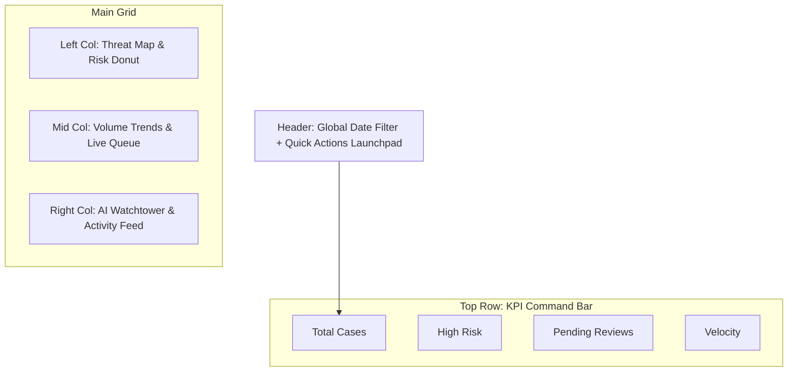

# 01. Dashboard Design: "The Command Center"

> **Goal:** Consolidate tactical metrics (KPIs) with strategic intelligence (Threat Map) into a unified "Glass Cockpit" for fraud operations.
> **Philosophy:** "Situational Awareness at a Glance."


---

## 🎯 Fraud Detection Value

| Fraud Type | How Dashboard Helps |
| :--- | :--- |
| **Embezzlement** | "High Risk Subjects" counter surfaces employees with anomalous behavior patterns. |
| **Money Laundering** | Threat Map visualizes geographic clusters of suspicious transactions (e.g., multiple wire transfers to high-risk jurisdictions). |
| **Vendor Fraud** | AI Watchtower flags vendor invoices that deviate from historical patterns. |
| **Structuring** | Volume Trend chart reveals "just under threshold" transaction patterns. |

---

## 1. Consolidated Feature Set

| Feature Category | Features | Source |
| :--- | :--- | :--- |
| **KPI Ticker** | Total Cases, High Risk Subjects, Pending Reviews, Reviewed Today | Merged |
| **Geospatial** | Threat Map (WebGL) showing transaction origins | Proposed |
| **Analytics** | Volume Trend (Area Chart) + Risk Distribution (Donut) | Merged |
| **Operations** | Live Activity Feed + Quick Actions Launchpad | Merged |
| **Intelligence** | AI Watchtower (Predictive Alerts) | Proposed |

---

## 2. Layout Structure (Grid System)

A dense, data-rich 3-column layout optimized for "Information Density".



---

## 3. Implementation Strategy

### 3.1 KPI Command Bar

- **Why:** Executives need instant health check.
- **What:** 4 metric cards with sparkline trends.
- **How:** `useDashboardMetrics` hook + `recharts` sparklines.

### 3.2 Threat Operations Map

- **Why:** Fraud has geographic patterns (shell companies cluster in specific jurisdictions).
- **What:** Interactive WebGL globe with transaction clusters.
- **How:** `react-map-gl` + floating Risk Donut overlay.

### 3.3 AI Watchtower

- **Why:** Raw logs are noise; interpreted insights are signal.
- **What:** AI-powered alert feed with actionable recommendations.
- **How:** WebSocket subscription to `threat_detected` channel.

---

## 4. Code Relationships

### Components

| Component | Path | Dependencies |
| :--- | :--- | :--- |
| `Dashboard.tsx` | `src/pages/Dashboard.tsx` | KPICard, ThreatMap, ActivityFeed |
| `KPICard.tsx` | `src/components/dashboard/KPICard.tsx` | recharts, lucide-react |
| `ThreatMap.tsx` | `src/components/dashboard/ThreatMap.tsx` | react-map-gl, mapbox-gl |
| `AIWatchtower.tsx` | `src/components/dashboard/AIWatchtower.tsx` | frenly-ai-sdk |

### API Endpoints

| Endpoint | Method | Purpose |
| :--- | :--- | :--- |
| `/api/v1/dashboard/metrics` | GET | KPI summary data |
| `/api/v1/dashboard/threats` | GET | Geospatial threat data |
| `/api/v1/dashboard/activity` | WS | Real-time activity stream |
| `/api/v1/stats/predictive` | GET | Predictive analytics data |

### Data Flow

```mermaid
flowchart LR
    API[Backend API] --> RQ[React Query Cache]
    RQ --> Dashboard[Dashboard.tsx]
    WS[WebSocket] --> Watchtower[AIWatchtower.tsx]
    Dashboard --> KPI[KPICard]
    Dashboard --> Map[ThreatMap]
    Dashboard --> Predictive[PredictiveDashboard]
    Predictive --> PredAPI[/stats/predictive]
```

---

## 5. Proposed Enhancements

| Enhancement | Priority | Description |
| :--- | :--- | :--- |
| **Predictive Scoring** | High | AI predicts which cases will escalate in next 24h. |
| **Drill-Down Filters** | Medium | Click KPI card → filter entire dashboard to that segment. |
| **Custom Widgets** | Low | User-configurable dashboard layout. |
| **Mobile Companion** | Low | Push notifications for critical alerts. |

---

## 6. User Scenarios

1. **Morning Triage:** User logs in. Sees "Pending Reviews" is high. Clicks card → jumps to [Cases Page](./cases.md) filtered by `status=pending`.
2. **Hunter Mode:** User sees red pulse on Threat Map. Clicks cluster. AI Watchtower shows "IP range blocked in 3 previous cases."
3. **Executive Briefing:** CFO opens dashboard. Screenshots KPI bar for board meeting.


---

# Technical Specification

# 📊 Dashboard Page

> System overview, key performance indicators (KPIs), and real-time activity monitoring.

**Route:** `/`  
**Component:** `src/pages/Dashboard.tsx`  
**Status:** ✅ Implemented

---

## 🏗 Architecture References

*   **Technology Stack:** See [00_TECH_STACK.md](../../architecture/SYSTEM_ARCHITECTURE.md)
*   **Data Models:** See [00_DATA_MODELS.md](../../architecture/SYSTEM_ARCHITECTURE.md)

---

## 🎨 Page Design & Layout

The dashboard uses a **Responsive Grid Layout** (`grid` + `flex`) to adapt to different screen sizes.

### Visual Hierarchy
1.  **Header**: Welcome message, Global Date Filter, and User Profile.
2.  **KPI Row**: 4 key metrics at the top for instant visibility.
3.  **Main Content Area**:
    -   **Left Column (2/3 width)**: 30-day Volume Chart (Historical data).
    -   **Right Column (1/3 width)**: Real-time Activity Feed and Risk Distribution.
4.  **Quick Actions**: Floating interactions or sidebar widgets.

### Component Specifications (shadcn/ui)

-   **Cards**: `Card`, `CardHeader`, `CardTitle`, `CardContent` used for all containers.
    -   *Style*: `bg-white dark:bg-slate-950 border-slate-200 dark:border-slate-800`.
-   **Typography**: Inter font.
    -   Headers: `text-2xl font-bold tracking-tight`.
    -   Subtext: `text-sm text-muted-foreground`.
-   **Colors**:
    -   *Success*: `text-emerald-500` (e.g., +12% growth).
    -   *Warning*: `text-amber-500` (Pending reviews).
    -   *Destructive*: `text-rose-500` (Critical alerts).

### Wireframe (Desktop)

```text
┌─────────────────────────────────────────────────────────────────────────────┐
│ 📊 Dashboard                                            [📅 Last 30 Days ▼] │
│ "Welcome back, Admin"                                   [🔔] [👤 Avatar ▼]  │
├─────────────────────────────────────────────────────────────────────────────┤
│                                                                             │
│  [ KPI CARDS ROW - grid-cols-4 ]                                            │
│  ┌──────────────┐  ┌──────────────┐  ┌──────────────┐  ┌──────────────┐     │
│  │ 📁 Total     │  │ ⚠️ High Risk │  │ ⏳ Pending   │  │ ✅ Reviewed  │     │
│  │ Cases        │  │ Subjects     │  │ Reviews      │  │ Today        │     │
│  │    1,234     │  │      45      │  │     127      │  │      23      │     │
│  │  [↗ 12%]     │  │  [↗ 3%]      │  │  [↘ 15%]     │  │  [↗ 8%]      │     │
│  └──────────────┘  └──────────────┘  └──────────────┘  └──────────────┘     │
│                                                                             │
│  [ MAIN GRID - grid-cols-1 md:grid-cols-3 ]                                 │
│                                                                             │
│  ┌───────────────────────────────────────┐  ┌──────────────────────────┐    │
│  │ 📈 Case Volume Trend (AreaChart)      │  │ 🔥 Live Activity Feed    │    │
│  │ [Header: Activity for Jan 2025]       │  │ [ScrollArea]             │    │
│  │                                       │  │                          │    │
│  │    /|    /|__      (Recharts)         │  │ • Case #123 reviewed     │    │
│  │   / |___/    \                        │  │   2 min ago              │    │
│  │ _/            \__                     │  │                          │    │
│  │                                       │  │ • ⚠️ Alert Detected      │    │
│  │ [X-Axis: Days] [Y-Axis: Volume]       │  │   5 min ago              │    │
│  └───────────────────────────────────────┘  │                          │    │
│                                             │ • User Logged In         │    │
│  ┌───────────────────────────────────────┐  │   10 min ago             │    │
│  │ 🥧 Risk Distribution (DonutChart)     │  └──────────────────────────┘    │
│  │                                       │                              │   │
│  │     [Low]      [High]                 │  ┌──────────────────────────┐    │
│  │      45%        15%                   │  │ ⚡️ Quick Actions        │    │
│  │                                       │  │                          │    │
│  │       ( )  Legend:                    │  │ [Button: New Case]       │    │
│  │      Donut   ■ Critical               │  │ [Button: Upload File]    │    │
│  │              ■ High                   │  │ [Button: Search]         │    │
│  └───────────────────────────────────────┘  └──────────────────────────┘    │
│                                                                             │
└─────────────────────────────────────────────────────────────────────────────┘
```

---

## 💻 Implementation Details

### State Management (React Query)

We use `useQuery` to fetch dashboard metrics. This ensures separate caching and background updates.

```typescript
// hooks/useDashboardMetrics.ts
import { useQuery } from '@tanstack/react-query';
import { api } from '@/services/api';

export interface DashboardMetrics {
  totalCases: number;
  totalCasesDelta: number;
  highRiskCount: number;
  highRiskDelta: number;
  pendingReviews: number;
  pendingDelta: number;
  casesClosedToday: number;
  casesClosedDelta: number;
}

export function useDashboardMetrics() {
  return useQuery({
    queryKey: ['dashboard', 'metrics'],
    queryFn: async () => {
      const { data } = await api.get<DashboardMetrics>('/dashboard/metrics');
      return data;
    },
    refetchInterval: 60000, // Refresh every minute
    staleTime: 30000,
  });
}
```

### Real-Time Updates (WebSocket)

The dashboard listens for `metrics_update` events to invalidate the cache and force a re-fetch without page reload.

```typescript
// components/Dashboard.tsx
import { useWebSocket } from '@/services/websocket';
import { useQueryClient } from '@tanstack/react-query';

export function Dashboard() {
  const queryClient = useQueryClient();
  
  useWebSocket('metrics_update', () => {
    // Flash a toast notification or just silently update
    queryClient.invalidateQueries({ queryKey: ['dashboard'] });
  });

  return ( ... );
}
```

### Visualization Integration

The Volume Chart uses `Recharts` for high-performance SVG rendering.

```tsx
// components/dashboard/VolumeChart.tsx
import { AreaChart, Area, XAxis, YAxis, Tooltip, ResponsiveContainer } from 'recharts';

export function VolumeChart({ data }) {
  return (
    <ResponsiveContainer width="100%" height={350}>
      <AreaChart data={data}>
        <defs>
          <linearGradient id="colorVolume" x1="0" y1="0" x2="0" y2="1">
            <stop offset="5%" stopColor="#8884d8" stopOpacity={0.8}/>
            <stop offset="95%" stopColor="#8884d8" stopOpacity={0}/>
          </linearGradient>
        </defs>
        <XAxis dataKey="date" />
        <YAxis />
        <Tooltip />
        <Area type="monotone" dataKey="volume" stroke="#8884d8" fillOpacity={1} fill="url(#colorVolume)" />
      </AreaChart>
    </ResponsiveContainer>
  );
}
```

---

## Keyboard Shortcuts

| Key | Action |
|-----|--------|
| `D` | Go to Dashboard (home) |
| `N` | Create new case |
| `S` | Open search |
| `?` | Show shortcuts help |
| `1-4` | Navigate to KPI details |

---

## Accessibility

| Feature | Implementation |
|---------|----------------|
| Landmarks | `role="main"`, `role="region"` for charts |
| KPI Cards | `aria-label` with full metric description |
| Charts | Text alternatives and data tables |
| Color Blind | Patterns in addition to colors |
| Focus | Clear focus indicators on all interactives |
| Screen Reader | Live regions for real-time updates |

---

## Responsive Behavior

| Breakpoint | Layout Change |
|------------|---------------|
| ≥1280px | 4-column KPI, 3-column grid |
| ≥1024px | 4-column KPI, 2-column grid |
| ≥768px | 2-column KPI, stacked content |
| <768px | Single column, collapsible sections |

---

## Performance Optimizations

- **React Query Caching:** Metrics cached with 30s stale time
- **Lazy Charts:** Charts load only when in viewport
- **WebSocket Batching:** Updates debounced (250ms)
- **Memoization:** KPI cards and chart components memoized
- **Skeleton Loading:** Immediate placeholder while data loads

---

## Testing

### Unit Tests
- KPI card rendering with mock data
- Trend calculation (+/- percentage)
- Chart data transformation

### Integration Tests
- API endpoint integration
- WebSocket real-time updates
- Filter state persistence

### E2E Tests
- Dashboard initial load
- KPI card click navigation
- Chart hover interactions
- Real-time update display

---


## 🔌 Implementation Links

### Frontend Components
- [`Dashboard.tsx`](../../../frontend/src/pages/Dashboard.tsx)

### Backend Services
- [`stats.py`](../../../backend/app/routers/stats.py)

### Key API Endpoints
- `GET /stats/metrics (KPIs)`
- `GET /stats/locations (Threat Map)`
- `GET /stats/predictive (AI Forecast)`

---
### Frontend Components
- [`Dashboard.tsx`](../../../frontend/src/pages/Dashboard.tsx)

### Backend Services
- [`stats.py`](../../../backend/app/routers/stats.py)

### Key API Endpoints
- `GET /stats/metrics (KPIs)`
- `GET /stats/locations (Threat Map)`
- `GET /stats/predictive (AI Forecast)`

---

## 🔮 Future Enhancements

### Phase 1: Simple Basic Functions (MVP)
- [ ] Display Key Metrics (Total Cases, Risk Score)
- [ ] Recent Activity List
- [ ] Basic Status Charts (Pie/Bar)
- [ ] Navigation Shortcuts

### Phase 2: Advanced (Professional)
- [ ] Real-time WebSocket Updates
- [ ] Interactive Charts (Drill-down capability)
- [ ] Customizable Widgets (Drag & Drop layout)
- [ ] "My Tasks" Personalized View

### Phase 3: Extreme (Sci-Fi)
- [ ] AI-Predicted Risk Trends (Forecasting)
- [ ] Voice Command Interface ("Show me high risk cases")
- [ ] 3D Data Visualization of Fraud Networks
- [ ] Sentiment Analysis of Recent user activity
