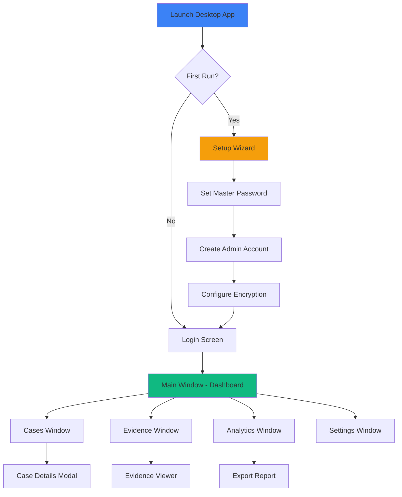

# Electron Desktop Application - UI & Workflow Guide

## Overview

The 378x492 Fraud Detection System is a **cross-platform Electron desktop application** combining the security of local data with the power of modern web technologies. This guide documents the desktop UI, user workflows, and application architecture.

**Platform Support**: macOS 10.15+, Windows 10+, Ubuntu 18.04+

---

## Application Architecture

### Electron Multi-Process Architecture

```
┌─────────────────────────────────────────────────┐
│           Main Process (Node.js)                │
│                                                 │
│  • Application Lifecycle                       │
│  • Menu & Tray Management                      │
│  • IPC Coordination                            │
│  • Database (SQLCipher)                        │
│  • File System Access                          │
│  • Auto-Updates                                │
└──────────────────┬──────────────────────────────┘
                   │ Secure IPC
                   ├────────────────┬─────────────┐
                   ▼                ▼             ▼
         ┌─────────────────┐ ┌──────────┐ ┌──────────┐
         │ Renderer Process│ │ Renderer │ │ Renderer │
         │   (React UI)    │ │(Settings)│ │ (Report) │
         │                 │ │          │ │          │
         │ • Cases         │ │ • Prefs  │ │ • Export │
         │ • Evidence      │ │ • Users  │ │ • Print  │
         │ • Analytics     │ │ • Logs   │ │          │
         └─────────────────┘ └──────────┘ └──────────┘
                   │
                   ▼
         ┌─────────────────┐
         │  SQLCipher DB   │
         │   (Encrypted)   │
         │                 │
         │ • Cases         │
         │ • Transactions  │
         │ • Evidence Meta │
         │ • Users         │
         └─────────────────┘
                   │
                   ▼
         ┌─────────────────┐
         │  Encrypted      │
         │  File Storage   │
         │                 │
         │ • PDFs          │
         │ • Images        │
         │ • Documents     │
         └─────────────────┘
```

---

## Desktop Application Workflow



---

## Desktop UI Pages & Windows

### Login Window

**Type**: Main Window (launches on startup)  
**Size**: 500x600px, non-resizable  
**Purpose**: Secure authentication

#### Visual Layout
```
┌────────────────────────────────────┐
│   [App Logo]                       │
│   378x492 Fraud Detection          │
│                                    │
│   ┌────────────────────────────┐  │
│   │ Email                       │  │
│   └────────────────────────────┘  │
│                                    │
│   ┌────────────────────────────┐  │
│   │ Password              [👁] │  │
│   └────────────────────────────┘  │
│                                    │
│   [x] Remember me on this computer │
│                                    │
│   ┌──────────Sign In──────────┐  │
│   └────────────────────────────┘  │
│                                    │
│   Forgot password? | First time?  │
└────────────────────────────────────┘
```

#### Electron-Specific Features
- **Window Security**: `nodeIntegration: false`, `contextIsolation: true`
- **Auto-lock**: Locks after 15 min inactivity
- **Biometric**: TouchID/Windows Hello support (optional)
- **Offline Login**: Works without internet using cached credentials

---

### Main Window - Dashboard

**Type**: Primary Application Window  
**Size**: 1440x900px minimum, resizable  
**Purpose**: Central hub for all fraud detection activities

#### Desktop Layout
```
┌───────────────────────────────────────────────────────┐
│ File  Edit  View  Window  Help        [- □ ×]       │ ← Native Menu Bar
├───────┬───────────────────────────────────────────────┤
│       │  Dashboard Overview                           │
│ CASES │  ┌─────┐ ┌─────┐ ┌─────┐ ┌─────┐           │
│ ▸     │  │ 847 │ │  24 │ │1,203│ │  5  │           │
│       │  │Cases│ │Active│ │Evid.│ │Alert│           │
│ EVID  │  └─────┘ └─────┘ └─────┘ └─────┘           │
│ ▸     │                                               │
│       │  Recent Activity                              │
│ ANALY │  • Case #8472 updated by John D.            │
│ TICS  │  • Evidence uploaded to Case #8451           │
│ ▾     │  • Fraud alert: High-risk transaction        │
│       │                                               │
│ SETT  │  Quick Actions                                │
│ INGS  │  [+ New Case] [Upload Evidence] [Reports]   │
│       │                                               │
│ HELP  │  System Status                                │
│       │  Database: ✓ | Sync: ✓ | Updates: ✓        │
└───────┴───────────────────────────────────────────────┘
```

#### Electron Features
- **Native Titlebar**: Platform-specific controls (macOS traffic lights, Windows minimize/maximize/close)
- **System Tray**: Minimize to tray, quick actions menu
- **Global Shortcuts**: Cmd/Ctrl+N for new case, Cmd/Ctrl+F for search
- **Window State**: Remembers size, position, sidebar collapsed state
- **Offline Indicator**: Yellow banner when no internet

---

### Cases Window

**Access**: Sidebar → Cases OR Cmd/Ctrl+1  
**Layout**: Replaces dashboard content in main window

#### Desktop View
```
┌───────────────────────────────────────────────────────┐
│ Cases                                  [+ New Case]   │
├───────────────────────────────────────────────────────┤
│ [Search cases...]  [Filter ▼] [Sort: Recent ▼]      │
├────┬────────────┬────────┬──────────┬─────────┬──────┤
│ ID │ Title      │ Status │ Priority │ Assignee│ Date │
├────┼────────────┼────────┼──────────┼─────────┼──────┤
│8472│ Wire Fraud │ Open   │ [HIGH]   │ John D. │ 12/8 │
│8471│ Structurin │ Review │ [MED]    │ Sarah K.│ 12/7 │
│8470│ Shell Co.  │ Closed │ [LOW]    │ Mike P. │ 12/6 │
│ ...│            │        │          │         │      │
└────┴────────────┴────────┴──────────┴─────────┴──────┘
   Showing 1-50 of 847 cases      [< 1 2 3 ... 17 >]
```

#### Context Menu (Right-Click)
- Open Case
- Edit Details
- Add Evidence
- Assign to User
- Change Priority
- Export Case
- Delete Case

#### Keyboard Shortcuts
- `Enter`: Open selected case
- `Cmd/Ctrl+E`: Edit case
- `Cmd/Ctrl+D`: Delete case
- `↑↓`: Navigate rows
- `/`: Focus search

---

### Evidence Window

**Access**: Sidebar → Evidence OR Cmd/Ctrl+2  
**Purpose**: Manage all evidence files centrally

#### Evidence Library
```
┌───────────────────────────────────────────────────────┐
│ Evidence Library                    [+ Upload Files] │
├───────────────────────────────────────────────────────┤
│ [Search...] [Type: All ▼] [Case: All ▼] [Date ▼]   │
├─────────────────────────────────────────────────────┤
│ ┌──────┐  ┌──────┐  ┌──────┐  ┌──────┐            │
│ │ 📄   │  │ 🖼️   │  │ 📊   │  │ 💬   │            │
│ │ Bank │  │ ID   │  │ Trans│  │ SMS  │            │
│ │ Stmt │  │ Scan │  │ ction│  │ Log  │            │
│ └──────┘  └──────┘  └──────┘  └──────┘            │
│ Case #8472  Case #8471  Case #8472  Case #8470     │
│ 12/8/24     12/7/24     12/8/24     12/6/24        │
│                                                     │
│ [Grid View] [List View] [Timeline View]            │
└─────────────────────────────────────────────────────┘
```

#### File Actions
- **Preview**: Double-click to open in viewer
- **Annotate**: Mark-up PDFs, add notes
- **Extract**: OCR text from images (Phase 4)
- **Analyze**: Run fraud detection (Phase 4)
- **Export**: Copy encrypted file to folder

#### Electron File Handling
- **Drag-in**: Drag files from Finder/Explorer directly
- **Drag-out**: Drag evidence files to desktop (exports)
- **Native Viewer**: Uses system PDF viewer for large files
- **Encryption**: All files encrypted at rest with AES-256

---

### Analytics Dashboard

**Access**: Sidebar → Analytics OR Cmd/Ctrl+3  
**Purpose**: System-wide fraud analytics and trends

#### Desktop Analytics View
```
┌───────────────────────────────────────────────────────┐
│ Analytics                    [Export Report ▼]       │
├───────────────────────────────────────────────────────┤
│ Time Range: [Last 30 Days ▼]  [Custom Range]        │
├───────────────────────────────────────────────────────┤
│                                                       │
│  Cases by Status          Fraud Types Detected       │
│  ┌─────────────┐         ┌─────────────┐           │
│  │ ████ Open   │         │ ▓▓▓ Struct  │           │
│  │ ▓▓▓  Review │         │ ███ Roundtr │           │
│  │ ░░░  Closed │         │ ▒▒▒ Velocity│           │
│  └─────────────┘         └─────────────┘           │
│                                                       │
│  Detection Rate Trend                                 │
│  ┌───────────────────────────────────────┐          │
│  │    ╱╲                                  │          │
│  │   ╱  ╲      ╱╲                        │          │
│  │  ╱    ╲    ╱  ╲    ╱╲                │          │
│  │ ╱      ╲──╱    ╲──╱  ╲───            │          │
│  └───────────────────────────────────────┘          │
│     Nov        Dec       Jan                         │
└───────────────────────────────────────────────────────┘
```

#### Export Options
- **PDF Report**: System-generated PDF with charts
- **Excel**: Raw data export
- **Print**: Native print dialog
- **Email**: Attach report to email (via system mail app)

---

### Settings Window

**Access**: Sidebar → Settings OR Cmd/Ctrl+,  
**Type**: Separate modal window  
**Size**: 800x600px

#### Settings Tabs
```
┌───────────────────────────────────────────────────────┐
│ Settings                                      [×]     │
├───────┬───────────────────────────────────────────────┤
│General│ Organization                                  │
│       │ Name: [Fraud Detection Unit        ]         │
│Security Logo: [Choose File...]                       │
│       │                                               │
│Users  │ Appearance                                    │
│       │ Theme: ○ Light  ● Dark  ○ System             │
│Data   │ Language: [English ▼]                        │
│       │                                               │
│Updates│ Preferences                                   │
│       │ [✓] Start on system boot                    │
│About  │ [✓] Minimize to system tray                 │
│       │ [✓] Show desktop notifications              │
│       │                                               │
│       │ [Save Settings] [Cancel]                     │
└───────┴───────────────────────────────────────────────┘
```

#### Security Tab (Electron-Specific)
- **Master Password**: Change database encryption password
- **Auto-Lock**: Lock after X minutes of inactivity
- **Biometric**: Enable TouchID/Windows Hello
- **Encryption Key**: Rotate encryption keys
- **Backup Key**: Export recovery key

#### Data Tab
- **Database Path**: C:\Users\...\378x492\frauddb.db
- **Storage Location**: Choose where encrypted files are stored
- **Backup**: Schedule automatic backups
- **Import/Export**: Migrate data between machines

---

## Electron-Specific Workflows

### Offline Operation

**Scenario**: No internet connection

```
User launches app → Works completely offline
├─ Login: Uses cached credentials
├─ Cases: Full CRUD operations
├─ Evidence: Upload and view (local storage)
├─ Analytics: Generate reports from local DB
└─ Sync: Queue changes, sync when online
```

**Offline Indicator**:
- Yellow banner: "Working Offline - Changes will sync when connected"
- Tray icon changes: Shows offline status

### Cross-Device Sync (Future Phase 4)

**Scenario**: User has app on desktop and laptop

```
Desktop: Make changes → Queue for sync
                ↓
         Internet available
                ↓
         Sync to cloud (encrypted)
                ↓
Laptop: Receives sync → Merge changes → Update UI
```

### Auto-Update Flow

```
App checks for updates (on launch + daily)
         ↓
   Update available?
         ├─ Yes → Download in background
         │        ├─ Notify user
         │        └─ Prompt: "Restart to update"
         │                   ↓
         │            User clicks "Restart"
         │                   ↓
         │            Apply update → Relaunch
         └─ No → Continue normally
```

---

## Native Integrations

### macOS Specific
- **Touch Bar**: Quick actions (New Case, Search, Sync)
- **Notification Center**: Native notifications
- **Handoff**: Continue work on iPhone/iPad (future)
- **Spotlight**: Index cases for system-wide search

### Windows Specific
- **Jump Lists**: Recent cases in taskbar menu
- **Toast Notifications**: Windows 10+ native notifications
- **File Association**: Open .s378 case files directly

### Linux Specific
- **Desktop Entry**: Proper .desktop file for launchers
- **D-Bus**: System integration
- **libnotify**: Native notifications

---

## Window-to-Window Communication

### Opening New Windows

**From Main Window**:
```javascript
// User clicks "Open Case #8472"
ipcRenderer.send('open-case-window', { caseId: 8472 });

// Main process creates new window
const caseWindow = new BrowserWindow({
  width: 1000,
  height: 700,
  parent: mainWindow, // Modal-like
  webPreferences: { /* security settings */ }
});
```

**Child Windows**:
- Case Details (modal)
- Evidence Viewer (non-modal, can open multiple)
- Report Generator (modal)
- Settings (modal)

---

## Data Security (Electron-Specific)

### SQLCipher Encryption

**Database**: `~/.config/378x492/frauddb.db`  
**Encryption**: AES-256 with master password

```javascript
// Main process opens DB
const db = new Database('frauddb.db');
db.pragma(`key='${masterPasswordDerived}'`);
db.pragma('cipher_page_size=4096');
```

### File Encryption

**Storage**: `~/.config/378x492/evidence/`  
**Method**: Each file encrypted with unique key

```
evidence/
├─ 8472/
│  ├─ bank_statement.pdf.enc
│  ├─ id_scan.png.enc
│  └─ metadata.json.enc
└─ 8471/
   └─ transaction_log.csv.enc
```

### Key Management

- **Master Password**: User-provided, never stored
- **Derived Keys**: PBKDF2 with 100,000 iterations
- **Key Storage**: OS keychain (macOS Keychain, Windows Credential Store)
- **Recovery Key**: One-time export for disaster recovery

---

## Performance Optimizations

### Lazy Window Creation
- Only Dashboard window on startup
- Other windows created on-demand
- Destroyed when closed (reduce memory)

### Database Optimization
- SQLite indexes on all foreign keys
- Prepared statements cached
- Connection pooling

### UI Performance
- Virtualized lists (react-window)
- Debounced search (300ms)
- Lazy-load images
- Web Workers for heavy processing

---

## Accessibility

All Electron windows support:
- **Keyboard Navigation**: Full keyboard control
- **Screen Readers**: NVDA, JAWS, VoiceOver compatible
- **High Contrast**: Respects system setting
- **Zoom**: Cmd/Ctrl++ to zoom UI (electron web zoom)
- **Reduced Motion**: Respects `prefers-reduced-motion`

---

## Development Tools

### DevTools Access

- **Development**: Auto-opens DevTools
- **Production**: Cmd/Ctrl+Shift+I (hidden by default)

### IPC Debugging

```javascript
// Log all IPC messages
ipcMain.on('*', (event, channel, ...args) => {
  console.log(`IPC: ${channel}`, args);
});
```

---

## Future Enhancements (Roadmap)

### Phase 4: Advanced Features
- **AI Fraud Detection**: Local ML inference
- **OCR**: Text extraction from evidence images
- **Network Graph**: Visualize entity relationships

### Phase 5: Collaboration
- **Real-Time Sync**: Multi-user collaboration
- **Shared Cases**: Team-based case assignment
- **Comments**: Annotate evidence with team

---

**Last Updated**: December 8, 2025  
**Version**: 1.0.0 (Electron 28+)  
**Platform**: macOS, Windows, Linux
