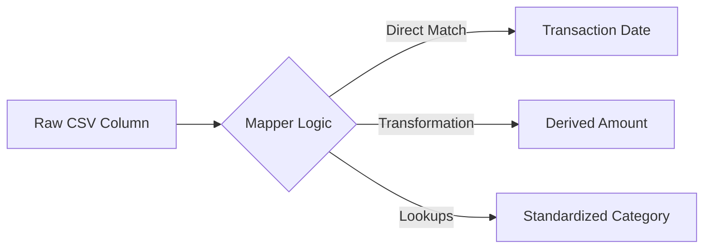

# 04. Evidence & Forensics Design: "The Lab"

> **Goal:** A unified pipeline for Data Ingestion, Organization, and Deep Forensic Analysis.
> **Philosophy:** "From Raw Data to Admissible Evidence."


---

## 🎯 Fraud Detection Value

| Fraud Type | How Evidence Page Helps |
| :--- | :--- |
| **Document Forgery** | ELA Heatmap reveals Photoshop tampering on invoices and receipts. |
| **Ghost Vendors** | OCR extracts vendor names from scanned documents → cross-reference with vendor registry. |
| **Timestomping** | Metadata timeline exposes documents with suspicious creation/modification dates. |
| **Redaction Fraud** | Gap Analysis reconstructs hidden transactions from partial bank statements. |

---

## 1. Consolidated Feature Set

| Feature Category | Features | Source |
| :--- | :--- | :--- |
| **Ingestion** | 5-Step Wizard (Upload → Scan → Map → Preview → Confirm) | Merged |
| **Automation** | AI Auto-Mapping & Gap Analysis | Merged |
| **Library** | Case Binders (Folder Tree) + Multi-Modal Viewer | Merged |
| **Forensics** | PDF/Image Tools (OCR, Annotate, Redact) | Merged |
| **Analysis** | Tamper Detection (ELA, Metadata Timeline) | Merged |
| **Video/Audio** | Transcription + Frame Extraction | Proposed |

---

## 2. Layout Structure: "The Laboratory"

### 2.1 Mode A: Airlock (Ingestion)

- **UI:** Stepper Wizard centered on screen.
- **Steps:** Source → Sanitize → Map → Confirm.

### 2.2 Mode B: Vault (Library)

- **UI:** Split pane. Left = Folder Tree. Right = Smart Cards.
- **Smart Cards:** Show extracted metadata, not just filenames.

### 2.3 Mode C: Workbench (Forensics)

- **UI:** Dark mode, high-contrast split screen.
- **Left:** Document Canvas (Zoomable, Layered).
- **Right:** Analysis Panel (OCR Text, Metadata, Tamper Flags).

---

## 3. Implementation Strategy

### 3.1 Ingestion Wizard

- **Why:** "Garbage in, garbage out" — strict validation before data enters.
- **What:** 5-step interactive importer with AI-powered column mapping.
- **How:** Heuristic engine scans top 50 rows for pattern recognition.

### 3.2 Forensic Canvas

- **Why:** Downloading malware-laden PDFs to local disk is dangerous.
- **What:** Sandboxed, web-based rendering engine.
- **How:** `react-pdf` + HTML5 Canvas overlay for annotations.

### 3.3 Video & Audio Pipeline

- **Why:** Fraud cases often include call recordings, CCTV, WhatsApp voice notes.
- **What:** Transcription + Frame Extraction.
- **How:** Whisper AI for audio, key frame extraction for video OCR.

---

## 4. Code Relationships

### Components

| Component | Path | Dependencies |
| :--- | :--- | :--- |
| `EvidenceLibrary.tsx` | `src/pages/EvidenceLibrary.tsx` | FolderTree, SmartCard, UploadWizard |
| `UploadWizard.tsx` | `src/components/evidence/UploadWizard.tsx` | react-dropzone, stepper |
| `ForensicCanvas.tsx` | `src/components/evidence/ForensicCanvas.tsx` | react-pdf, fabric.js |
| `TamperDetector.tsx` | `src/components/evidence/TamperDetector.tsx` | ELA library, exiftool |

### API Endpoints

| Endpoint | Method | Purpose |
| :--- | :--- | :--- |
| `/api/v1/evidence/upload` | POST | Upload files |
| `/api/v1/evidence/:id/ocr` | GET | Extract text |
| `/api/v1/evidence/:id/metadata` | GET | EXIF data |
| `/api/v1/evidence/:id/ela` | GET | Error Level Analysis |

### Data Flow


---

## 5. Proposed Enhancements

| Enhancement | Priority | Description |
| :--- | :--- | :--- |
| **Signature Matching** | High | Clip a signature → find all documents with matching signatures. |
| **Handwriting Analysis** | Medium | AI compares handwriting samples across documents. |
| **Blockchain Notarization** | Medium | Hash evidence to blockchain for legal admissibility. |
| **AR Document Overlay** | Low | iPad camera overlays annotations on physical documents. |

---

## 6. User Scenarios

1. **Import:** Analyst drops Zip of 50 PDFs. Wizard detects "Chase Bank Statements". Auto-applies template.
2. **Verify:** System flags "Statement_Mar.pdf" as **Tampered**. Analyst opens in Workbench.
3. **Analyze:** Analyst toggles ELA Heatmap. Sees inconsistent noise around "Total Amount". Confirms forgery.
4. **Extract:** Analyst clips forged amount, adds note, saves as "Key Evidence".


---

# Technical Specification

# 📥 Ingestion & Mapping Page

> Upload data and define field mappings

**Route:** `/ingestion`  
**Component:** `src/pages/Ingestion.tsx`

---

## Overview

The Ingestion & Mapping page is the entry point for new data into the system. Users can upload files, connect to databases, or configure API feeds. After ingestion, they define how source fields map to the system's data model.

---

## Screenshot

```text
┌─────────────────────────────────────────────────────────────────────────────┐
│ 📥 Data Ingestion                                              [+ New Job]  │
├─────────────────────────────────────────────────────────────────────────────┤
│                                                                             │
│  Progress: ─────●─────────────────────────────────────────────             │
│            ① Source  ② Upload  ③ Mapping  ④ Preview  ⑤ Confirm             │
│                                                                             │
│  ┌─────────────────────────────────────────────────────────────────────┐   │
│  │ SELECT DATA SOURCE                                                   │   │
│  ├─────────────────────────────────────────────────────────────────────┤   │
│  │                                                                      │   │
│  │  ┌─────────────┐  ┌─────────────┐  ┌─────────────┐                  │   │
│  │  │ 📁          │  │ 🗄️          │  │ 🔗          │                  │   │
│  │  │ FILE        │  │ DATABASE    │  │ API FEED    │                  │   │
│  │  │ UPLOAD      │  │ CONNECTION  │  │             │                  │   │
│  │  │   [✓]       │  │   [ ]       │  │   [ ]       │                  │   │
│  │  └─────────────┘  └─────────────┘  └─────────────┘                  │   │
│  │                                                                      │   │
│  │  Supported: CSV, JSON, XML, Excel, PDF (OCR)                        │   │
│  │                                                                      │   │
│  └─────────────────────────────────────────────────────────────────────┘   │
│                                                                             │
│  ┌─────────────────────────────────────────────────────────────────────┐   │
│  │                                                                      │   │
│  │                    ╔═══════════════════════════╗                    │   │
│  │                    ║                           ║                    │   │
│  │                    ║   📁 Drop files here     ║                    │   │
│  │                    ║   or click to browse      ║                    │   │
│  │                    ║                           ║                    │   │
│  │                    ╚═══════════════════════════╝                    │   │
│  │                                                                      │   │
│  └─────────────────────────────────────────────────────────────────────┘   │
│                                                                             │
│                                              [Cancel]  [Next: Upload →]    │
└─────────────────────────────────────────────────────────────────────────────┘
```

---

## Features

| Feature | Status | Description |
|---------|--------|-------------|
| File Upload | ✅ | Drag-and-drop or click to upload |
| Database Connection | 🔲 | Connect to SQL/NoSQL databases |
| API Feed | 🔲 | Configure REST/GraphQL endpoints |
| Progress Pipeline | ✅ | Visual step-by-step progress |
| OCR Processing | ✅ | Extract text from PDF/images |
| Metadata Extraction | ✅ | Parse file metadata |
| Virus Scanning | ✅ | Security check on uploads |
| CSV Import Wizard | ✅ | Column mapping for CSV files |
| AI Auto-Mapping | 🚀 | *Proposed:* ML prediction of column types |
| Mapping Templates | 🚀 | *Proposed:* Save/Load mapping configs |
| Data Hygiene | 🚀 | *Proposed:* Auto-cleaning rules |
| Multi-File Stitching | 🚀 | *Proposed:* Merge multiple PDFs |
| Redaction Gap Analysis | 🚀 | *Proposed:* Infer missing values |

---

## Ingestion Steps


### Step 1: Source Selection

- Choose data source type
- File Upload (most common)
- Database Connection
- API Feed


### Step 2: Upload / Connect

- **File Upload:** Drag-and-drop zone with validation
- **Database:** Connection string, credentials
- **API:** Endpoint URL, authentication


### Step 3: Mapping

- View detected fields
- Map source → target fields
- Define transformations
- Handle data type conversions


### Step 4: Preview

- Show first 10 rows
- Validation messages
- Data quality indicators
- Fix errors before commit


### Step 5: Confirm

- Summary of upload
- Start ingestion process
- Real-time progress tracking
- Completion notification

---

## Field Mapping

The mapping interface allows users to link source columns to the internal data schema.




### Mapping Logic

- **Direct Matching:** 1-to-1 link (e.g., "Date" -> `transaction_date`)
- **Combined Fields:** Merge two columns (e.g., "First Name" + "Last Name" -> `full_name`)
- **Conditional Formatting:** Flip signs based on "Type" column (Debit/Credit)

---

## Standardized Data Model

All ingested data is normalized to this structure:

| Field | Type | Description |
|-------|------|-------------|
| `transaction_id` | UUID | Unique identifier |
| `transaction_date` | ISO8601 | YYYY-MM-DD format |
| `amount` | Decimal | Signed value (negative = outflow) |
| `currency` | Enum | USD, EUR, IDR, etc. |
| `description` | String | Raw text from bank |
| `counterparty` | String | Cleaned vendor/payer name |
| `category` | Enum | Initial classification |

---

## Components Used

| Component | Purpose |
|-----------|---------|
| `UploadZone` | Drag-and-drop file upload |
| `ProcessingPipeline` | Progress visualization |
| `CSVWizard` | CSV column mapping |
| `FieldMapper` | Source → Target mapping |
| `DataPreview` | Preview table |
| `ForensicResults` | OCR/metadata results |
| `UploadHistory` | Past uploads |

---

## API Endpoints
 
 ### Upload Evidence
 ```typescript
 POST /api/v1/evidence/upload
 Content-Type: multipart/form-data
 
 Form Data:
 - file: File (Binary)
 - case_id: string
 - description: string (optional)
 - tags: string (JSON array, optional)
 
 Response (200 OK):
 {
   "message": "Evidence uploaded and processed successfully",
   "evidence_id": "ev_12345",
   "id": "ev_12345", // Legacy support
   "caseId": "case_987",
   "fileName": "invoice_scan.pdf",
   "fileType": "application/pdf",
   "sizeBytes": 102400,
   "uploadedAt": "2023-10-27T10:00:00Z",
   "filePath": "uploads/uuid.pdf",
   "ocrText": "INVOICE #001...",
   "analysis_result": {
     "extractedTextLength": 500,
     "keyEntitiesCount": 5,
     "sentimentScore": 0.1,
     "qualityScore": 0.95,
     "fileType": "application/pdf"
   }
 }
 ```
 
 ### Analyze File (Multimodal)
 ```typescript
 POST /api/v1/multimodal/analyze/upload
 Content-Type: multipart/form-data
 
 Form Data:
 - file: File
 - enable_ocr: boolean (default: true)
 - enable_forensics: boolean (default: true)
 
 Response (200 OK):
 {
   "success": true,
   "file_info": { "filename": "...", "file_type": "...", "size_bytes": 123 },
   "text_analysis": { "extracted_text": "...", "sentiment_score": 0.5 },
   "visual_analysis": { "objects_detected": [], "faces_detected": [] },
   "forensic_analysis": { "manipulation_score": 0.0, "authenticity_score": 98.0 }
 }
 ```
 
 ---

## WebSocket Events

Real-time progress tracking via WebSocket:

| Event | Payload | Description |
|-------|---------|-------------|
| `upload_progress` | `{ percent: number }` | Upload percentage |
| `stage_update` | `{ stage: string, status: string }` | Pipeline stage change |
| `processing_complete` | `{ id, summary }` | Ingestion finished |
| `error` | `{ message, stage }` | Error occurred |

---

## Processing Pipeline Stages

| Stage | Description | Duration |
|-------|-------------|----------|
| 🔼 Upload | File transfer | variable |
| 🛡️ Virus Scan | Security check | ~5s |
| 📄 OCR / PDF Table | Text & Table extraction | ~30s |
| 🧹 Data Hygiene | Rule-based cleaning | ~3s |
| 🤖 Auto-Mapping | ML Column prediction | ~5s |
| 📋 Metadata | Parse file info | ~2s |
| 🔍 Forensics | Pattern detection | ~10s |
| 📇 Indexing | Add to search index | ~5s |

---

## 🚀 Advanced Features (Proposed)

These advanced capabilities enhance the ingestion process with AI automation and power-user tools.

### 1. 🤖 AI-Powered Auto-Mapping & Column Detection

Instead of manual field selection, the system analyzes the first 50 rows of data to guess the correct mapping.

- **Heuristic matching:** Detects likely headers (e.g., "Trx Date", "Valuta Date" → `transaction_date`)
- **Data Pattern Recognition:** Identifies columns containing currency or recognizable date formats to suggest types
- **Confidence Scoring:** Shows a confidence score (e.g., "98% confident this is Amount") and asks for verification on low-confidence fields

### 2. 📑 Mapping Template Library

Save time on recurring uploads from the same bank or institution.

- **Save as Template:** "Save this mapping as 'BCA Checking Account 2024'"
- **Auto-Apply:** System fingerprinting detects the file structure and suggests the matching template automatically
- **Global vs Personal:** Share verified templates across the organization

### 3. 🧹 Automated Data Hygiene Rules

Configure cleaning rules that run *before* ingestion to normalize data.

- **Remove Rows:** "Delete rows where Description contains 'OPENING BALANCE'"
- **Encoding Fixes:** Auto-correct UTF-8/Latin-1 issues
- **Number Parsing:** Handle European (`10.000,00`) vs US (`10,000.00`) decimals automatically
- **Date Standardization:** Convert "15-Jan-23" or "01/15/2023" to ISO `YYYY-MM-DD`

### 4. 🧩 Multi-File Knitting (Stitching)

Upload 12 separate monthly statements (Jan.pdf ... Dec.pdf) as a single job.

- **Gap Detection:** "Warning: Missing transactions for March 15 - April 1"
- **Overlap Handling:** "Duplicate transactions detected between Feb.pdf end and Mar.pdf start. Auto-deduplicated."
- **Unified Preview:** Treat the stitched dataset as one continuous timeline

### 5. 👁️ Intelligent PDF Parsing (Table Extraction)

Advanced handling for complex, non-standard layouts.

- **Header/Footer Removal:** Ignore recurring page headers/footers in parsed data
- **Multi-Column Logic:** Detect check images vs transaction tables
- **Row Span Handling:** Merge multi-line descriptions into a single cell

### 6. 🕵️‍♂️ Heuristic Analysis Engine (Forensics)

Automated statistical analysis run immediately upon ingestion to detect anomalies in the raw dataset.

#### Benford's Law Analysis


- Checks if the leading digits follow the natural distribution (Newcomb–Benford law)
- Deviations often indicate fabricated data


#### Round-Number Density

- Flags excessive use of round numbers (e.g., $5,000.00)
- May indicate manual estimation or kickbacks rather than actual expenses


#### Velocity/Structuring (Smurfing)

- Detects bursts of small transactions just below reporting thresholds (e.g., typically $10,000)
- Identifies patterns within a short window


#### Temporal Anomalies

- Identifies business transactions occurring at unusual times (e.g., 3:00 AM)
- Flags transactions on non-working days (Weekends/Holidays)

### 7. 🕵️‍♂️ Redaction Gap Analysis

Heuristic logic to infer values for redacted items in bank statements.

#### Sequence Gap Logic


- If Cheque #101 is $50 and #103 is $50, and total withdrawal is $150, inferred #102 is ~$50


#### Reference Reconstruction

- Use partial distinct metadata (e.g., "TRX-***-99") to match against known counter-parties with similar patterns


#### Running Balance Math

- Calculate the precise value of a redacted transaction by computing `Balance_Before - Balance_After = Transaction_Amount`


#### Heuristic Balance Reconstruction

- If ending balance is missing, categorizes transactions (Income/Expense/Transfer)
- Infers the final balance deviation based on historical cash flow patterns

### 8. 🛠️ Complete Implementation Roadmap

Core functionality to build the ingestion system from scratch.

**Phase 1: Basic Upload & Mapping**
- Implement 5-step wizard UI with progress pipeline.
- File upload with drag-and-drop and validation.
- Basic field mapping interface (manual source-target linking).
- Data preview table with first 10 rows.
- Simple CSV parsing and column detection.

**Phase 2: Advanced Processing**
- OCR integration for PDF/image text extraction.
- Metadata parsing and virus scanning.
- Data type conversions and basic transformations.
- WebSocket real-time progress updates.
- Error handling and retry logic.

**Phase 3: AI & Automation**
- ML-based auto-mapping with confidence scoring.
- Automated data hygiene rules (date/number standardization).
- Forensic analysis (Benford's Law, anomaly detection).
- Mapping template save/load functionality.
- Multi-file stitching with gap detection.

**Phase 4: Enterprise Features**
- Database connection support (SQL/NoSQL).
- API feed configuration (REST/GraphQL).
- Redaction gap analysis and inference.
- Bulk template management and sharing.
- Advanced data transformation rules.

**Phase 5: Optimization & Scale**
- Chunked upload for large files.
- Background processing and queuing.
- Performance optimizations (lazy loading, caching).
- Real-time collaboration on mappings.
- Integration with external data sources.

---

## Keyboard Shortcuts

| Key | Action |
|-----|--------|
| `Ctrl+O` | Open file browser |
| `Enter` | Continue to next step |
| `Esc` | Cancel upload |
| `Ctrl+M` | Toggle mapping panel |

---

## Error Handling

| Error | Resolution |
|-------|------------|
| File too large | Max size is 100MB |
| Invalid format | Check supported formats |
| Virus detected | File rejected |
| Mapping error | Review field types |
| Timeout | Retry or contact support |

---

## Accessibility

| Feature | Implementation |
|---------|----------------|
| File Upload | Accessible drop zone with keyboard support |
| Progress Indicators | ARIA live regions for status updates |
| Mapping Controls | Keyboard navigation for field selection |
| Error Messages | Screen reader announcements |
| Focus Management | Focus trap in mapping wizard |

---

## Responsive Behavior

| Breakpoint | Layout Change |
|------------|---------------|
| ≥1280px | Full wizard with side preview |
| ≥1024px | Stacked wizard steps |
| ≥768px | Simplified mapping interface |
| <768px | Single column, step-by-step |

---

## Performance Optimizations

- **Chunked Upload:** Large files uploaded in chunks
- **Background Processing:** OCR and analysis run asynchronously
- **Progress Streaming:** Real-time WebSocket updates
- **Lazy Schema Detection:** Only analyze visible rows initially
- **Cached Templates:** Mapping templates stored locally

---

## 🏗 Architecture References

*   **Technology Stack:** See [00_TECH_STACK.md](../../architecture/SYSTEM_ARCHITECTURE.md)
*   **Processing Logic:** See [00_FRAUD_LOGIC.md](../../architecture/SYSTEM_ARCHITECTURE.md)

---

## Testing

### Unit Tests


- File validation logic
- Mapping transformation functions
- Data type conversion
- Template save/load

### E2E Tests


- Complete upload flow
- CSV mapping wizard
- Error handling scenarios
- Multi-file upload

---

## Related Files

```
frontend/src/
├── pages/Ingestion.tsx
├── components/ingestion/
│   ├── UploadZone.tsx
│   ├── ProcessingPipeline.tsx
│   ├── CSVWizard.tsx
│   ├── FieldMapper.tsx
│   ├── DataPreview.tsx
│   ├── ForensicResults.tsx
│   └── UploadHistory.tsx
└── lib/
    ├── api.ts
    └── websocket.ts
```

---


## 🔌 Implementation Links

### Frontend Components
- [`Ingestion.tsx`](../../../frontend/src/pages/Ingestion.tsx)
- [`EvidenceViewer.tsx`](../../../frontend/src/components/evidence/EvidenceViewer.tsx)

### Backend Services
- [`evidence.py`](../../../backend/app/routers/evidence.py)
- [`multimodal_analysis_service.py`](../../../backend/app/services/multimodal_analysis_service.py)

### Key API Endpoints
- `POST /evidence/upload`
- `GET /evidence/{id}/content`
- `POST /evidence/process`

---
### Frontend Components
- [`Ingestion.tsx`](../../../frontend/src/pages/Ingestion.tsx)
- [`EvidenceViewer.tsx`](../../../frontend/src/components/evidence/EvidenceViewer.tsx)

### Backend Services
- [`evidence.py`](../../../backend/app/routers/evidence.py)
- [`multimodal_analysis_service.py`](../../../backend/app/services/multimodal_analysis_service.py)

### Key API Endpoints
- `POST /evidence/upload`
- `GET /evidence/{id}/content`
- `POST /evidence/process`

---

## 🔮 Future Enhancements

### Phase 1: Simple Basic Functions (MVP)
- [ ] Drag-and-Drop File Upload
- [ ] 5-Step Progress Wizard (Upload -> Scan -> Map -> Preview -> Confirm)
- [ ] Basic Field Mapping (Source -> Target linking)
- [ ] Simple CSV Validation (Check required fields)

### Phase 2: Advanced (Professional)
- [ ] Mapping Templates (Save "Chase Bank" preset)
- [ ] API Feed Configuration (Connect external providers)
- [ ] Automated Data Hygiene (Date/Number standardization)
- [ ] Multi-File Stitching (Merge Jan.pdf + Feb.pdf)
- [ ] Redaction Gap Inference

### Phase 3: Extreme (Sci-Fi)
- [ ] AI Auto-Mapping (Zero-config column detection)
- [ ] Heuristic "Smurfing" Detection during upload
- [ ] Benford's Law Real-time Analysis
- [ ] "Self-Healing" Data Pipeline (Auto-corrects malformed rows)

---

## Related Pages

- [Dashboard](./02_DASHBOARD.md) - System overview
- [Cases](./03_CASES.md) - Case management
- [Forensics](./05_FORENSICS.md) - Next step after ingestion


---

# Forensics & Analysis Workspace

**Route:** `/forensics/:documentId`
**Component:** `src/pages/ForensicsAnalysis.tsx`
**Status:** ✅ Implemented

---

## Overview

The Forensics Workspace is the "lab bench" for deep-dive document analysis. Unlike **Ingestion** (which handles bulk upload and initial processing), Forensics is where analysts inspect specific suspicious files to verify authenticity, detect tampering, and extract evidence.

**Core Mission:** Answer the question *"Is this document real, and what does it prove?"*

---

## 🏗 Architecture References

*   **Technology Stack:** See [00_TECH_STACK.md](../../architecture/SYSTEM_ARCHITECTURE.md)
*   **Data Models:** See [00_DATA_MODELS.md](../../architecture/SYSTEM_ARCHITECTURE.md)
*   **Fraud Logic:** See [00_FRAUD_LOGIC.md](../../architecture/SYSTEM_ARCHITECTURE.md)

---

## Layout

```text
┌─────────────────────────────────────────────────────────────────────────────┐
│ 🔙 Back to Case | 📄 Invoice_Dec2025.pdf (Verified)    [🔍 Zoom] [⬇ Export]│
│─────────────────────────────────────────────────────────────────────────────│
│                                                                             │
│  ┌── TOOLS ──────┐  ┌── DOCUMENT VIEWER (Canvas) ────────────────────────┐  │
│  │               │  │                                                    │  │
│  │ [T] Text      │  │  INVOICE #10234                                    │  │
│  │ [🖊] Highlight │  │                                                    │  │
│  │ [🔗] Link TRX │  │  To: 378x492 Corp                                  │  │
│  │ [✂️] Snippet  │  │                                                    │  │
│  │               │  │  Item          Qty    Price                        │  │
│  │ LAYERS        │  │  Services      1      $5,000                       │  │
│  │ [✓] OCR Text  │  │                                                    │  │
│  │ [ ] ELA Heat  │  │  Total: $5,000                                     │  │
│  │ [ ] Grid      │  │                                                    │  │
│  └───────────────┘  │  Valid Signature: [John Doe]                       │  │
│                     │  (Signed 2025-12-07 14:00)                         │  │
│                     │                                                    │  │
│                     └────────────────────────────────────────────────────┘  │
│                                                                             │
│  ┌── ANALYSIS PANEL ─────────────────────────────────────────────────────┐  │
│  │                                                                       │  │
│  │  Tabs: [ METADATA ] [ CONTENTS ] [ TAMPER CHECK ] [ HISTORY ]         │  │
│  │                                                                       │  │
│  │  metadata: {                                                          │  │
│  │    "Author": "Microsoft Word 2013",                                   │  │
│  │    "Created": "2025-12-07T10:00:00Z",                                 │  │
│  │    "Modified": "2025-12-07T14:30:00Z" (⚠️ Differed by 4h)             │  │
│  │  }                                                                    │  │
│  │                                                                       │  │
│  │  [ Mark as Admissible Evidence ]  [ Flag as Forged ]                  │  │
│  └───────────────────────────────────────────────────────────────────────┘  │
└─────────────────────────────────────────────────────────────────────────────┘
```

---

## Features

### 1. The Document Canvas
A high-performance viewer (using `react-pdf`) that supports layered rendering.
*   **OCR Overlay:** Toggle selectable text layer over the image.
*   **Annotation:** Draw bounding boxes to highlight key evidence (e.g., "See inflated price here").
*   **Snippet Extraction:** One-click tool to crop a region and save it as a standalone "Evidence Clip" linked to a Transaction.

### 2. Tamper Detection Lab
Tools to reveal invisible modifications.
*   **Metadata Timeline:** Visualizes creation vs. modification dates.
*   **Error Level Analysis (ELA):** (See `00_FRAUD_LOGIC.md`) Generates a heatmap showing compression artifacts. Inconsistent compression suggests inserted/patched text.
*   **Font Consistency Check:** Scans PDF internal structure for multiple font families (e.g., "Arial" mixed with "Arial-Patched").

### 3. Linkage Workbench
Connects the document to the financial reality.
*   **Transaction Lookup:** Sidebar to search for the transaction this document claims to support.
*   **Auto-Match:** AI suggests links based on Amount and Date extracted via OCR.

---


## 🔌 Implementation Links

### Frontend Components
- [`Ingestion.tsx`](../../../frontend/src/pages/Ingestion.tsx)
- [`EvidenceViewer.tsx`](../../../frontend/src/components/evidence/EvidenceViewer.tsx)

### Backend Services
- [`evidence.py`](../../../backend/app/routers/evidence.py)
- [`multimodal_analysis_service.py`](../../../backend/app/services/multimodal_analysis_service.py)

### Key API Endpoints
- `POST /evidence/upload`
- `GET /evidence/{id}/content`
- `POST /evidence/process`

---
### Frontend Components
- [`Ingestion.tsx`](../../../frontend/src/pages/Ingestion.tsx)
- [`EvidenceViewer.tsx`](../../../frontend/src/components/evidence/EvidenceViewer.tsx)

### Backend Services
- [`evidence.py`](../../../backend/app/routers/evidence.py)
- [`multimodal_analysis_service.py`](../../../backend/app/services/multimodal_analysis_service.py)

### Key API Endpoints
- `POST /evidence/upload`
- `GET /evidence/{id}/content`
- `POST /evidence/process`

---

## 🔮 Future Enhancements (Roadmap)

### Phase 1: Simple Basic Functions (MVP)
*   [ ] PDF / Image Viewing.
*   [ ] Basic Metadata Extract (Author, Date).
*   [ ] "Verified" / "Rejected" Status Toggles.

### Phase 2: Advanced (Professional)
*   [ ] **ELA Heatmap Layer:** Visualizing compression anomalies.
*   [ ] **OCR-to-Form:** Drag selection from analysis view to auto-fill form fields.
*   [ ] **Version Diff:** Compare two uploaded versions of the "same" contract.

### Phase 3: Extreme (Sci-Fi)
*   [ ] **Stylometric Fingerprinting:** AI analysis of writing style to determine if "Vendor A" is actually "Employee B".
*   [ ] **Pixel-History Reconstruction:** Attempt to undo "Blackout/Redaction" bars if metadata layers were preserved.
