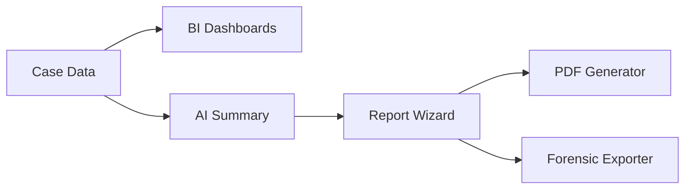

# 06. Reporting & Intelligence Design: "The Insight Deck"

> **Goal:** Synthesize operational data into strategic business intelligence and court-admissible reports.
> **Philosophy:** "Intelligence, not just Data." Interactive dashboards that become static evidence when needed.


---

## 🎯 Fraud Detection Value

| Fraud Type | How Reporting Page Helps |
| :--- | :--- |
| **Embezzlement** | Burn Rate Simulator reveals unexplained fund depletion patterns. |
| **Construction Fraud** | Milestone Tracker exposes phases marked "complete" without matching expenditure. |
| **Regulatory Evasion** | Compliance templates ensure SAR/STR filings meet jurisdictional requirements. |
| **Evidence Tampering** | Forensic ZIP package includes SHA-256 hashes for chain of custody. |

---

## 1. Consolidated Feature Set

| Feature Category | Features | Source |
| :--- | :--- | :--- |
| **BI Dashboards** | Cashflow Waterfall, Burn Rate Simulator, Peer Benchmarks | `08_VIS` |
| **Milestone Tracking** | Phase Stepper, Fund Utilization | `08_VIS` |
| **Summary Preview** | Success Banner, Executive Cards, Key Findings | `09_SUMMARY` |
| **Report Builder** | Conclusion Wizard (4 Steps), Template Selection | `05_REPORTING` |
| **Export Options** | PDF (4 templates), Forensic ZIP Package | `09_SUMMARY` |
| **Advanced** | Interactive Story Mode (Scrollytelling) | `09_SUMMARY` |

---

## 2. Layout: "The Boardroom"

### Tab Structure

| Tab | Name | Purpose |
| :--- | :--- | :--- |
| **A** | Financial Health | Cashflow Waterfall, Burn Rate Simulator |
| **B** | Project Tracker | Milestone Stepper, Peer Benchmarks |
| **C** | Summary Preview | Success Banner + Key Findings (AI) |
| **D** | Report Builder | Conclusion Wizard (Verify → Select → Draft → Sign) |

---

## 3. Implementation Strategy

### 3.1 Cashflow Balance & Waterfall

- **Why:** Investigators need to isolate "Project Cost" from noise (personal expenses, mirror transactions).
- **What:** Split-view with Waterfall Chart showing subtraction layers.
- **How:** `recharts` WaterfallChart + category toggles.

### 3.2 Conclusion Wizard

- **Why:** Court-admissible reports require structured methodology.
- **What:** 4-step flow: Verify Subjects → Select Evidence → Draft Narrative → Sign.
- **How:** Multi-step form with AI-assisted narrative generation.

### 3.3 Forensic Export

- **Why:** Legal proceedings require chain of custody documentation.
- **What:** ZIP package with hashes, custody log, self-contained HTML viewer.
- **How:** JSZip + SHA-256 hash generation.

---

## 4. Code Relationships

### Components

| Component | Path | Dependencies |
| :--- | :--- | :--- |
| `Reporting.tsx` | `src/pages/Reporting.tsx` | Main Layout (Tabs) |
| `FinancialHealth.tsx` | `src/components/reporting/FinancialHealth.tsx` | Cashflow Waterfall, Burn Rate |
| `ProjectTracker.tsx` | `src/components/reporting/ProjectTracker.tsx` | Milestone Stepper, Benchmarks |
| `SummaryPreview.tsx` | `src/components/reporting/SummaryPreview.tsx` | Success Banner, Key Findings |
| `ReportBuilder.tsx` | `src/components/reporting/ReportBuilder.tsx` | Conclusion Wizard Wrapper |
| `ConclusionWizard.tsx` | `src/components/reporting/ConclusionWizard.tsx` | Wizard Logic |
| `DossierExport.tsx` | `src/components/reporting/DossierExport.tsx` | Export Functionality |

### API Endpoints

| Endpoint | Method | Purpose |
| :--- | :--- | :--- |
| `/analytics/cases` | GET | Case analytics |
| `/analytics/transactions` | GET | Transaction analytics |
| `/analytics/overview` | GET | System overview |
| `/reporting/export` | POST | Generate Report |
| `/reporting/summary/{case_id}` | GET | Case summary with findings |
| `/reporting/templates` | GET | Available report templates |
| `/reporting/scheduled` | GET | List scheduled reports |
| `/reporting/scheduled` | POST | Create scheduled report |
| `/reporting/scheduled/{id}` | DELETE | Delete scheduled report |
| `/reporting/financial-health/{case_id}` | GET | Financial health data |
| `/reporting/project-tracker/{case_id}` | GET | Milestone & benchmark data |

### Data Flow



---

## 5. Proposed Enhancements

| Enhancement | Priority | Description |
| :--- | :--- | :--- |
| **Interactive Story Mode** | High | Scrollytelling presentation synced to charts. |
| **Multi-Language Export** | Medium | PDFs in English, Arabic, Indonesian. |
| **Scheduled Reports** | Medium | Auto-generate weekly summary emails. |
| **Blockchain Notarization** | Low | Timestamp reports on public blockchain. |

---

## 6. User Scenarios

1. **CFO Review:** Opens Tab A. Sees "Burn Rate" in red. Adjusts simulation sliders.
2. **Phase Approval:** PM opens Tab B. Marks "Foundation" complete. Releases Phase 2 funds.
3. **Legal Filing:** Investigator opens Tab D. Runs Wizard. Signs report. Downloads Forensic ZIP.


---

# Technical Specification

**Route:** `/reporting`
**Component:** `src/pages/Reporting.tsx`
**Status:** ✅ Implemented
**Backend Router:** `backend/api/reporting.py`

---

## 🏗 Architecture References

*   **Technology Stack:** See [00_TECH_STACK.md](../../architecture/SYSTEM_ARCHITECTURE.md)
*   **Data Models:** See [00_DATA_MODELS.md](../../architecture/SYSTEM_ARCHITECTURE.md)

---

> [!NOTE]
> **Implementation Note:** Features strictly marked as "Court-Admissible" or "Cryptographic" (ISO 27037) are high-complexity items requiring specialized compliance auditing. In the current "378x492" scope, these will be implemented as standard PDF Reports with hashed logs, which may not meet full legal forensics standards without additional 3rd-party certification.

**Key Features:**

- 📊 **Executive Summary** - Consolidated metrics and findings
- 📄 **PDF Report Generation** - Professional, court-ready documents
- 🗄️ **Case Archival** - Close and archive workflow
- 📖 **Interactive Story Mode** - Scrollytelling narrative (planned)
- ⚖️ **Court-Admissible Export** - Forensics-compliant packages (planned)
- 🕸️ **Link Analysis Summary** - Visual fraud network (planned)

---

## Layout

### Desktop View (≥1024px)

```text
┌─────────────────────────────────────────────────────────────────────────────┐
│ 📄 Case Summary Report                                  Related: CASE-001   │
├─────────────────────────────────────────────────────────────────────────────┤
│                                                                             │
│           ╔═══════════════════════════════════════════════════════╗        │
│           ║                                                       ║        │
│           ║           ✓ SUCCESS! CASE CLOSED                     ║        │
│           ║                                                       ║        │
│           ║        99.8% Data Quality Achieved                   ║        │
│           ║        45 days to resolution                         ║        │
│           ║                                                       ║        │
│           ╚═══════════════════════════════════════════════════════╝        │
│                                                                             │
│  ─────────────────────────────────────────────────────────────────────     │
│                           EXECUTIVE SUMMARY                                 │
│  ─────────────────────────────────────────────────────────────────────     │
│                                                                             │
│  ┌──────────────────┐  ┌──────────────────┐  ┌──────────────────────┐     │
│  │ 📥 INGESTION     │  │ 🔄 RECONCILIATION│  │ ⚖️ ADJUDICATION       │     │
│  │                  │  │                  │  │                      │     │
│  │ 12,450 records   │  │ Match Rate: 94.2%│  │ Resolved: 98         │     │
│  │ 8 source files   │  │ New: 890 records │  │ Avg Time: 8.3 min    │     │
│  │ ✓ Complete       │  │ Rejected: 45     │  │ ✓ Complete           │     │
│  └──────────────────┘  └──────────────────┘  └──────────────────────────┘  │
│                                                                             │
│  ┌───────────────────────────────────────────────────────────────────────┐ │
│  │ 📊 KEY FINDINGS                                                        │ │
│  ├───────────────────────────────────────────────────────────────────────┤ │
│  │                                                                        │ │
│  │ • Identified 15 high-risk mirroring patterns involving 3 entities    │ │
│  │ • Total flagged amount: $4.8M                                        │ │
│  │ • 3 confirmed fraudulent transactions referred to authorities        │ │
│  │ • 45 false positives correctly ruled out                             │ │
│  │ • Recommended enhanced monitoring for 2 vendor accounts              │ │
│  │                                                                        │ │
│  └───────────────────────────────────────────────────────────────────────┘ │
│                                                                             │
│  ┌───────────────────────────────────────────────────────────────────────┐ │
│  │ 📈 INCLUDED VISUALIZATIONS                                            │ │
│  ├───────────────────────────────────────────────────────────────────────┤ │
│  │                                                                        │ │
│  │  ┌─────────────────────────┐  ┌─────────────────────────┐            │ │
│  │  │ Risk Distribution       │  │ Transaction Timeline    │            │ │
│  │  │ [Static Chart Preview] │  │ [Static Chart Preview] │            │ │
│  │  └─────────────────────────┘  └─────────────────────────┘            │ │
│  │                                                                        │ │
│  │  ┌─────────────────────────┐  ┌─────────────────────────┐            │ │
│  │  │ Entity Network Graph    │  │ Cashflow Analysis       │            │ │
│  │  │ [Static Chart Preview] │  │ [Static Chart Preview] │            │ │
│  │  └─────────────────────────┘  └─────────────────────────┘            │ │
│  │                                                                        │ │
│  │  └───────────────────────────────────────────────────────────────────────┘ │
│                                                                             │
│  ╔═══════════════════════════════════════════════════════════════════════╗ │
│  ║ ACTIONS                                                               ║ │
│  ║                                                                       ║ │
│  ║  [📥 Generate PDF Report]  [🗄️ Archive Case]  [➕ Start New Case]   ║ │
│  ║                                                                       ║ │
│  ║  [📧 Email Report]  [✏️ Edit Summary]  [📋 Copy to Clipboard]       ║ │
│  ║                                                                       ║ │
│  ╚═══════════════════════════════════════════════════════════════════════╝ │
│                                                                             │
└─────────────────────────────────────────────────────────────────────────────┘
```

---

## UI Components

### SuccessBanner (`components/summary/SuccessBanner.tsx`)

**Props:**

```typescript
interface SuccessBannerProps {
  status: 'success' | 'partial' | 'failed';
  dataQuality: number;  // 0-100
  daysToResolution: number;
  caseId: string;
}
```

**Features:**

- Animated checkmark on success
- Color-coded status (green/yellow/red)
- Data quality percentage
- Resolution time display

### SummaryCard (`components/summary/SummaryCard.tsx`)

**Props:**

```typescript
interface SummaryCardProps {
  title: string;
  icon: ReactNode;
  metrics: {
    label: string;
    value: string | number;
    status?: 'complete' | 'pending' | 'error';
  }[];
  status: 'complete' | 'partial' | 'pending';
}
```

**Card Types:**

- **Ingestion Card** - Records, files, completion status
- **Reconciliation Card** - Match rate, new records, rejections
- **Adjudication Card** - Resolved count, avg time, completion

### KeyFindings (`components/summary/KeyFindings.tsx`)

**Props:**

```typescript
interface KeyFindingsProps {
  findings: Finding[];
  caseId: string;
  editable?: boolean;
}

interface Finding {
  id: string;
  type: 'pattern' | 'amount' | 'confirmation' | 'false_positive' | 'recommendation';
  severity: 'high' | 'medium' | 'low';
  description: string;
  evidence?: string[];
}
```

**Features:**

- Bullet point list of key findings
- AI-generated from case data
- Editable by user
- Categorized by type and severity

### ChartEmbed (`components/summary/ChartEmbed.tsx`)

**Props:**

```typescript
interface ChartEmbedProps {
  chartType: 'risk_distribution' | 'timeline' | 'network' | 'cashflow';
  data: any;
  title: string;
  static?: boolean;  // If true, renders as image
}
```

**Embedded Charts:**

- Risk distribution pie chart
- Transaction timeline
- Entity relationship graph
- Cashflow analysis

### PDFGenerator (`components/summary/PDFGenerator.tsx`)

**Props:**

```typescript
interface PDFGeneratorProps {
  caseId: string;
  template: 'executive' | 'standard' | 'detailed' | 'compliance';
  onGenerate: (pdfUrl: string) => void;
}
```

**Features:**

- Multiple report templates
- Progress indicator during generation
- Auto-download on completion
- Preview before download option

### ActionButtons (`components/summary/ActionButtons.tsx`)

**Props:**

```typescript
interface ActionButtonsProps {
  caseId: string;
  onArchive: () => void;
  onEmail: () => void;
  onCopy: () => void;
  onEdit: () => void;
}
```

---

## Features

### Summary Sections

#### 1. Success Banner

**Purpose:** Visual indicator of case completion status

**Metrics Displayed:**

- Case status (Success/Partial/Failed)
- Data quality score (0-100%)
- Time to resolution (days)
- Case ID reference

**Status Indicators:**

- ✅ **Success:** Green banner, 95%+ data quality
- ❌ **Failed:** Red banner, <80% data quality

#### 2. Executive Summary Cards

| Card | Metrics | Status Criteria |
|------|---------|-----------------|
| **Ingestion** | Total records, source files, completion % | Complete if all files processed |
| **Reconciliation** | Match rate %, new records, rejections | Complete if >90% matched |
| **Adjudication** | Records resolved, avg time, completion % | Complete if all alerts resolved |

#### 3. Key Findings

AI-generated bullet points summarizing:

**Finding Types:**

- **Pattern Detection:** "Identified 15 high-risk mirroring patterns involving 3 entities"
- **Amount Summary:** "Total flagged amount: $4.8M"
- **Confirmations:** "3 confirmed fraudulent transactions referred to authorities"
- **False Positives:** "45 false positives correctly ruled out"
- **Recommendations:** "Recommended enhanced monitoring for 2 vendor accounts"

**Generation Logic:**

```typescript
const generateFindings = async (caseId: string): Promise<Finding[]> => {
  const caseData = await api.getCaseData(caseId);
  const aiAnalysis = await api.getAIAnalysis(caseId);

  return [
    {
      type: 'pattern',
      severity: 'high',
      description: `Identified ${aiAnalysis.patterns.length} high-risk patterns...`,
    },
    // ... more findings
  ];
};
```

#### 4. Visualizations

Embedded static charts from the visualization page:

**Included Charts:**

- **Risk Distribution** - Pie chart showing risk levels
- **Transaction Timeline** - Line chart of transaction volume over time
- **Entity Network Graph** - Force-directed graph of relationships
- **Cashflow Analysis** - Waterfall chart of fund flows

**Chart Rendering:**

```typescript
// Convert interactive charts to static images for PDF

const renderStaticChart = (chartType: string, data: any) => {
  return html2canvas(chartRef.current).then(canvas => {
    return canvas.toDataURL('image/png');
  });
};
```

---

## Report Generation

### PDF Report Structure

| Section | Content | Pages |
|---------|---------|-------|
| **Cover Page** | Case ID, title, date, analyst name, organization logo | 1 |
| **Executive Summary** | Key metrics cards, success banner data | 1-2 |
| **Methodology** | Data sources, investigation approach, tools used | 1 |
| **Timeline** | Chronological events from ingestion to closure | 1-2 |
| **Findings** | Detailed findings with evidence references | 2-3 |
| **Visualizations** | All embedded charts in high resolution | 2-3 |
| **Recommendations** | Action items and monitoring suggestions | 1 |
| **Appendix** | Detailed transaction list, entity roster | 3-5 |
| **Signature Block** | Sign-off area for approvals | 1 |

### Report Templates

#### Executive Template (2-3 pages)

**Use Case:** C-suite briefing, board presentation

**Includes:**

- Cover page
- Executive summary only
- Top 5 findings
- 2-3 key visualizations
- Signature block

#### Standard Template (8-12 pages)

**Use Case:** Standard investigation report

**Includes:**

- All sections except detailed appendix
- Summary transaction list (top 50)
- Key visualizations
- Full findings list

#### Detailed Template (15-25 pages)

**Use Case:** Full audit trail, legal proceedings

**Includes:**

- All sections
- Complete transaction list
- All visualizations
- Detailed methodology
- Chain of custody log

#### Compliance Template (10-15 pages)

**Use Case:** Regulatory submission (SAR, STR)

**Includes:**

- Regulatory-specific format
- Required fields per jurisdiction
- Standardized terminology

### PDF Generation Process

```typescript
const generatePDF = async (caseId: string, template: ReportTemplate) => {
  // 1. Fetch all data
  const summary = await api.getCaseSummary(caseId);
  const findings = await api.getFindings(caseId);
  const charts = await renderAllCharts(caseId);
  
  // 2. Build PDF document
  const pdf = new jsPDF({
    orientation: 'portrait',
    unit: 'mm',
    format: 'a4'
  });
  
  // 3. Add sections based on template
  addCoverPage(pdf, summary);
  addExecutiveSummary(pdf, summary);
  
  if (template !== 'executive') {
    addMethodology(pdf, summary);
    addTimeline(pdf, summary);
    addFindings(pdf, findings);
    addVisualizations(pdf, charts);
  }
  
  if (template === 'detailed') {
    addAppendix(pdf, summary);
  }
  
  addSignatureBlock(pdf);
  
  // 4. Save and return URL
  const blob = pdf.output('blob');
  const url = await uploadToStorage(blob);
  
  return url;
};
```

---

## Actions

### Primary Actions

#### 1. Generate PDF Report

**Trigger:** Click "Generate PDF Report" button

**Confirmation:** None

**Process:**

1. User selects template (Executive/Standard/Detailed/Compliance)
2. System generates PDF (shows progress indicator)
3. PDF opens in new tab
4. Auto-download initiated

**Implementation:**

```typescript
const handleGeneratePDF = async () => {
  setGenerating(true);
  try {
    const pdfUrl = await generatePDF.mutateAsync({
      caseId,
      template: selectedTemplate
    });
    window.open(pdfUrl, '_blank');
    toast.success('Report generated successfully');
  } catch (error) {
    toast.error('Failed to generate report');
  } finally {
    setGenerating(false);
  }
};
```

#### 2. Archive Case

**Trigger:** Click "Archive Case" button

**Confirmation:** Yes (modal dialog)

**Process:**

1. Confirmation modal: "Are you sure you want to archive this case?"
2. User confirms
3. Case status updated to "Archived"
4. Redirect to case list
5. Success toast notification

**Confirmation Modal:**

```typescript
<ConfirmDialog
  title="Archive Case?"
  message="This will close the case and move it to archives. You can still access it later."
  confirmText="Archive"
  confirmVariant="warning"
  onConfirm={handleArchive}
/>
```

#### 3. Start New Case

**Trigger:** Click "Start New Case" button

**Confirmation:** None

**Process:**

1. Navigate to case creation page
2. Pre-fill template based on current case type

#### 4. Email Report

**Trigger:** Click "Email Report" button

**Confirmation:** Yes (email dialog)

**Process:**

1. Email dialog opens
2. User enters recipients
3. Selects report template
4. Optional: Add custom message
5. System sends email with PDF attached

**Email Dialog:**

```typescript
interface EmailReportDialogProps {
  caseId: string;
  onSend: (recipients: string[], template: string, message?: string) => void;
}
```

#### 5. Edit Summary

**Trigger:** Click "Edit Summary" button

**Confirmation:** None

**Process:**

1. Key findings section becomes editable
2. User modifies text
3. Click "Save" to persist changes
4. AI re-generates based on edits

#### 6. Copy to Clipboard

**Trigger:** Click "Copy to Clipboard" button

**Confirmation:** None

**Process:**

1. Formats summary as plain text
2. Copies to clipboard
3. Toast notification: "Summary copied"

---

## 🚀 Advanced Reporting Features (Proposed)

### 1. 📖 Interactive Story Mode

A "scrollytelling" experience that walks stakeholders through the fraud timeline step-by-step.

**Concept:**

- **Narrative Arc:** Auto-generated narrative text: "It started with small withdrawals in January..."
- **Visual Sync:** As user scrolls, side chart updates to highlight specific data points
- **Annotations:** Clickable "Evidence" bubbles linking to source documents
- **Chapters:** Investigation divided into chapters (Discovery, Analysis, Confirmation, Resolution)

**Implementation:**

```typescript
interface StoryChapter {
  id: string;
  title: string;
  narrative: string;
  visualization: ChartConfig;
  evidence: Document[];
  scrollTrigger: number; // Scroll position %
}

const StoryMode = ({ chapters }: { chapters: StoryChapter[] }) => {
  const [activeChapter, setActiveChapter] = useState(0);
  
  useScrollPosition(({ currPos }) => {
    const scrollPercent = (currPos.y / document.body.scrollHeight) * 100;
    const newChapter = chapters.findIndex(ch => 
      scrollPercent >= ch.scrollTrigger
    );
    setActiveChapter(newChapter);
  });
  
  return (
    <div className="story-mode">
      <div className="narrative-panel">
        {chapters.map((chapter, idx) => (
          <ChapterSection key={chapter.id} active={idx === activeChapter}>
            <h2>{chapter.title}</h2>
            <p>{chapter.narrative}</p>
          </ChapterSection>
        ))}
      </div>
      <div className="visualization-panel sticky">
        <AnimatedChart data={chapters[activeChapter].visualization} />
      </div>
    </div>
  );
};
```

### 2. ⚖️ Court-Admissible Export Package

Generates a ZIP file compliant with digital forensics standards (e.g., ISO 27037).

**Package Contents:**

- **Chain of Custody Log:** Who touched the data and when
- **Hash Verification:** MD5/SHA-256 hashes for all source files
- **Self-Contained Viewer:** HTML report that runs offline without installation
- **Evidence Files:** All original documents with metadata
- **Audit Trail:** Complete investigation log
- **Certification:** Digital signature of investigator

**File Structure:**

```text
case_001_forensics_package.zip
├── index.html                    # Self-contained viewer
├── chain_of_custody.pdf          # Custody log
├── verification.txt              # File hashes
├── evidence/
│   ├── document_001.pdf
│   ├── document_002.xlsx
│   └── ...
├── reports/
│   ├── executive_summary.pdf
│   └── detailed_report.pdf
├── data/
│   ├── transactions.csv
│   └── entities.json
└── metadata/
    ├── timestamps.json
    └── signatures.json
```

**Hash Verification:**

```typescript
const generateForensicsPackage = async (caseId: string) => {
  const files = await api.getCaseFiles(caseId);

  // Generate hashes
  const hashes = await Promise.all(
    files.map(async file => ({
      filename: file.name,
      md5: await calculateMD5(file),
      sha256: await calculateSHA256(file),
      timestamp: file.uploadedAt
    }))
  );
  
  // Create verification file
  const verificationContent = hashes.map(h => 
    `${h.sha256}  ${h.filename}`
  ).join('\n');
  
  // Package everything
  const zip = new JSZip();
  zip.file('verification.txt', verificationContent);
  // ... add other files
  
  return zip.generateAsync({ type: 'blob' });
};
```

### 3. 🕸️ Link Analysis Visual Summary

A final force-directed graph showing the "Web of Fraud".

**Features:**

- **Central Node:** The suspect or main account
- **Edges:** Money flows (thickness = volume, color = risk)
- **Clusters:** Detecting collusion rings or shell company groups
- **Annotations:** Key findings overlaid on graph
- **Interactive:** Click nodes for details, filter by relationship type

**Graph Configuration:**

```typescript
interface FraudNetworkNode {
  id: string;
  type: 'subject' | 'account' | 'vendor' | 'shell_company';
  label: string;
  riskScore: number;
  isCentral: boolean;
}

interface FraudNetworkEdge {
  source: string;
  target: string;
  amount: number;
  transactionCount: number;
  riskLevel: 'high' | 'medium' | 'low';
  type: 'transfer' | 'payment' | 'mirror';
}
```

### 4. 📦 Complete Audit Trail (The "Black Box")

A cryptographic record of every action taken during the investigation.

**Features:**

- **Immutable Log:** "Analyst A ignored Match B at 2:00 PM"
- **Replayability:** Ability to "undo" the investigation to any previous state
- **Compliance:** Ready for external audit review
- **Blockchain-inspired:** Hash chain linking all events

**Audit Log Entry:**

```typescript
interface AuditLogEntry {
  id: string;
  timestamp: Date;
  userId: string;
  action: 'view' | 'edit' | 'approve' | 'reject' | 'ignore' | 'flag';
  entityType: 'transaction' | 'alert' | 'case' | 'document';
  entityId: string;
  previousState?: any;
  newState?: any;
  reason?: string;
  previousHash: string;  // Hash of previous entry
  currentHash: string;   // Hash of this entry
}

// Generate hash chain
const hashEntry = (entry: AuditLogEntry): string => {
  const data = JSON.stringify({
    ...entry,
    currentHash: undefined
  });
  return sha256(data + entry.previousHash);
};
```

---

## API Integration

### Summary Data

```typescript
GET /api/v1/summary/:caseId

Response (200):
{
  "caseId": "case_001",
  "status": "success",
  "dataQuality": 99.8,
  "daysToResolution": 45,
  "ingestion": {
    "totalRecords": 12450,
    "sourceFiles": 8,
    "completionRate": 100
  },
  "reconciliation": {
    "matchRate": 94.2,
    "newRecords": 890,
    "rejections": 45
  },
  "adjudication": {
    "resolved": 98,
    "avgTimeMinutes": 8.3,
    "completionRate": 100
  }
}
```

### AI Findings

```typescript
GET /api/v1/summary/:caseId/findings

Response (200):
{
  "findings": [
    {
      "id": "finding_001",
      "type": "pattern",
      "severity": "high",
      "description": "Identified 15 high-risk mirroring patterns involving 3 entities",
      "evidence": ["doc_001", "doc_002"]
    },
    // ... more findings
  ]
}
```

### Report Generation API

```typescript
POST /api/v1/summary/:caseId/report
Content-Type: application/json

Request:
{
  "template": "standard",
  "includeAppendix": true,
  "format": "pdf"
}

Response (200):
{
  "reportUrl": "https://storage.example.com/reports/case_001_report.pdf",
  "expiresAt": "2025-12-13T00:00:00Z"
}
```

### Case Archival

```typescript
POST /api/v1/summary/:caseId/archive
Content-Type: application/json

Request:
{
  "reason": "Investigation complete",
  "archiveLocation": "2025/Q4"
}

Response (200):
{
  "status": "archived",
  "archivedAt": "2025-12-06T23:00:00Z",
  "archiveId": "archive_001"
}
```

### Email Report

```typescript
POST /api/v1/summary/:caseId/email
Content-Type: application/json

Request:
{
  "recipients": ["supervisor@example.com", "legal@example.com"],
  "template": "executive",
  "message": "Please review the attached case summary.",
  "cc": ["analyst@example.com"]
}

Response (200):
{
  "status": "sent",
  "messageId": "msg_12345",
  "sentAt": "2025-12-06T23:05:00Z"
}
```

---

## State Management

Stores data for:

- **Metrics:** `useQuery(['summary', caseId])`
- **Findings:** `useQuery(['summary', caseId, 'findings'])`
- **PDF Generation:** `useMutation` for `generateReport`
- **Case Archival:** `useMutation` for `archiveCase`
- **Email Report:** `useMutation` for `emailReport`
- **Editing:** Local state for Key Findings edits

```typescript
// Fetch summary data
const { data: summary, isLoading } = useQuery({
  queryKey: ['summary', caseId],
  queryFn: () => api.getCaseSummary(caseId),
});

// Fetch findings
const { data: findings } = useQuery({
  queryKey: ['summary', caseId, 'findings'],
  queryFn: () => api.getFindings(caseId),
});

// PDF generation mutation
const generatePDF = useMutation({
  mutationFn: (params: { caseId: string; template: string }) => 
    api.generateReport(params.caseId, params.template),
  onSuccess: (pdfUrl) => {
    window.open(pdfUrl, '_blank');
    toast.success('Report generated successfully');
  },
  onError: () => {
    toast.error('Failed to generate report');
  }
});

// Archive case mutation
const archiveCase = useMutation({
  mutationFn: (caseId: string) => api.archiveCase(caseId),
  onSuccess: () => {
    navigate('/cases');
    toast.success('Case archived successfully');
  }
});

// Email report mutation
const emailReport = useMutation({
  mutationFn: (params: EmailReportParams) => 
    api.emailReport(params.caseId, params.recipients, params.template),
  onSuccess: () => {
    toast.success('Report sent successfully');
  }
});
```

---

## Print Styles

The page includes print-specific CSS for professional output:

```css
@media print {
  /* Hide navigation and actions */
  nav, .action-buttons, .sidebar {
    display: none !important;
  }
  
  /* Optimize layout */
  body {
    margin: 0;
    padding: 20mm;
    font-size: 11pt;
    color: #000;
    background: #fff;
  }
  
  /* Page breaks */
  .summary-section {
    page-break-inside: avoid;
  }
  
  .success-banner {
    page-break-after: always;
  }
  
  /* Black & white friendly */
  .chart-embed {
    filter: grayscale(100%);
  }
  
  /* Optimize fonts */
  h1 { font-size: 18pt; }
  h2 { font-size: 14pt; }
  p { line-height: 1.5; }
}
```

---

## Accessibility

| Feature | Implementation |
|---------|----------------|
| Keyboard Navigation | Tab through all actions, Enter to activate |
| Screen Reader | ARIA labels on all interactive elements |
| Focus Management | Clear focus indicators on buttons |
| Color Contrast | WCAG AA compliant (4.5:1 minimum) |
| Alternative Text | Descriptive alt text for charts |
| Semantic HTML | Proper heading hierarchy (h1 → h2 → h3) |
| Tab Order | Logical flow through cards and actions |
| ARIA Live Regions | Status updates for PDF generation progress |

---

## Keyboard Shortcuts

| Key | Action |
|-----|--------|
| `P` | Generate PDF report |
| `Ctrl+P` | Print preview |
| `A` | Archive case |
| `N` | Start new case |
| `E` | Email report |
| `C` | Copy summary to clipboard |
| `Esc` | Close dialogs/modals |

---

## Testing

### Unit Tests

- Unit tests for metric calculations
- Component snapshot tests
- ✅ Summary data calculation
- ✅ Finding generation logic
- ✅ PDF template rendering
- ✅ Chart static rendering

### Integration Tests

- ✅ API endpoint integration
- ✅ Report generation flow
- ✅ Email sending
- ✅ Case archival workflow

### E2E Tests

- Generate PDF and verify download
- Archive case and verify redirect
- Email report and verify sent status
- Edit findings and verify persistence

---

## Performance

- **Summary Loading:** < 1 second
- **PDF Generation:** 3-5 seconds (standard template)
- **Chart Rendering:** < 500ms per chart
- **Email Sending:** < 2 seconds

**Optimizations:**

- Pre-generate static charts during case closure
- Cache summary data for 5 minutes
- Lazy-load chart images
- Background PDF generation with progress indicator
- PDF generation in web worker (to avoid UI freeze)
- Image optimization for embedded charts

---

## Accessibility Features

| Feature | Implementation |
|---------|----------------|
| Tab Navigation | Full keyboard support across all tabs |
| Screen Reader | ARIA labels on all interactive elements |
| Color Contrast | WCAG AA compliant color schemes |
| Focus Management | Visible focus indicators on buttons |
| Chart Accessibility | Alt text for all visualizations |
| Form Labels | Associated labels for all form inputs |

---

## Responsive Behavior

| Breakpoint | Layout Change |
|------------|---------------|
| ≥1280px | Full 4-tab layout with sidebar |
| ≥1024px | Compact tabs, reduced padding |
| ≥768px | Stacked layout, tabs become dropdown |
| <768px | Single column, mobile-optimized cards |

---

## Testing Strategy

### Unit Tests
- Tab switching and state management
- Report generation form validation
- API integration mocks
- Chart data rendering

### E2E Tests
- Full report generation workflow
- Template selection and preview
- Scheduled report CRUD operations
- Export functionality (PDF, CSV, HTML)

---

## Related Files

```text
frontend/src/
├── pages/
│   └── FinalSummary.tsx                # Main page (planned)
├── components/summary/
│   ├── SuccessBanner.tsx               # Completion indicator
│   ├── SummaryCard.tsx                 # Metric cards
│   ├── KeyFindings.tsx                 # AI findings list
│   ├── ChartEmbed.tsx                  # Static chart display
│   ├── PDFGenerator.tsx                # Report generation
│   ├── ActionButtons.tsx               # Export actions
│   ├── StoryMode.tsx                   # Scrollytelling (planned)
│   └── ForensicsPackage.tsx            # Court export (planned)
└── lib/
    ├── api.ts                           # API integration
    └── pdf-generator.ts                 # PDF utilities

backend/
├── app/api/v1/endpoints/
│   └── summary.py                       # Summary endpoints
└── app/services/
    ├── report_generator.py              # PDF generation
    ├── findings_analyzer.py             # AI findings
    └── forensics_packager.py            # Court package (planned)
```

---


## 🔌 Implementation Links

### Frontend Components
- [`Reporting.tsx`](../../../frontend/src/pages/Reporting.tsx)

### Backend Services
- [`reporting.py`](../../../backend/app/routers/reporting.py)

### Key API Endpoints
- `GET /reports/generate`
- `GET /reports/history`

---

## 🔮 Future Enhancements

### Phase 1: Simple Basic Functions (MVP)
- [ ] Interactive Scrollytelling Mode
- [ ] Manual "Court Package" Export (PDF + Hash)
- [ ] Basic "Key Findings" Editor
- [ ] Multi-Language Support (Static Templates)
- [ ] Simple Email Report Dispatch

### Phase 2: Advanced (Professional)
- [ ] Video Summary Generation (AI Narration)
- [ ] Automated SAR/STR Regulatory Filing
- [ ] Real-time Collaboration on Findings
- [ ] Advanced Data Visualization Library (Interactive Charts)
- [ ] Custom Branding/Whitelabeling

### Phase 3: Extreme (Sci-Fi)
- [ ] Predictive Case Outcome Modeling
- [ ] Blockchain-Based Immutable Audit Trail (Public Ledger)
- [ ] "Minority Report" Pre-Crime Visualization
- [ ] Automated "Chain of Custody" DNA Marker
- [ ] Deep Learning "Narrative Construction" (AI writes the story)

---

## Related Documentation

- [Visualization](./08_VISUALIZATION.md) - Previous step
- [Cases](./03_CASES.md) - Investigation workflow
- [Dashboard](./02_DASHBOARD.md) - Metrics overview
- [Adjudication Queue](./06_ADJUDICATION_QUEUE.md) - Decision workflow
- [Frenly AI Assistant](./10_FRENLY_AI_ASSISTANT.md) - AI findings generation

---

**Maintained by:** Antigravity Agent  
**Last Updated:** December 6, 2025  
**Version:** 1.0.0
