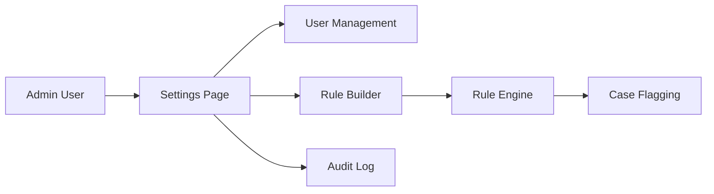

# 07. Settings & Admin Design: "Mission Control"

> **Goal:** Centralize security policy, user roles, detection rules, and system health monitoring.
> **Philosophy:** "The investigator is also a target." Every action must be logged and auditable.


---

## 🎯 Fraud Detection Value

| Fraud Type | How Settings Page Helps |
| :--- | :--- |
| **Insider Threat** | Audit Log surfaces suspicious analyst behavior (bulk approvals, after-hours access). |
| **Rule Evasion** | Detection Rule Builder allows real-time threshold adjustments without code deploy. |
| **Collusion** | Permission Matrix reveals toxic role combinations (e.g., Approver + Requester). |
| **Evidence Tampering** | Immutable audit trail prevents log deletion. |

---

## 1. Page Structure (Vertical Navigation)

| Tab | Purpose |
| :--- | :--- |
| **Team & Access** | User management, roles, permissions |
| **Security Audit** | Immutable action log, session history |
| **Detection Logic** | No-code rule builder for fraud thresholds |
| **System Health** | CPU/Memory gauges, API latency |
| **Integrations** | ETL connectors (Plaid, Stripe) |

---

## 2. Implementation Strategy

### 2.1 Audit Log ("Black Box")

- **Why:** Internal fraud requires tamper-proof evidence of analyst actions.
- **What:** Append-only log with hash chain (blockchain-inspired).
- **How:** Database triggers write to `audit_logs` table. Frontend uses `react-virtualized` for 100k+ row scanning.

### 2.2 Detection Rule Builder

- **Why:** Analysts need to adjust thresholds without engineering involvement.
- **What:** No-code predicate builder (drag-and-drop conditions).
- **How:** `react-query-builder` → JSON Logic output → backend evaluation.

### 2.3 System Health Gauges

- **Why:** Admins need to detect performance degradation before users complain.
- **What:** Real-time CPU, Memory, Queue Depth gauges.
- **How:** `react-gauge-chart` + `/health/metrics` endpoint.

---

## 3. Code Relationships

### Components

| Component | Path | Dependencies |
| :--- | :--- | :--- |
| `Settings.tsx` | `src/pages/Settings.tsx` | Tabs, UserTable, RuleBuilder |
| `AuditLog.tsx` | `src/components/settings/AuditLog.tsx` | react-virtualized |
| `RuleBuilder.tsx` | `src/components/settings/RuleBuilder.tsx` | react-query-builder |
| `HealthGauges.tsx` | `src/components/settings/HealthGauges.tsx` | react-gauge-chart |
| `PermissionMatrix.tsx` | `src/components/settings/PermissionMatrix.tsx` | DataTable |

### API Endpoints

| Endpoint | Method | Purpose |
| :--- | :--- | :--- |
| `/api/v1/settings/users` | GET/POST | User CRUD |
| `/api/v1/settings/audit-log` | GET | Action history |
| `/api/v1/settings/rules` | GET/POST | Detection rules |
| `/api/v1/health/metrics` | GET | System health |

### Data Flow



---

## 4. Proposed Enhancements

| Enhancement | Priority | Description |
| :--- | :--- | :--- |
| **Role Templates** | High | Pre-built permission sets (Analyst, Manager, Auditor). |
| **IP Allowlisting** | Medium | Restrict access by IP range. |
| **2FA Enforcement** | Medium | Require TOTP for all users. |
| **Auto-Update Manager** | Low | Electron app update controls with release notes. |

---

## 5. User Scenarios

1. **Onboarding:** Admin creates new Analyst user. Assigns "Analyst" role template.
2. **Threshold Tuning:** Compliance Officer opens Rule Builder. Changes "Large Transaction" threshold from $10k to $8k.
3. **Incident Response:** Security team opens Audit Log. Filters by User X. Sees 50 bulk approvals at 2 AM.
4. **Health Check:** Admin sees API Latency gauge in yellow. Allocates more backend resources.


---

# Technical Specification

# Settings Page

**Route:** `/settings`  
**Component:** `src/pages/Settings.tsx`  
**Status:** ✅ Implemented

## 🏗 Architecture References

*   **Technology Stack:** See [00_TECH_STACK.md](../../architecture/SYSTEM_ARCHITECTURE.md)

> [!NOTE]
> The **Audit Log** described here provides a view into *System Activity* (Login, Password Change, User Edits). For *Case Investigation Trails* (Evidence handling, Decision logging), see the **Summary** page documentation.

---

## Layout

```
┌─────────────────────────────────────────────────────────────┐
│ Header: "Settings"                                          │
├─────────────────────────────────────────────────────────────┤
│  [General] [Security] [Audit Log]                           │
├─────────────────────────────────────────────────────────────┤
│                                                             │
│  General Tab:                                               │
│  ┌───────────────────────────────────────────────────────┐ │
│  │ Profile                                                │ │
│  │ ──────────                                             │ │
│  │ Name:    [John Smith          ]                        │ │
│  │ Email:   [john.smith@company.com]                      │ │
│  │                                     [Save Changes]     │ │
│  │                                                        │ │
│  │ Appearance                                             │ │
│  │ ──────────                                             │ │
│  │ Theme:   (●) Light  ( ) Dark  ( ) System               │ │
│  │                                                        │ │
│  │ Notifications                                          │ │
│  │ ──────────────                                         │ │
│  │ [✓] Email notifications for high-risk alerts          │ │
│  │ [✓] Browser notifications                             │ │
│  │ [ ] Daily summary digest                              │ │
│  └───────────────────────────────────────────────────────┘ │
│                                                             │
└─────────────────────────────────────────────────────────────┘
```

---

## Tabs

### 1. General Tab
User profile and preferences.

**Sections:**
- **Profile:** Name and email editing
- **Appearance:** Theme toggle (Light/Dark/System)
- **Notifications:** Email and browser notification preferences

### 2. Security Tab
Password and security settings.

**Sections:**
- **Change Password:** Current password, new password, confirm
- **Two-Factor Authentication:** Enable/disable TOTP
- **Active Sessions:** View and revoke sessions

### 3. Audit Log Tab
System audit trail viewer.

**Features:**
- Searchable log table
- Filter by action type, user, date range
- Export to CSV
- Pagination

---

## Components

| Component | Description |
|-----------|-------------|
| `ProfileForm` | Name and email editing form |
| `ThemeToggle` | Light/Dark/System mode selector |
| `NotificationSettings` | Notification preference checkboxes |
| `PasswordChangeForm` | Password update form with validation |
| `SessionManager` | Active session list with revoke |
| `AuditLogViewer` | Searchable, filterable audit log table |

---

## Features

### Profile Management
- Edit display name
- Update email (with verification)
- Avatar upload

### Theme Settings
| Option | Description |
|--------|-------------|
| Light | Light color scheme |
| Dark | Dark color scheme |
| System | Follow OS preference |

### Security Features
- Password requirements: 8+ chars, uppercase, lowercase, number
- Password strength indicator
- Session management (view/revoke active sessions)
- Two-factor authentication setup

### Audit Log
| Column | Description |
|--------|-------------|
| Timestamp | Event date/time |
| User | Actor who performed action |
| Action | Type of action (login, create, update, delete) |
| Resource | Affected resource (case, alert, user) |
| IP Address | Source IP |
| Details | Additional context |

---

## API Endpoints

| Method | Endpoint | Description |
|--------|----------|-------------|
| GET | `/api/v1/users/me` | Get current user profile |
| PATCH | `/api/v1/users/me` | Update profile |
| POST | `/api/v1/auth/change-password` | Change password |
| GET | `/api/v1/users/me/sessions` | Get active sessions |
| DELETE | `/api/v1/users/me/sessions/:id` | Revoke session |
| GET | `/api/v1/audit-logs` | Get audit logs |

---

## Accessibility

| Feature | Implementation |
|---------|----------------|
| Tabs | ARIA tabs pattern |
| Forms | Proper labels and error messages |
| Theme Toggle | `role="radiogroup"` |
| Table | Proper headers and cell associations |

---

## Related Files

```
frontend/src/
├── pages/Settings.tsx
└── components/settings/
    ├── ProfileForm.tsx
    ├── ThemeToggle.tsx
    ├── NotificationSettings.tsx
    ├── PasswordChangeForm.tsx
    ├── SessionManager.tsx
    └── AuditLogViewer.tsx
```

---

## Performance Optimizations

- **Virtual Scrolling:** Audit log uses react-window for 100k+ rows
- **Debounced Search:** 300ms delay on audit log filter
- **Lazy Loading:** Tabs load content on demand
- **Memoization:** Settings forms memoized to prevent re-renders
- **Batch Updates:** Profile changes batched before save

---

## Testing

### Unit Tests
- Form validation logic
- Theme toggle state
- Notification preference persistence

### Integration Tests
- Password change flow
- Session management API
- Audit log filtering

### E2E Tests
- Profile update workflow
- Theme switching persistence
- Session revocation
- Audit log export

---


## 🔌 Implementation Links

### Frontend Components
- [`Settings.tsx`](../../../frontend/src/pages/Settings.tsx)

### Backend Services
- [`users.py`](../../../backend/app/routers/users.py)
- [`admin.py`](../../../backend/app/routers/admin.py)

### Key API Endpoints
- `GET /users/me`
- `PATCH /users/settings`
- `POST /admin/backup`

---
### Frontend Components
- [`Settings.tsx`](../../../frontend/src/pages/Settings.tsx)

### Backend Services
- [`users.py`](../../../backend/app/routers/users.py)
- [`admin.py`](../../../backend/app/routers/admin.py)

### Key API Endpoints
- `GET /users/me`
- `PATCH /users/settings`
- `POST /admin/backup`

---

## 🔮 Future Enhancements

### Phase 1: Simple Basic Functions (MVP)
- [ ] Profile Management (Name/Email)
- [ ] Password Change Form
- [ ] Theme Toggle (Light/Dark)
- [ ] Session List (View Active Sessions)
- [ ] Basic Notification Preferences (Email On/Off)

### Phase 2: Advanced (Professional)
- [ ] Avatar Upload with Cropping
- [ ] 2FA Setup (QR Code)
- [ ] Role-Based Access Control View
- [ ] Audit Log Viewer with Filters
- [ ] Remote Session Revocation

### Phase 3: Extreme (Sci-Fi)
- [ ] Biometric Login Integration (WebAuthn)
- [ ] " Panic Button" (Instant Account Lock)
- [ ] AI-Driven Security Anomaly Alerts
- [ ] Voiceprint Authentication Setup
- [ ] GDPR "One-Click Erasure" with Blockhain Proof
